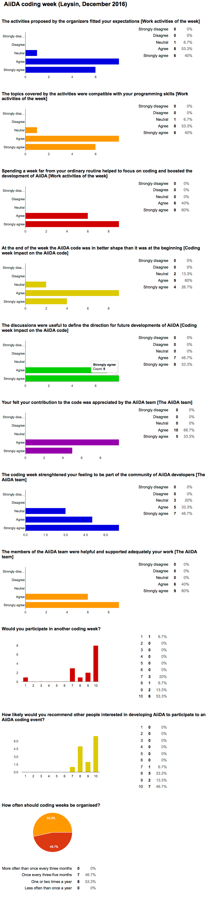

# Report from the AiiDA coding week - Dec 2016

Last week (5-9 Dec 2016) we had a coding week for AiiDA, to which 15 people participated (roughly half of them core developers from the AiiDA, and the other half were developers who were interested in contributing to the platform).

The coding week has taken place in Leysin, in the Swiss Alps. A few discussion or work topics had been identified before the start by the AiiDA team, and have been addressed during the week. In particular, the following topics have been discussed and the result has been summarised in a draft document for later implementation:

* New more efficient implementation of the AiiDA daemon
* How third-parties can contribute to Materials Cloud sections
* Redesign of the ORM classes (in particular Node) to improve the way multiple backends are supported

A few discussions have also led to new branches of development, that will be soon merged into the develop branch (and appear in a future release):

* AiiDA plugin interface integrated with pip
* Various improvements and bug fixes to the SQLAlchemy backend implementation

Finally, the remaining work topics have been taking up a large part of the coding sessions, and most of the code has already been merged into the develop branch:

* Redesign of the AiiDA documentation, with a more clear structure, removal of duplicates, a new and more clear installation section.
* Simplified procedure to install AiiDA.
* New testing infrastructure to test in parallel any database backend (currently, both Django and SQLAlchemy)
* Removal of the DbPath (transitive closure) table and triggers, and replacement with a dynamically created query (using either PostgreSQL recursive queries or PostgreSQL functions). The performance of these queries has been optimised.

Beside programming, most participants have taken place to an outdoor hiking activity on Wednesday morning to Berneuse, close to Tour d'Aï, that was a great team building opportunity. Participants have also enjoyed after-dinner sessions with board and card games.

The outcome of the feedback, summarised below, has been very positive, both in terms of participation, organisation, and improvement to the code. The results indicate also that similar events should be organised again in the future, with a frequency of about twice a year.

Some photos of the event can be found on our [Facebook page](https://www.facebook.com/pg/aiidateam/photos/?tab=album&album_id=580802998793892).

-- Giovanni Pizzi

## **Summary of the results of the feedback form**

