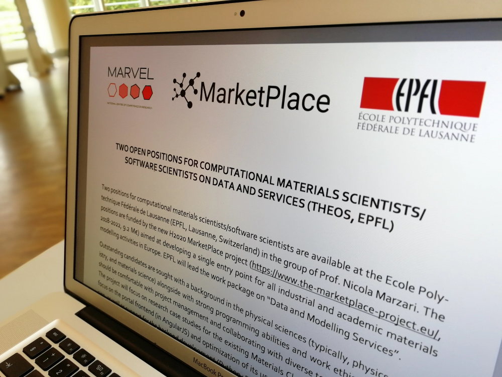

# Two open positions available for computational materials scientist/software scientists on data and services

Two positions for computational materials scientists/software scientists are available at the Ecole Polytechnique Fédérale de Lausanne (EPFL, Lausanne, Switzerland) in the group of Prof. Nicola Marzari. The positions are funded by the new [H2020 MarketPlace project](https://www.the-marketplace-project.eu/) (2018-2022, 9.2 M€) aimed at developing a single entry point for all industrial and academic materials modeling activities in Europe. EPFL will lead the work package on "Data and Modeling Services".

For more information, please refer to the [official advertisement](https://bit.ly/2z1XBzA)
