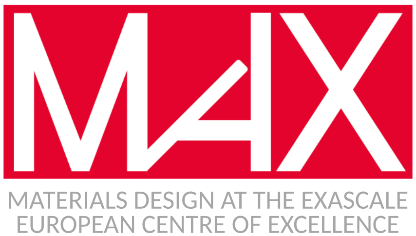

# Tutorial on writing reproducible workflows for computational materials science

## Coordinates

**When** May 21st, 2019 (9:00) until May 24th, 2019 (13:00)

**Where** EPFL, Station 9, CH-1015 Lausanne, Switzerland

**Registration** [Registration link](https://docs.google.com/forms/d/e/1FAIpQLScMFoXAiGaU9IwDc1WSfqhBbtx8tBWk6QJ-XyZ5GqqIbjcYBg/viewform)

(as of April 15th 2019, **the workshop is fully booked**. You may still register if you would like to be added to the waiting list)

**Materials** [Hands-on instructions](https://aiida-tutorials.readthedocs.io/en/latest/pages/2019_MARVEL_Psik_MaX/index.html)

## Schedule

|               |                 Tue, 21 May                 |            Wed, 22 May            |          Thu, 23 May           |   Fri, 24 May   |
| ------------- | ------------------------------------------- | --------------------------------- | ------------------------------ | --------------- |
| 09:00 - 09:30 | Registration                                | Highlight talk M. Govoni          | AiiDA Q&A                      |                 |
| 09:30 - 10:00 | AiiDA intro (R)                             | Highlight talk F. Mohammed (R)    | Highlight talkG. Petretto (R)  |                 |
| 10:00 - 10:30 | Highlight talk S. Cottenier                 |                                   |                                |                 |
| 10:30 - 11:00 | 1. Getting set up                           | AiiDA lab (R)                     | Materials Cloud                |                 |
| 11:00 - 11:30 | Coffee break                                | Group photo                       | Coffee break                   | Coffee break    |
| 11:30 - 12:00 | 2. verdi CLI                                | Workflows intro (R)               | AiiDA plugins (R)              | Feedback forms  |
| 12:00 - 12:30 | 6. Workflows                                | Open Mic round+ split into groups | Group work                     |                 |
| 12:30 - 13:00 | 3. verdi shell                              |                                   |                                |                 |
| 13:00 - 14:30 | Lunch                                       | Lunch                             | Lunch                          | Closing remarks |
| 14:30 - 15:00 | 4. Managing calculations                    | 6. Workflows                      | Intros to topics of group work |                 |
| 15:00 - 15:30 | Group work & setting up AiiDAon your laptop |                                   |                                |                 |
| 15:30 - 16:00 |                                             |                                   |                                |                 |
| 16:00 - 16:30 |                                             |                                   |                                |                 |
| 16:30 - 17:00 | Coffee break                                | Coffee break                      | Coffee break                   |                 |
| 17:00 - 17:30 | QueryBuilder intro                          | 7. Band structure                 | Group work                     |                 |
| 17:30 - 18:00 | 5. QueryBuilder+ Appendices                 |                                   |                                |                 |
| 18:00 - 18:30 | Error handling & real-lifeWorkChains (R)    |                                   |                                |                 |
| 18:30 - 19:00 | Problems during hands-on                    |                                   |                                |                 |
| ...           |                                             |                                   |                                |                 |
| Evening       | Standing dinner,poster session              | Social dinner, 7:30pm             |                                |                 |
|               |                                             |                                   |                                |                 |
| Rooms         | Tutorial lecture                            | Hands-on                          | Discussion                     | Highlight talk  |
|               | MED 2 1522                                  | MED 2 1522/1124                   | MED 2 1522                     | MED 0 1418      |

Talks marked by (R) are planned to be recorded

## About

This 3.5-day tutorial is designed to get Master students, PhD students and Postdocs from the field of computational materials science started with writing reproducible workflows. Participants will be introduced to the state of the art in workflow management and high-throughput computations by experts in the field, and gain in-depth hands-on experience using a tool that they can directly apply to their own research.

Our tool of choice is the AiiDA framework for workflow management and provenance tracking, which is backed by a significant community of users and developers, and has interfaces to more than 20 materials science codes (see [plugin registry](https://aiidateam.github.io/aiida-registry/)), including to the *ab initio* codes **Quantum ESPRESSO, VASP, cp2k, Castep, Siesta, Fleur, Crystal, NWChem, Wannier90, and Yambo**. AiiDA's permissive open source license (MIT) enables participants to use it both in academic and commercial settings. By virtue of its general design and flexible plugin system, AiiDA is easily extended to new codes and new use cases.

* The **first day** will serve as an introduction to AiiDA 1.0. In order to avoid losing time on installation issues, all participants will have the option to connect to a personal virtual machine preconfigured with AiiDA (or to come with AiiDA 1.0 already installed on their laptop).

* The **second day** will cover *workflows* in AiiDA 1.0. Following input from the workshop questionnaire, participants will first learn the concepts using *aiida-quantumespresso*, and then have the option to get to know other plugins (such as *aiida-vasp*) in the following days.

* In the **remaining 1.5 days**, participants will be able to start working on their own projects, choosing among three topics:

  + **Developing a new workflow** (S. Huber, G. Pizzi):

    - includes: AiiDA workflow engine under the hood

  + **Writing a plugin for your code** (L. Talirz, O. Arbelaez):

    - includes: How to write an AiiDA plugin

	+ **Wrapping a workflow in a web application** (S. Yakutovich, C. Andersen):

    - includes: Getting started with the AiiDA lab

* Throughout the tutorial, lectures by the organizers and core developers of AiiDA are complemented by talks by the invited speakers highlighting the use of the workflows in computational materials science.

  + **NEW**: [Your answers to Stefaan's questions](../pics/legacy/questions-by-stefaan.pdf) & [Stefaan's answers to your questions](../pics/legacy/questions-by-participants.pdf)

* Discussion sessions, as well as a poster session (**NEW** [Poster abstracts](../pics/legacy/Posters-abstracts.pdf)) and an open-mic session are scheduled to foster interaction between the participants, to discuss and answer questions.

While this tutorial is deliberately open to computational materials scientists at many levels, we do require the following  for participation:

* familiarity with a Unix operating system and the bash shell (or equivalent)
* familiarity with python
* familiarity with a job scheduler (e.g. slurm, torque, sge, ...)
* full participation for (at least) the last 2.5 days

## Speakers & organisers

The tutorial is organised by **Leopold Talirz (EPFL, CH), Sebastiaan Huber (EPFL, CH), Espen Flage-Larsen (SINTEF, NO), Alberto García (ICMAB, ES) and Andrea Ferretti (CNR, IT)** who bring expertise in a diverse set of *ab initio* codes and their applications in different work environments (universities, research institutes and companies).

The following invited speakers will illustrate the use workflows in their research using a recent example, highlighting both the challenges encountered and possible solutions.

* Stefaan Cottenier (UGent, BE)
* Marco Govoni (ANL, US)
* Fawzi Mohamed (FHI, GE)
* Guido Petretto (UC Louvain, BE)

Tutorial lectures and assistance during hands-on session will be provided by a team of core AiiDA developers and active plugin developers:

* Espen Flage-Larsen (SINTEF, No)
* Andrea Ferretti (CNR, Istituto Nanoscienze, IT)
* Alberto Garcia (ICMAB-CSIC, ES)
* Sebastiaan Huber (EPFL, CH)
* Leopold Talirz (EPFL, CH)
* Giovanni Pizzi (EPFL, CH)
* Aliaksandr Yakutovich (EPFL, CH)
* Casper Andersen (EPFL, CH)
* Oscar Arbelaez (EPFL, CH)
* Daniele Tomerini (EPFL, CH)

For generic information concerning the tutorial, contact [aiida.workflows2019@gmail.com](mailto:aiida.workflows2019@gmail.com) .

## How to get there

Registration will take place in the [2nd floor of the MED building](https://plan.epfl.ch/?room==MED%202%201124).

For general directions on how to arrive to EPFL, see [here](http://theossrv1.epfl.ch/Main/Contact).

## Funding

The tutorial will be offered free of charge, with roughly 40 participants. By default, **participants are expected to cover their costs for travel and lodging**, but we aim to reimburse the cost of lodging for participants who require financial assistance (which they need to motivate during registration).

We are very grateful to our sponsors for helping to make this event possible:

* The [Psi-k network](http://psi-k.net) for funding
* [EPFL](http://epfl.ch) for hosting the event and for providing administrative support
* The [NCCR MARVEL National Centre of Competence in Research](http://nccr-marvel.ch/) for funding
* The [MaX European Centre of Excellence](http://www.max-centre.eu/) for funding
* The [swissuniversities P-5 project "Materials Cloud"](https://www.materialscloud.org/swissuniversities) for funding
* The INTERSECT project for funding

