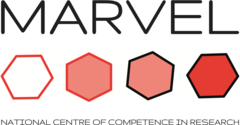

# AiiDA Coding Week 2019

## Coordinates

**When** December 9th, 2019 (morning) until December 13th, 2019 (afternoon)

**Where** [Fiescherhof](http://www.fiescherhof.ch/en/), Furkastrasse 75, CH-3984 Fiesch, Switzerland

## Schedule

|       | Monday           | Tuesday         | Wednesday             | Thursday        | Friday               |
| 09:00 |                  |                 | Group excursion       |                 |                      |
| 10:30 | Arrive in Fiesch | Coffee          |                       | Coffee          | Coffee               |
| 12:30 | Lunch            | Lunch           | Lunch                 | Lunch           | Lunch                |
| 15:30 | Coffee           | Coffee          | Coffee                | Coffee          | Close of coding week |
| 19:00 | Dinner at Hotel  | Dinner at Hotel | Restaurant des Alpes? | Dinner at Hotel |                      |

## About

The Coding Week is an annual event meant to develop, discuss, and focus on the core of AiiDA, i.e., the [aiida-core](https://github.com/aiidateam/aiida-core) package.

Core developers, mainly from EPFL, but also external, are invited for a week of focused development in a scenic and social setting.

The week includes a group excursion. Last year this was a walk/trek in the surrounding Alps with snowshoes, and a memorable view at the local Aletsch glacier.

Since the recent release of AiiDA 1.0.0, we are looking forward to 1.1.0. Several subjects have already been circulated internally to focus on and will be discussed in plenum in Fiesch.

## Funding

Out of the 30 people invited, 16 will be participating. By default, **participants are expected to cover their costs for travel and lodging**, but we aim to reimburse the cost of lodging for participants who require financial assistance.

We are very grateful to our sponsors for helping to make this event possible:

* [EPFL](http://epfl.ch) for for providing administrative support

* The [MARVEL National Centre of Competence in Research](http://nccr-marvel.ch/) "OSP" for funding

* The [MaX European Centre of Excellence](http://www.max-centre.eu/) for funding

* The [swissuniversities P-5 project](https://www.swissuniversities.ch/en/organisation/projects-and-programmes/p-5/) "Materials Cloud" for funding

* The [MarketPlace](https://www.the-marketplace-project.eu/) project for funding

