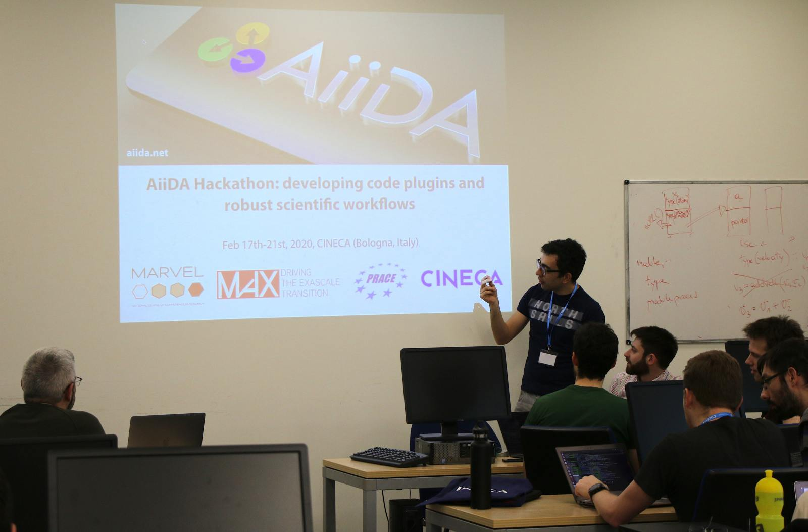
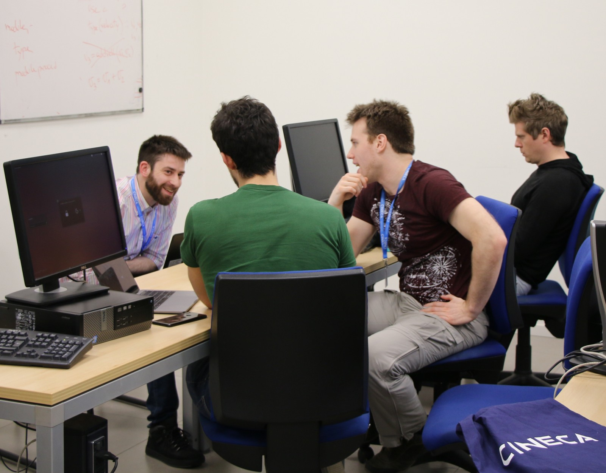
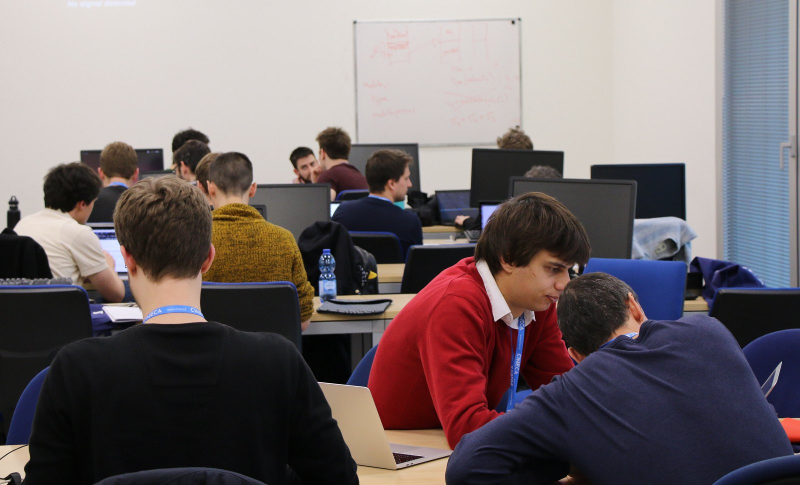
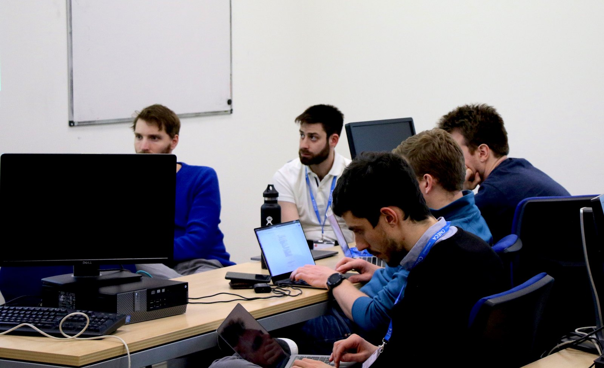
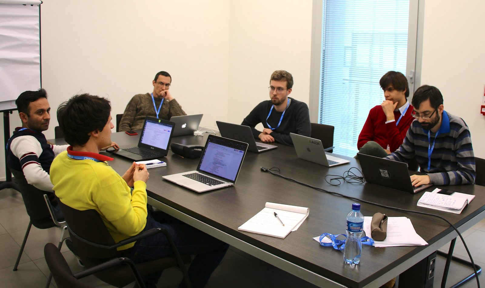
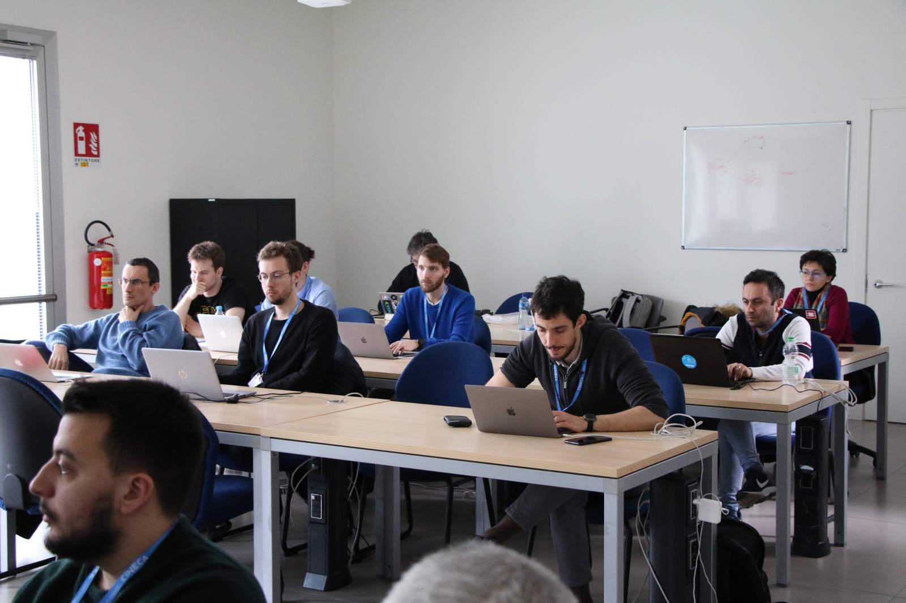
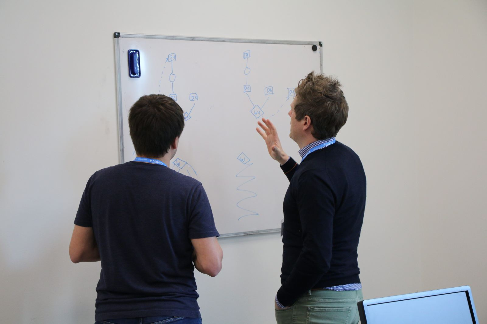
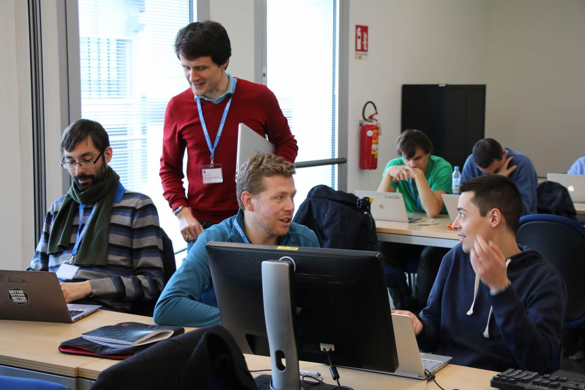
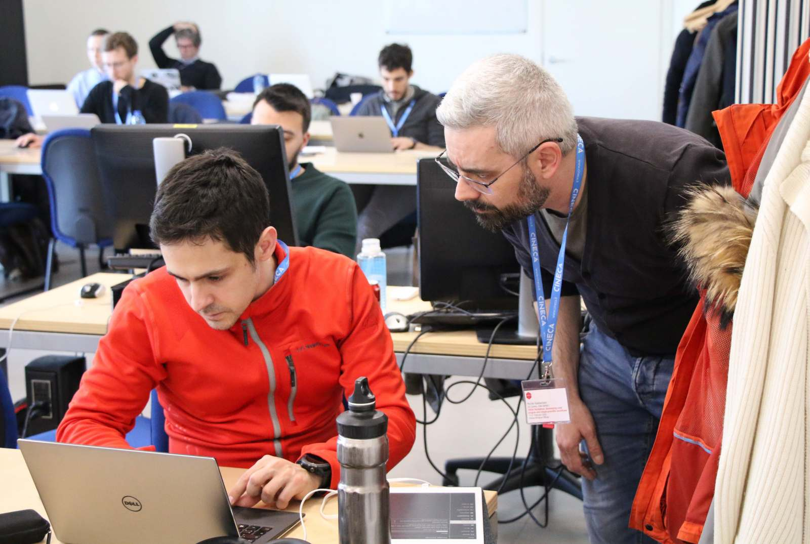
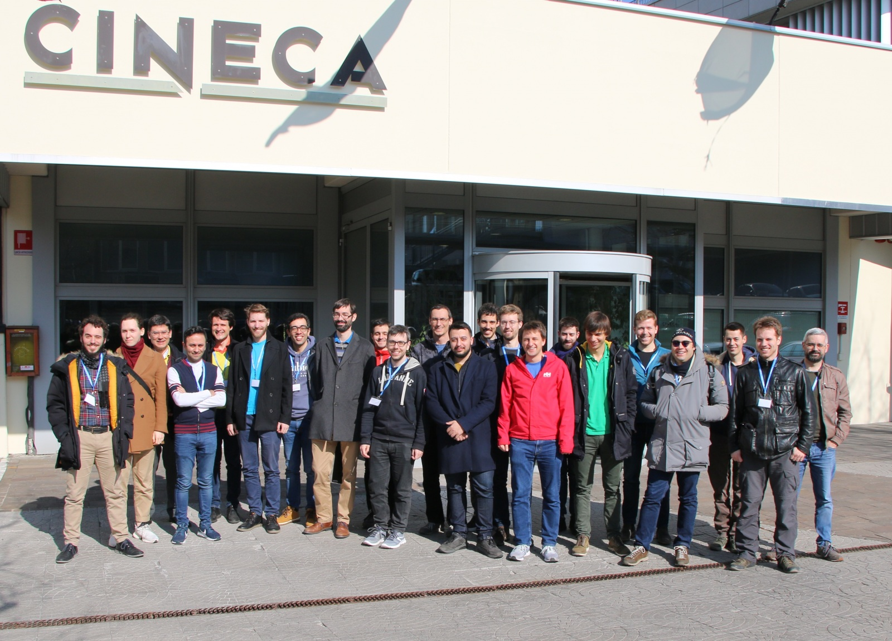

# Notes from AiiDA hackathon on plugin and workflow development

The  AiiDA hackathon held at CINECA from February 17th-21st 2020 featured a number of presentations and discussion sessions on topics relevant to plugin and workflow development.

Those interested can find links to **slides of presentations**, **video recordings**, as well as **notes of the discussion sessions** in the [report](http://www.aiida.net/wp-content/uploads/2020/02/Bologna-hackathon-report.pdf) . Enjoy!

:::{subfigure} 2
:layout-sm: 1

:::
