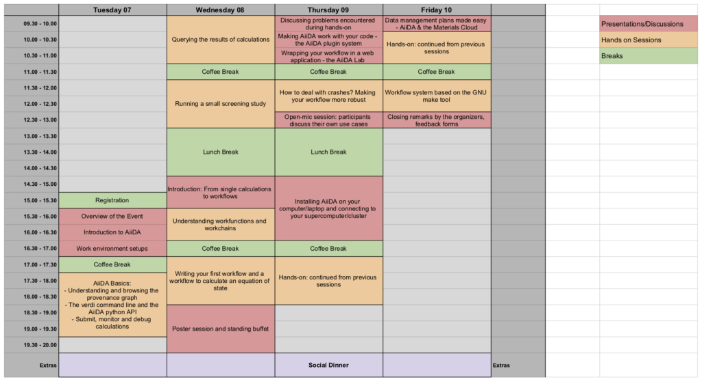
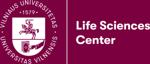
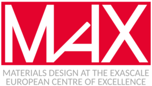
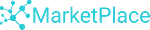
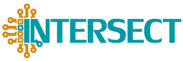

# AiiDA tutorial at Vilnius University (Vilnius, Lithuania)

## Description

This 3-day tutorial is designed to get about 40 students and researchers from the field of computational materials science started with writing reproducible workflows. Participation both from academia and from industry is encouraged.

Participants will be introduced by experts in the field to the use of AiiDA, a state-of-the-art framework for provenance tracking and workflow management designed to support high-throughput research, and will gain in-depth hands-on experience using a tool that they can directly apply to their own research.

The AiiDA framework is a tool for workflow management and provenance tracking, which is backed by a significant community of users and developers, and has interfaces to more than 20 materials science codes (see [plugin registry](http://aiidateam.github.io/aiida-registry)), including (among others) to the ab initio codes Quantum ESPRESSO, VASP, cp2k, Castep, Siesta, Fleur, Crystal, NWChem, Wannier90, and Yambo. AiiDA's permissive open source license (MIT) enables participants to use it both in academic and commercial settings. By virtue of its general design and flexible plugin system, AiiDA is easily extended to new codes and new use cases.

In order to avoid losing time on installation issues, participants will have the option to connect to virtual machines preconfigured with AiiDA (or to come with AiiDA already installed on their laptop via the [Quantum Mobile virtual machine](https://quantum-mobile.readthedocs.io/en/latest)).

The event will mostly focus on in-depth tutorials on using AiiDA and on writing workflows. It will also include some talks on how AiiDA has been already used in production, given by the organisers and the core developers of AiiDA; on advanced aspects of workflow management; on designing and writing new AiiDA plugins; and on research data management (RDM) and how to write data management plans (DMPs), especially when using AiiDA and the [Materials Cloud](https://www.materialscloud.org).

## Coordinates

**When:** From July 7th, 2020 (starting at 15:00) to July 10th, 2020 (ending at 13:00).

**Where:** [Vilnius University](https://www.vu.lt/) (Saulėtekio av. 7, LT- 10257 Vilnius, Lithuania).

**Registration:** Fill this [online form](https://docs.google.com/forms/d/1yuvM2ZRjbt78WyY_6j21psyObG_cNr3JtzPw1v7EGrc).

**Registration deadline**: **May 3rd, 2020**. After the deadline, we will select participants if there are more applications than the number of available seats. C*onfirmation of acceptance will be sent to applicants at the latest on May 13th, 2020.*

## Event cost and financial contributions

Participation to the event if free of charge, but due to space limitations we can only accept up to 40 participants (see note above).

Partial financial contribution for the accommodation can be granted to a limited number of selected participants, thanks to the support of our sponsors. These will be awarded to those who most need it, based on this registration form. If you need such contribution, please indicate this in the registration form.

Note: as a general rule, travel and meals will not be covered. If this is preventing you from participating, please indicate this in the form and we will consider whether to make an exception.

## Speakers & organisers

The tutorial is organised by **Saulius Gražulis (VU, LT), Andrius Merkys (VU, LT),****Elsa Passaro (EPFL, CH), Giovanni Pizzi (EPFL, CH) and Francisco Ramirez (EPFL, CH).**

Tutorial lectures and assistance during hands-on session will be provided by a team of core AiiDA developers and active plugin developers.

For local information of Vilnius you can contact Andrius (andrius.merkys at gmc.vu.lt), whereas for general information concerning the tutorial you can contact Francisco (francisco.ramirez at epfl.ch).

## Tentative schedule

Below is a tentative schedule for the event (click to zoom).

## Funding

We are very grateful to our sponsors for helping to make this event possible:

[Vilnius University](https://www.vu.lt/) for hosting the event and for providing administrative support; the [MaX European Centre of Excellence,](http://www.max-centre.eu/) [Centre Européen de Calcul Atomique et Moléculaire (CECAM)](https://www.cecam.org/), the [swissuniversities P-5 project "Materials Cloud"](https://www.materialscloud.org/swissuniversities), the [MARVEL National Centre of Competence in Research](http://nccr-marvel.ch/), the [H2020 MARKETPLACE project](https://www.the-marketplace-project.eu/), the H2020 INTERSECT project and the [PASC project](https://www.pasc-ch.org/) for funding.

:::{subfigure} 2
:layout-sm: 1
:gap: 1em

:::
