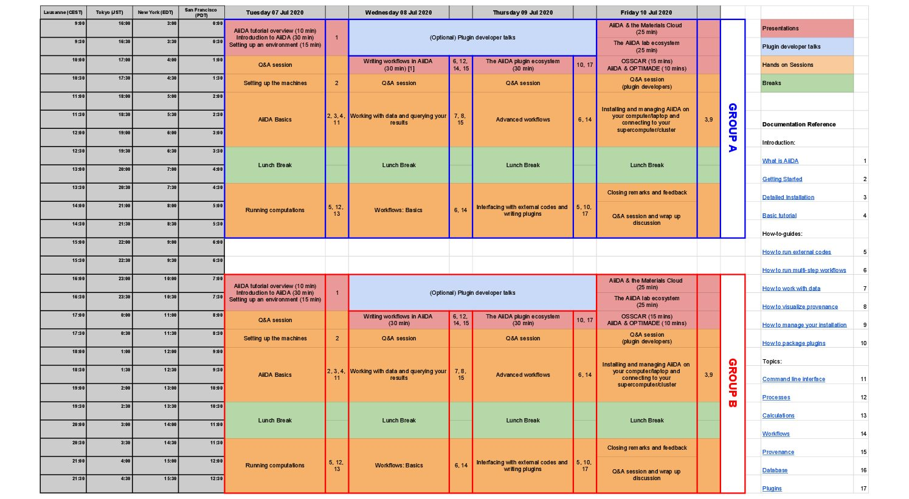
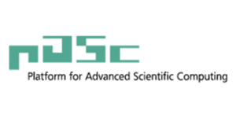

# AiiDA Virtual Tutorial July 2020

The AiiDA team is pleased to announce details for our annual tutorial week!

## Description

This year introductory tutorial to AiiDA from the 7th to the 10th of July 2020 will be organised in a virtual format.

The goal of this 4 day-tutorial is to help students and researchers from the field of computational materials science get started with writing reproducible workflows. They will be introduced by experts in the field (including the developers of the code) to the use of AiiDA, a state-of-the-art framework for provenance tracking and workflow management designed to support high-throughput research, and will gain in-depth hands-on experience using a tool that they can directly apply to their own research. Participation both from academia and from industry is encouraged.

The AiiDA framework is a tool for workflow management and provenance tracking, which is backed by a significant community of users and developers, and has interfaces to more than 30 materials science codes (see [plugin registry](http://aiidateam.github.io/aiida-registry)), including (among others) to the ab initio codes Quantum ESPRESSO, VASP, cp2k, Castep, Siesta, Fleur, Crystal, NWChem, Wannier90, and Yambo. AiiDA’s permissive open source license (MIT) enables participants to use it both in academic and commercial settings. By virtue of its general design and flexible plugin system, AiiDA is easily extended to new codes and new use cases.

Talks will be pre-recorded and made available to participants before the event, and hands-on tutorials will be held _via_ [Zoom](https://zoom.us). In order to avoid losing time on installation issues, participants will have the option to connect to virtual machines preconfigured with AiiDA (or to come with AiiDA already installed on their laptop via the [Quantum Mobile virtual machine](https://www.materialscloud.org/work/quantum-mobile)).

The event will mostly focus on in-depth tutorials on using AiiDA and on writing workflows. It will also include some talks on how AiiDA has been already used in production, given by the organisers and the core developers of AiiDA; on advanced aspects of workflow management; on designing and writing new AiiDA plugins; and on research data management (RDM) and how to write data management plans (DMPs), especially when using AiiDA and the [Materials Cloud](https://www.materialscloud.org).

## Key Details

**When:** From July 7th, 2020 to July 10th, 2020.
**Where:** Virtual [Zoom](https://zoom.us) Meetings
**Registration:** Fill this [online form](https://forms.gle/VwagYgWceJA5Yo9w7).
**Registration deadline**: **June 19th, 2020**.
After the deadline, we will select participants if there are more applications than the number of available spaces.
_Confirmation of acceptance will be sent to applicants at the latest on June 26th, 2020._

Participation to the event is free of charge. Up to 80 participants will be chosen (split into two time-zone groups), in order ensure the possibility for the AiiDA-core developers and tutors to provide direct feedback to all participants during the hands-on sessions.

## Tutors and organisers

The tutorial is organised by **Chris Sewell (EPFL, CH),** **Marnik Bercx (EPFL, CH) and Giovanni Pizzi (EPFL, CH).**

Tutorial lectures and assistance during hands-on session will be provided by the organisers and a team of core AiiDA developers: **Sebastiaan Huber, Leopold Talirz, Yakutovich Aliaksandr, Casper Andersen and Francisco Ramirez**.

For general information concerning the tutorial you can contact Chris (christopher.sewell@epfl.ch) or Marnik (marnik.bercx@epfl.ch).

## Schedule

Below is the schedule for the event (click to zoom). Two time slots will be provided for each session to accommodate for participants in different timezones.

## Videos

The videos of this tutorial (see also schedule) can be found on [this YouTube playlist](https://www.youtube.com/playlist?list=PL19kfLn4sO_-e_A9lVYb_NBNcwoVvUP6V).

## Tutorial text

The tutorial text can be found on [this page of the AiiDA Tutorials website](https://aiida-tutorials.readthedocs.io/en/latest/pages/2020_Intro_Week/index.html#intro-week-homepage).

## Funding

We are very grateful to our sponsors for helping to make this event possible:

The [MaX European Centre of Excellence,](http://www.max-centre.eu/) the [swissuniversities P-5 project “Materials Cloud”](https://www.materialscloud.org/swissuniversities), the [MARVEL National Centre of Competence in Research](http://nccr-marvel.ch/), the [H2020 MARKETPLACE project](https://www.the-marketplace-project.eu/), the [H2020 INTERSECT project](http://intersect-project.eu/) and the [PASC project](https://www.pasc-ch.org/) for funding.

:::{list-table}
:widths: 50 50

- - 
  - 
- - 
  - 
- - 
  - 

:::
