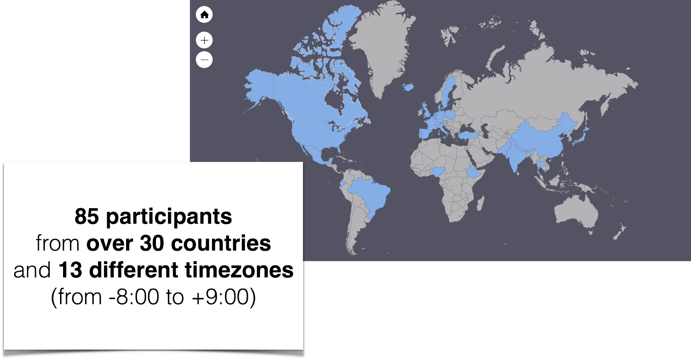
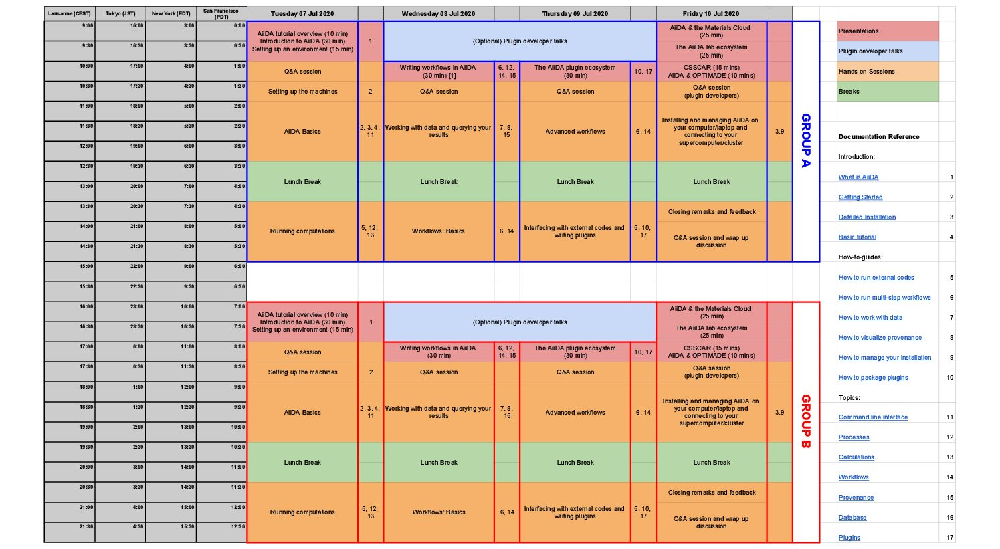
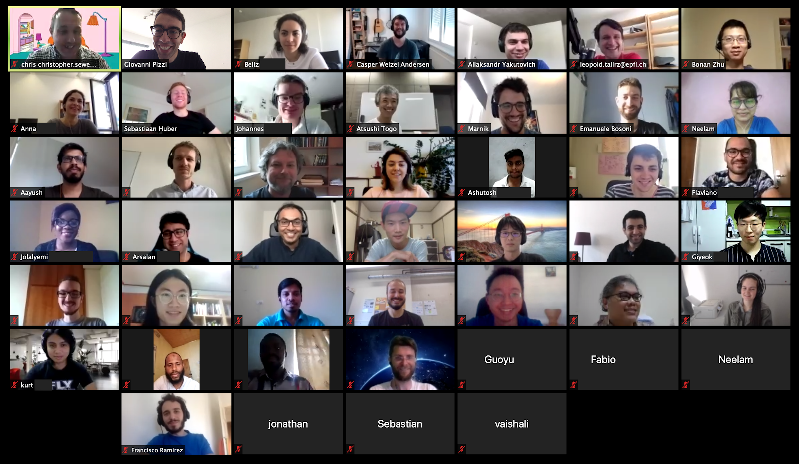
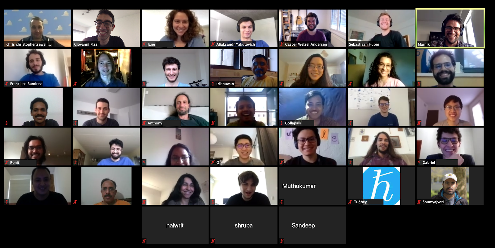
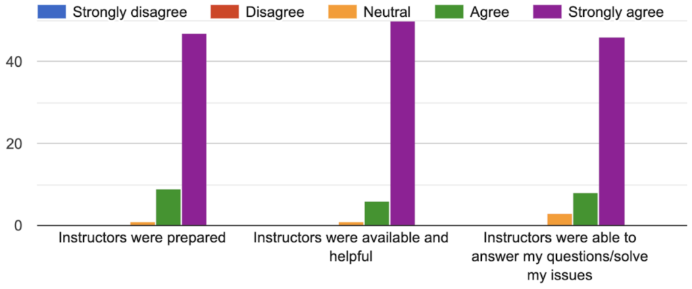
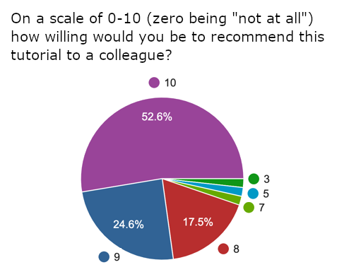
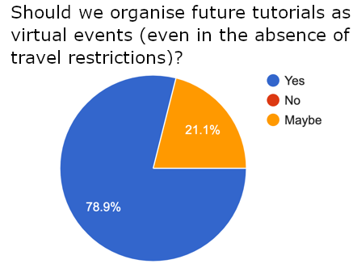

# Report on the 2020 AiiDA virtual tutorial

Due to the ongoing pandemic, this year’s edition of the AiiDA tutorial was organised in an entirely virtual format, which gave us the opportunity to expand our admittance to a truly global audience. In total, we accepted 85 participants from 30 countries and 13 different time zones. Incorporating this wide range of time zones presented an interesting challenge, and so we decided to split participants into two groups, running duplicate hands-on sessions for each group at different times of the day.

```{seealso}
All the presentations and material used for the hands-on sessions can be found on the [tutorial webpage](https://aiida-tutorials.readthedocs.io/en/latest/pages/2020_Intro_Week/index.html).
```



All presentations were pre-recorded and published on YouTube before the start of the tutorial. Next to the talks, which introduced the concepts for each of the hand-on sessions, there were also many interesting contributions from several of AiiDA’s plugin developers. The hands-on sessions were organised via Zoom meetings, with our instructors on hand to provide feedback to the participants and breakout rooms made available for one-on-one assistance.



The first day started with a brief introduction, after which we made sure the participants were able to connect to their Quantum Mobile virtual machines, hosted on Amazon’s web services. Once everyone was ready to get started, Giovanni Pizzi kicked off the hands-on sessions by explaining the basics of using AiiDA. After a short break, Francisco Ramirez guided the session on running computations through the AiiDA engine, using Quantum ESPRESSO as an example.

The first session on Wednesday, presented by Casper Andersen and Aliaksandr Yakutovich, was devoted to some essential tools for managing data and querying your database. After the break, Marnik Bercx coordinated an initial session on how to write workflows in AiiDA, continuing through to Thursday with Sebastiaan Huber introducing more advanced methods to improve the robustness of your workflows. In Thursday’s second session, Leopold Talirz explained the basics on writing plugins, after which participants could either work through a prepared example to understand the concepts, or start working on writing a plugin for an external code they wanted to run using AiiDA.



On the last day a Q&A panel was arranged with a number of plugin developers, who were kind enough to take time out of their busy schedule to answer questions about their work. Finally, the last session was dedicated to helping the participants install and run AiiDA on their machine, facilitated by a step-by-step explanation from Chris Sewell. After the closing remarks, a final hands-on session was available to participants who had further questions for our team or required more assistance with their AiiDA installation.



As many of the instructors were present for most of the hands-on sessions of both groups, this resulted in some long days for some! However, their energy and dedication never wavered, which was very much appreciated by the participants.



All in all, the first virtual AiiDA tutorial was a great success! As shown by the graphs below, participants were very happy with the format and tutorial material, and close to 80% said that we should organise more virtual tutorials in the future, even once travelling no longer is an issue. We have also received many valuable suggestions which we will consider to further improve the next tutorials.

Thanks to all who attended, and we look forward to hearing from you again!




