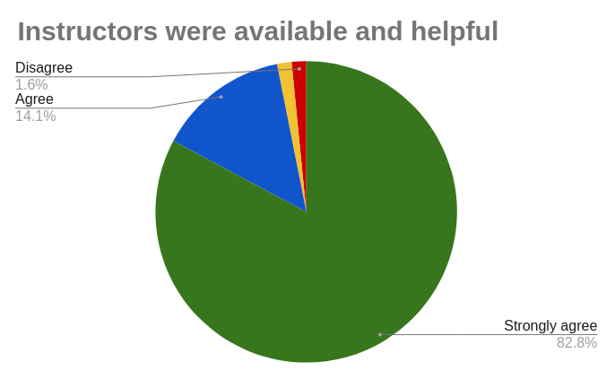
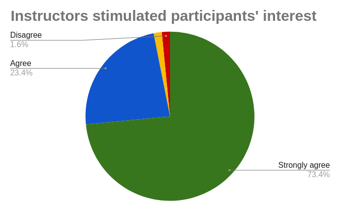
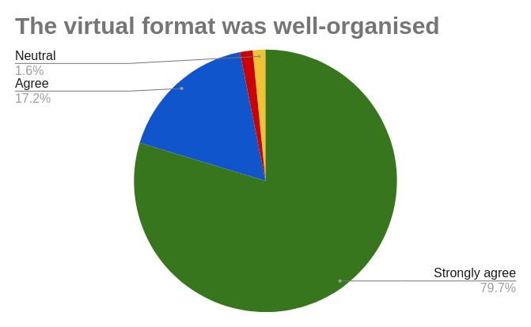
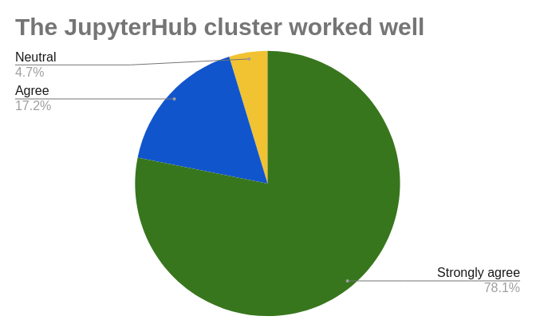
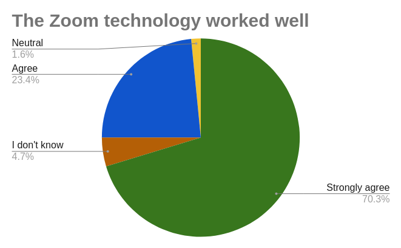
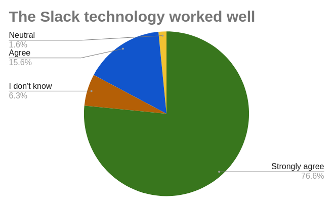
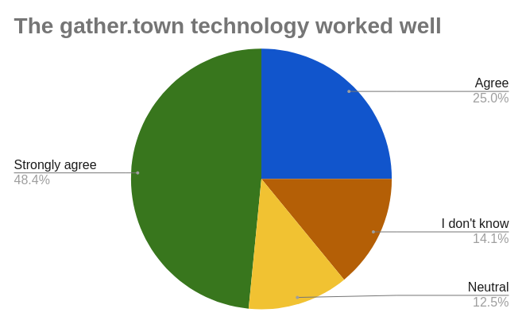

# Report on the 2021 AiiDA virtual tutorial

Last month we held our annual AiiDA’s introductory tutorial (from the 5th to the 9th of July 2021), an event in which the AiiDA developers teach students and researchers from the field of computational materials science how to get started with running and writing reproducible workflows with our code. This year the event lasted for 5 days and was organized in a fully virtual format, which allowed us to support over 100 participant from 30 different countries around the world!

```{seealso}
All the presentations and material used for the hands-on sessions can be found on the [tutorial webpage](https://aiida-tutorials.readthedocs.io/en/tutorial-2021-intro/).
```

Given the success of the previous AiiDA tutorial, this year’s edition was again organized in an entirely virtual format, giving us the opportunity to expand our admittance to a truly global audience. We managed to support around 100 active participants from 30 different nationalities distributed over 20 time zones.

```{figure} ../pics/2021-tutorial-chart1.png
Participant nationalities breakdown.
```

As last year’s duplicate-schedule format seemed to be effective at dealing with the wide range of time zones, we decided to use it this time as well. All presentations were pre-recorded and published on the [Materials Cloud YouTube channel](https://www.youtube.com/channel/UC-NZvRRQ5VzT2wKE5DM1N3A) before the start of the tutorial. Next to the talks, which introduced the concepts for each of the hand-on sessions, there were also many interesting contributions from several of AiiDA’s plugin developers. The hands-on sessions were organized via Zoom meetings, with our instructors on hand to provide feedback to the participants and breakout rooms made available for one-on-one assistance.

```{figure} ../pics/2021-tutorial-schedule.png
The tutorial schedule, showing the time slots for both groups A and B.
```

The first day started with a brief introduction, after which we made sure the participants were able to connect to their Quantum Mobile virtual machines, hosted on Amazon’s web services. Once everyone was ready to get started, Marnik Bercx kicked off the hands-on sessions by explaining the basics of using AiiDA. After a short break, Francisco Ramirez guided the session on running computations through the AiiDA engine, using Quantum ESPRESSO as an example.

The session on Tuesday, presented by Casper Andersen with the assistance of Aliaksandr Yakutovich, was devoted to some essential tools for managing data and querying your database. After the break, a social event was organized using the [gather town platform](https://www.gather.town/) in which a session of scientific speed dating was proposed. The participants were divided into pairs so they could discuss their research projects and ideas on how AiiDA could help them. After some minutes, the pairs would rotate so as to allow people to be exposed to a wider variety of individuals and projects. Extra time was provided at the end for a more free-form socialization event.

```{figure} ../pics/2021-tutorial-gathertown.png
The gather town platform.
```

Going back to work, the third day was focused on learning how to design and write workflows in AiiDA. The basics were introduced by Flaviano dos Santos in the first session, while Marnik Bercx made a come back to explain the more advanced methods to improve their robustness.

In Thursday’s first session started with Leopold Talirz and Sudarshan Vijay explaining the basics on writing plugins, after which participants could either work through a prepared example to understand the concepts, or start working on writing a plugin for an external code they wanted to run using AiiDA. The second session of the day was led by Chris Sewell, who explained to the participants how to install and run AiiDA on their own machines.

```{figure} ../pics/2021-tutorial-zoom.jpeg
Participant Zoom screenshot.
```

On the last day a Q&A panel was arranged with a number of plugin developers, who were kind enough to take time out of their busy schedule to answer questions about their work. Finally, the rest of the day was reserved for a hackathon in which participants were allowed to work on their own specific projects under the supervision of the AiiDA developers, discuss the future plans for the platform, and ask any remaining questions they had left from the workshop.

As many of the instructors were present for most of the hands-on sessions of both groups, this resulted in some long days for some! However, their energy and dedication never wavered, which was very much appreciated by the participants.

```{list-table}
* - 
  - 
```

This second edition of the virtual tutorial also allowed us to test new technologies to support our teaching efforts. We already had some experience in the previous instance with Zoom to handle the Q&As, hand-on sessions and one-on-one assistance. We also had used Slack before to handle general questions and support. This year we decided to introduce two new tools: besides the aforementioned use of the gather.town platform, Simon Adorf set up and deployed an AiiDAlab JupyterHub cluster to provide the participants with a uniform and accessible work environment. We are happy to see that the feedback on these technological aspects has been positive and that we are on the right track!

```{list-table}
* - 
  - 
  - 
* - 
  - 
  -
```

All in all, the second virtual AiiDA tutorial was a new great success! As shown by the graphs below, participants were very happy with the format and tutorial material, and over 88% said that they would be very likely (8 or more out of 10) to recommend this tutorial to a colleague. We have also received many valuable suggestions which we will consider to further improve the next tutorials.

Thanks to all who attended, and we look forward to hearing from you again!

```{image} ../pics/2021-tutorial-feedback3.png
```
