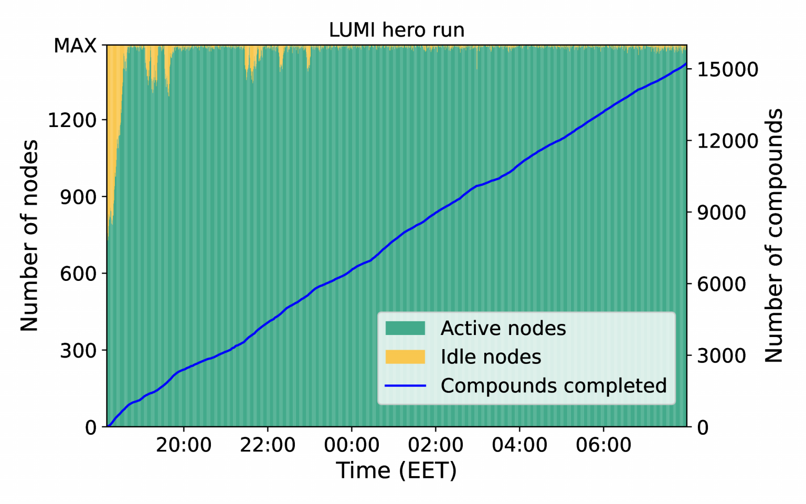

# LUMI-C hero run

Last friday night was our hero run on LUMI-C! We had exclusive access to the whole partition of 1500 nodes, using AiiDA to orchestrate 55704 Quantum ESPRESSO calculations which optimized the geometry of 15324 inorganic compounds in 13 hours.

Using the error recovery features implemented in the AiiDA workflows, 7887 issues were dealt with on the fly without any user intervention. It was a great demonstration of how AiiDA can robustly fill a pre-exascale machine while tracking the full history of each workflow in the provenance.

You can find more information about the new LUMI supercomputer here: <https://www.lumi-supercomputer.eu/>

