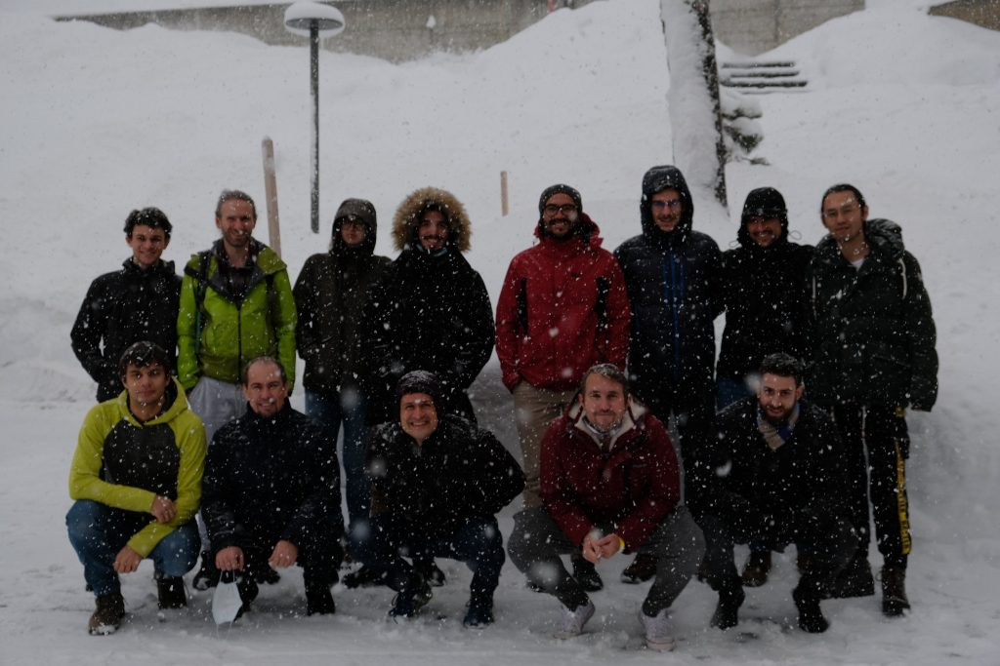
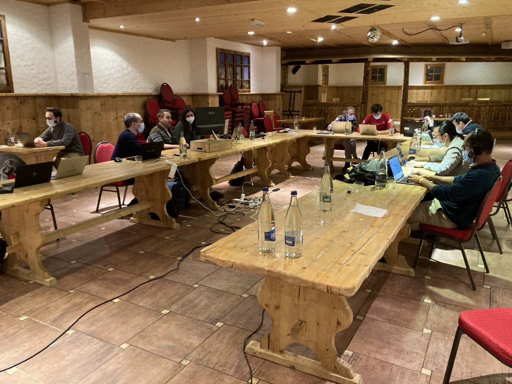

# Report from the AiiDA coding week – Dec 2021

Last week (6-10 Dec 2021) we had a coding week for AiiDA, in Leysin. About 10 people participated on-site and a few people participated online. Not only do had active participation by core AiiDA developers, but also by other developers who were interested in contributing to the platform. In addition, members from the Swiss supercomputing centre CSCS were present, and an outstanding presentation was contributed from Microsoft, introducing their use and extensions to the AiiDA ecosystem.

A few discussion or work topics had been identified before the start by the AiiDA team, and have been addressed during the week. In particular, the following topics have been discussed and the result has been summarised in a set of draft documents for later implementation:

- Overview and compare the different technologies we can use for task farming of jobs.
- Discuss the ways of moving the materials-science datatypes out of `aiida-core`.
- How push/pull for sharing AiiDA graphs with collaborators could work.
- The Web API for using AiiDA (AiiDA as a service).
- Discuss how to support an object-store backend for file repository.
- Plans to remove the dependency on rabbitmq from `aiida-core`.

A few discussions have also led to new branches of development, that will be soon merged into the develop branch (and appear in a future release):

- Supporting of setup and run of containerized code with AiiDA.
- Transport and scheduler support via the FirecREST REST API, developed at CSCS, as well as the hyperqueue “meta-scheduler” for task farming.
- Mechanism to lock profile access within AiiDA (v2)

Finally, the remaining work topics have been taking up a large part of the coding sessions, and most of the code has already been merged into the develop branch:

- Documenting the QueryBuilder endpoint of the `aiida-core` REST API and aiida-restapi package.
- Add a possibility to specify memory per node during the computer setup which can be used to automatically determine the number of nodes needed for a given calculation.
- Add `with_mpi` option to the code setup to allow setup a code that, for example, can’t be run with MPI.

We also discussed the pre-release time of the new major version of aiida-core, which hopefully will come out soon in early 2022.

Besides coding, participants had a lovely dinner at the “Le Leysin” restaurant on Tuesday evening, which was a great team-building opportunity. Participants have also enjoyed after-dinner sessions playing at pools and table tennis.

The outcomes of the week and the feedback from the participants indicate also that similar events should be organized again in the future, either online or on-site, with on-site participation being preferred if the situation permits.

