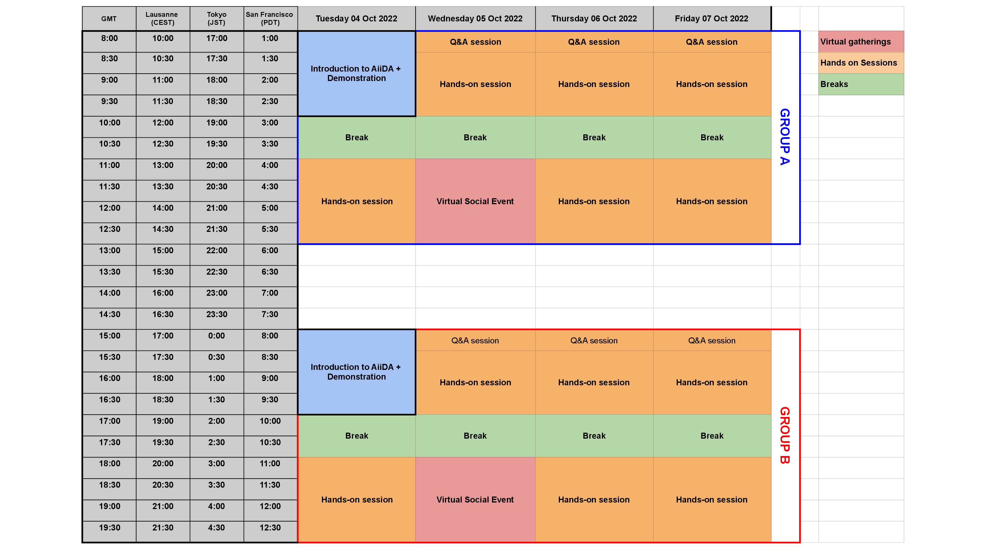
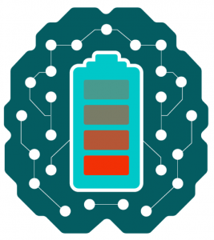

# AiiDA online demo and virtual tutorial 2022

The AiiDA team is excited to announce the 2022 edition of our introductory tutorial, now prefaced with a short demonstration of AiiDA’s capabilities in orchestrating workflows for materials science!

## Description

For this year’s edition, we are organising two events to introduce computational scientists to AiiDA:

- The event will start with a 2-hour online demonstration of AiiDA’s capabilities on October 4th 2022, _which can be attended separately without full participation in the tutorial_.
- The online tutorial will follow directly after the demonstration, spanning from 4-7 October 2022. In order to be able to provide ample interaction between tutors and participants, the number of participants in the tutorial is limited.

The goal of this 4 day-tutorial is to help students and researchers from the field of computational materials science get started with running and writing reproducible workflows. They will be introduced by experts in the field (including the developers of the code) to the use of AiiDA, and will gain in-depth hands-on experience using a tool that they can directly apply to their own research.

**Target Audience**: Computational scientists from both academia and industry are encouraged to apply. Experience with Python is required, but prior experience with AiiDA is not expected.

## Key Details

### Online demonstration

**When:** a 2-hour session on October 4th 2022, with two options to accommodate people from different time zones: 8:00-10:00 GMT and 15:00-17:00 GMT.

**Where:** Virtual Zoom Meeting, details will be communicated on October 1st.

**Registration:** Registration is free of charge, simply fill in the following (short) form before October 1st 2022:

[https://forms.gle/MjXi8Fb1rXquyETb8](https://forms.gle/MjXi8Fb1rXquyETb8)

### Virtual tutorial

**When**: 4-7 October 2022. Two time slots are organised for each hands-on session, as shown in the schedule below:

**Where:** Talks will be pre-recorded and made available to participants before the event. Hands-on tutorials will be held _via_ Zoom, with participants running the tutorial in their browser by accessing a multi-user AiiDAlab deployed on the [Azure Kubernetes Service](https://azure.microsoft.com/en-us/products/kubernetes-service/).

**Registration**: Registration is closed!

## Organisers

The tutorial is organised by Chris Sewell (EPFL, CH), Marnik Bercx (EPFL, CH) and Giovanni Pizzi (EPFL, CH).

Tutorial lectures and assistance during hands-on sessions will be provided by the organisers and a team of core AiiDA developers: Jusong Yu, Francisco Ramirez, Sebastiaan Huber, Flaviano dos Santos, and Carl Simon Adorf.

For general information concerning the tutorial you can contact Chris (chris.sewell@epfl.ch) or Marnik (marnik.bercx@epfl.ch).

## Funding

We are very grateful to our sponsors for helping to make this event possible:

The [MaX European Centre of Excellence,](http://www.max-centre.eu/) the [swissuniversities P-5 project “Materials Cloud”](https://www.materialscloud.org/swissuniversities), the [MARVEL National Centre of Competence in Research](http://nccr-marvel.ch/), the [H2020 MARKETPLACE project](https://www.the-marketplace-project.eu/), and the [BIG-MAP](https://www.big-map.eu/) project.
Computational resources on Azure were provided by [Microsoft Azure Quantum](https://azure.microsoft.com/en-us/products/quantum/).

:::{subfigure} 2
:layout-sm: 1
:gap: 1em

:::
