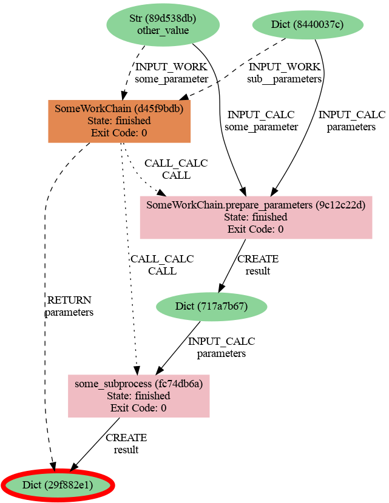

 ---
blogpost: true
category: Blog
tags: provenance
author: Sebastiaan Huber
date: 2023-11-01
---

# On provenance

One of the main defining characteristics of AiiDA is its focus on provenance.
It aims to provide its users with the necessary tools to preserve the provenance of data that is produced by automated workflows.
As a tool, AiiDA cannot enforce nor guarantee "perfect" provenance, but AiiDA simply encourages and enables its users to keep provenance as complete as possible and as detailed as necessary.
What this means exactly is not so much a technical question as it is a philosophical question, and is always going to be use-case specific.
In this blog post, I will discuss ideas concerning provenance that are hopefully useful to users of AiiDA when they are designing their workflows.
In the following, I assume that the reader is already familiar with the basic concept of provenance as it is implemented in AiiDA and explained [in the documentation](https://aiida.readthedocs.io/projects/aiida-core/en/latest/topics/provenance/concepts.html).

As mentioned in the introduction, the provenance that is kept by AiiDA is not "perfect".
That is to say, given a provenance graph created by AiiDA, it is not yet possible to fully reproduce the results in an automated way.
Although all the inputs to the various processes are captured, the computing environments in which those processes took place, are not fully captured.
AiiDA has the concepts of `Code`s and `Computer`s, which represent the code that processed the input and the compute environment in which it took place, but these are mere *symbolic* references.
The recently added support for container technologies ([added in v2.1](https://github.com/aiidateam/aiida-core/blob/main/CHANGELOG.md#support-for-running-code-in-containers)) has made a great step in the direction of making perfect provenance possible, but for the time being, we will have to be content with a limited version.

It is important to note though, that not having perfect provenance is not the end of the world.
Having any kind of provenance is often better than having not provenance at all.
We should be wary not to fall victim to a myopic provenance puritism and remind ourselves that tracking provenance is not a goal in and of itself.
Rather it is a solution to a particular problem: making computational results reproducible.

Imagine that we have some data: for the purpose of this example, we will take a simple dictionary.
This dictionary can be stored in AiiDA's provenance graph by wrapping it in a `Dict` node:
```python
from aiida import orm
dict1 = orm.Dict({'key': 'value'}).store()
dict2 = orm.Dict(dict1.get_dict())
dict2['key'] = 'other_value'
dict2.store()
dict2.get_dict()
>>> {'key': 'other_value'}
```
We can now generate the provenance of `dict2` using the following `verdi` command:
```console
verdi node graph generate <PK>
```
which generates the following image:


The updated dictionary appears isolated in the provenance graph: the fact that it was created by modifying another dictionary was not captured.
The simplest way to capture the modifications of data is by warpping it in a [`calcfunction`](https://aiida.readthedocs.io/projects/aiida-core/en/latest/topics/calculations/concepts.html#calculation-functions):
```python
from aiida import engine, orm
@engine.calcfunction
def update_dict(dictionary):
    updated = dictionary.get_dict()
    updated['key'] = 'other_value'
    return orm.Dict(updated)
dict1 = orm.Dict({'key': 'value'})
dict2 = update_dict(dict1)
dict2.get_dict()
>>> {'key': 'other_value'}
```
If we recreate the provenance graph for `dict2` in this example, we get something like the following:


The modification of the original `Dict` into another `Dict` has now been captured and is represented by the `update_dict` node in the provenance graph.
Given that the source code of the `update_dict` function is stored, together with the original input, the produced output `Dict` can now be reproduced.

Of course output nodes can, and very often will in real scenarios, be modified themselves and in turn become inputs to calculations:

```python
from aiida import engine, orm
@engine.calcfunction
def add_random_key(dictionary):
    import secrets
    token = secrets.token_hex(2)
    updated = dictionary.get_dict()
    updated[token] = token
    return orm.Dict(updated)
dict1 = orm.Dict()
dict2 = add_random_key(dict1)
dict3 = add_random_key(dict2)
dict3.get_dict()
>>> {'14b4': '14b4', '38f8': '38f8'}
```


From this follows that, as a general rule of thumb, tracking the provenance of _inputs_ is just as important as that of outputs.
However, in practice, there are pragmatic justifications for making an exception to this rule.
To demonstrate this, we need to consider a more complex example that more closely resembles real-world use cases.
For the following example, we imagine a workflow, implemented by a `WorkChain`, that wraps a subprocess.
The exact nature of the subprocess is irrelevant, so we take a very straightforward `calcfunction` that simply returns the same content of its input dictionary as a stand-in.
The workflow exposes the inputs of the subprocess, but _also_ adds a particular parameter as an explicit input.
This is typically done to make the workflow easier to use for users as in this way they don't have to know exactly where in the sub process' input namespace the parameter is supposed to go.


```{note}
For a concrete example, see the [`only_initialization` input](https://github.com/aiidateam/aiida-quantumespresso/blob/74bbaa22b383b3323fcc3d41ad5b82fa89895c92/src/aiida_quantumespresso/workflows/ph/base.py#L35) of the `PhBaseWorkChain` of the `aiida-quantumespresso` plugin.
```

```python
from aiida import engine, orm
@engine.calcfunction
def some_subprocess(parameters: orm.Dict):
    """Example subprocess that simply returns a dict with the same content as the ``parameters`` input."""
    return orm.Dict(parameters.get_dict())
class SomeWorkChain(engine.WorkChain):
    @classmethod
    def define(cls, spec):
        super().define(spec)
        spec.expose_inputs(some_subprocess, namespace='sub')
        spec.input('some_parameter', valid_type=orm.Str, serializer=orm.to_aiida_type)
        spec.outline(cls.run_subprocess)
        spec.output('parameters')
    def run_subprocess(self):
        inputs = self.exposed_inputs(some_subprocess, 'sub')
        parameters = inputs.parameters.get_dict()
        parameters['some_parameter'] = self.inputs.some_parameter.value
        inputs['parameters'] = parameters
        result = some_subprocess(**inputs)
        self.out('parameters', result)
inputs = {
    'sub': {
        'parameters': {
            'some_parameter': 'value',
        }
    },
    'some_parameter': 'other_value'
}
results, node = engine.run.get_node(SomeWorkChain, **inputs)
results['parameters'].get_dict()
>>> {'some_parameter': 'other_value'}
```


***Fig. 4**: The provenance graph generated by running `SomeWorkChain` where the modification of the input `parameters` is done in a work chain step and so is not explicitly captured.*


```python
from aiida import engine, orm

@engine.calcfunction
def some_subprocess(parameters: orm.Dict):
    """Example subprocess that returns a dict with the same content as `parameters` input."""
    return orm.Dict(parameters.get_dict())


class SomeWorkChain(engine.WorkChain):

    @classmethod
    def define(cls, spec):
        super().define(spec)
        spec.expose_inputs(some_subprocess, namespace='sub')
        spec.input('some_parameter', valid_type=orm.Str, serializer=orm.to_aiida_type)
        spec.outline(cls.run_subprocess)
        spec.output('parameters')

    @staticmethod
    @engine.calcfunction
    def prepare_parameters(parameters, some_parameter):
        parameters = parameters.get_dict()
        parameters['some_parameter'] = some_parameter.value
        return orm.Dict(parameters)

    def run_subprocess(self):
        inputs = self.exposed_inputs(some_subprocess, 'sub')
        inputs['parameters'] = self.prepare_parameters(
            inputs.pop('parameters'),
            self.inputs.some_parameter
        )
        result = some_subprocess(**inputs)
        self.out('parameters', result)


inputs = {
    'sub': {
        'parameters': {
            'some_parameter': 'value',
        }
    },
    'some_parameter': 'other_value'
}
results, node = engine.run.get_node(SomeWorkChain, **inputs)
results['parameters'].get_dict()
```

```{note}
Support for adding [process functions as class member functions](https://aiida.readthedocs.io/projects/aiida-core/en/latest/topics/processes/functions.html#as-class-member-methods) was added in AiiDA v2.3.
```


***Fig. 5**: The provenance graph generated by running `SomeWorkChain` where the modification of the input `parameters` is explicitly captured through the `prepare_parameters` function.*

Now the modification of the original input parameters `8440037c` is properly captured by the `prepare_parameters` function.
But this approach has a downside: the `calcfunction` that was introduced `_hard-codes` the key of the parameter that needs to be updated.
What if that key needs to be different?

We could simply make another function that updates another key.
However, this runs the risk that we will end up with a whole slew of trivial `calcfunctions` that make the code harder to read and that will have to be maintained.
An alternative would be to try to make the `calcfunction` more flexible, for example, by allowing to define the key as an input to the function:
```python
@engine.calcfunction
def prepare_parameters(parameters, key, some_parameter):
    parameters = parameters.get_dict()
    parameters[key.value] = some_parameter.value
    return orm.Dict(parameters)
```
But what if the `parameters` is a nested dictionary and the key to be replaced is in a subnamespace?
Or what if the value to replace is _itself_ a dictionary and it needs to either completely replace the existing key or recursively be merged into it?

We quickly see that it is not trivial to come up with a straightforward solution.
And this brings us back to the original question: why are we even doing this?
We are trying to wrap the input parameter modification in a `calcfunction` because _in general_ it is a good thing to keep provenance.
But we should remind ourselves that, as stated in the introduction, tracking provenance is a _means_ to an end, and not the goal itself.
The real goal is to capture all the necessary information to make it possible to retrace how data came into existence.

When we take a step back and look at the provenance graph of our example `SomeWorkChain`, the real output of interest is the final `Dict(297882e1)` output node.
The input parameters `Dict(717a7b67)` are also important, as that will have an influence on the output, however, exactly how that node came into existence does not really matter.
Imagine that `some_subprocess` would have been called directly, without a wrapping workflow, the input `parameters` would have been defined by the user and would _also_ appear out of thin air.

That being said, even in the case where the `parameters` are updated without an explicit `prepare_parameters` calcfunction, its origin is still captured _indirectly_ through the provenance of the `WorkChain`.

The situation can be summarized as follows:

* It is _possible_ to perfectly capture the modification of the input `parameters`
* However, depending on the exact use-case, this can require many (complex) `calcfunctions` which hurts readability and maintainability of the code
* Explicitly capturing parameters modification does not provide any additional valuable information in understanding the origin of the final output of interest

The conclusion in this particular example then is that the non-negligible cost of explicitly tracking the parameters' modification by the workflow is not worth the menial gain of information, if there even is any.
