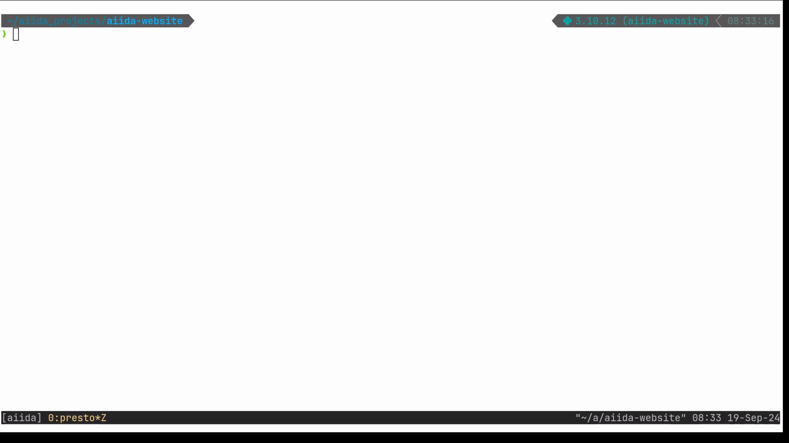
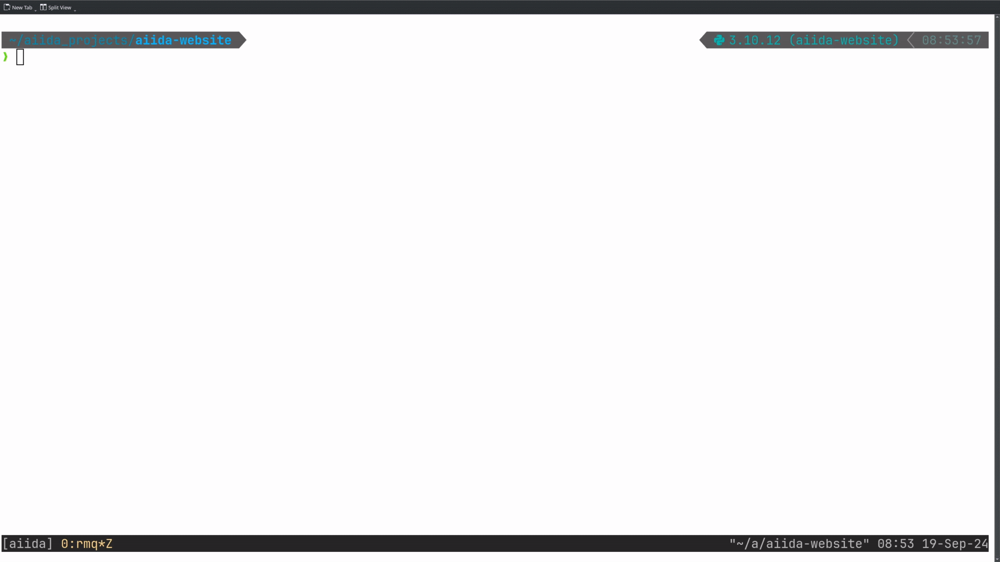

# Simplifications to the installation of AiiDA since v2.0

Dear users,

As we are always working hard to improve your experience with AiiDA, we would like to share with you some of the new
features aimed at user friendliness since the last major release v2.0. In this blog post, we will cover improvements to
the installation, so let's get started, shall we?

## Service-less AiiDA

_Get to a running AiiDA installation in seconds_

While `PostgreSQL` (PSQL) as database backend and `RabbitMQ` (RMQ) as message broker provide high-performance and
high-throughput capabilities, we have found over the years that their setup can pose an initial hurdle for new users.

Therefore, recent changes have made it possible to run AiiDA entirely without them[^1]. This can be achieved with the
new command `verdi presto`, which reduces the installation effort of AiiDA to a mere two commands:

```shell
pip install aiida-core
verdi presto
```

It only takes about 20 seconds, really:



As you can see in the video above, on running `verdi presto`, you are greeted with:

```shell
Report: Option `--use-postgres` not enabled: configuring the profile to use SQLite.
Report: RabbitMQ server not found (Failed to connect with following connection parameters: {'protocol': 'amqp', 'username': 'guest', 'password': 'guest', 'host': '127.0.0.1', 'port': 5672, 'virtual_host': ''}): configuring the profile without a broker.
Report: See https://aiida-core.readthedocs.io/en/stable/installation/guide_quick.html#quick-install-limitations for details on the limitations of running without a broker.
Report: Initialising the storage backend.
Report: Storage initialisation completed.
Success: Created new profile `presto`.
Success: Configured the localhost as a computer.
```

And after successfull profile creation, `verdi status` returns:

```shell
 ✔ version:     AiiDA v2.6.2
 ✔ config:      /home/aiidateam/aiida_projects/aiida-website/.aiida
 ✔ profile:     presto
 ✔ storage:     SqliteDosStorage[/home/aiidateam/aiida_projects/aiida-website/.aiida/repository/sqlite_dos_d2a4e83ea09141678de8ea4b2250fc69]: open,
 ⏺ broker:      No broker defined for this profile: certain functionality not available.
 ⏺ daemon:      No broker defined for this profile: daemon is not available.
```

`verdi presto`, by default, uses SQLite instead of PSQL, however, the latter can also be selected with
the `--use-postgres` flag.

In addition, the command works without RMQ, creating a profile without a
[broker](https://aiida.readthedocs.io/projects/aiida-core/en/latest/topics/processes/usage.html#manipulating-processes)
and [daemon](https://aiida.readthedocs.io/projects/aiida-core/en/stable/topics/daemon.html#daemon). If, instead, RMQ was
already available on the system[^2], it is automatically set up for your AiiDA profile, and the output of `verdi presto`
will be slightly different.

```shell
Report: Option `--use-postgres` not enabled: configuring the profile to use SQLite.
Report: RabbitMQ server detected: configuring the profile with a broker.
Report: Initialising the storage backend.
Report: Storage initialisation completed.
Success: Created new profile `presto`.
Success: Configured the localhost as a computer.
```

Now, assume you initially created your profile without RMQ, but would then like to upgrade: Worry not, you can still
configure it after profile creation, using:

```shell
verdi profile configure-rabbitmq
```

You can see the full process right here:



## New way to manually create a profile

`verdi presto` serves as a fully automated shortcut to create a profile. If you desire more fine-grained control,
e.g. over the database backend, you can also use the new command:

```shell
verdi profile setup
```

When run as shown above, the different storage backends will be listed[^3].

For instance, to set up a profile with SQLite, the command could be:

```shell
verdi profile setup core.sqlite_dos --profile-name aiida_rocks --email aiida_rocks@mail.com
```

Upon execution, you will be asked for the remaining options interactively:


Lastly, please note that the previous commands `verdi setup` and `verdi quicksetup` still work for now, but deprecation
warnings will be issued as we eventually plan to remove them.

**Have fun getting your feet wet! 🚀**

---

**Relevant PRs**

For the more tech-savvy among us, here are the most relevant PRs with the changes outlined in this blog post:

- [[#6023]](https://github.com/aiidateam/aiida-core/pull/6023) Add `verdi profile setup`
- [[#6148]](https://github.com/aiidateam/aiida-core/pull/6148) Add the `SqliteDosStorage` storage backend
- [[#6454]](https://github.com/aiidateam/aiida-core/pull/6454) CLI: Add the `verdi profile configure-rabbitmq` command

**Footnotes**

[^1]:
    It should be kept in mind, however, that these two changes come at the cost of lower performance, and should, at
    least for now, not be used in production (we are currently working on reducing possible limitations as much as
    possible). Rather, they are mainly intended for new users to get a running AiiDA instance quickly and be able to
    play around with the tool. The absence of the broker and daemon does not allow *submitting* of jobs, but only
    *running* them in a blocking manner (remote execution, e.g. on HPC resources, is still possible, though), and SQLite
    can handle concurrent writes to the database worse than PSQL.

[^2]:
    Installation should be fairly simple, e.g. via `sudo apt install rabbitmq-server` on Ubuntu.

[^3]:
    The [complete installation
    guide](https://aiida.readthedocs.io/projects/aiida-core/en/v2.6.2/installation/guide_complete.html) provides a
    concise overview of the simplified installation process using `verdi profile setup`. We also added a [dedicated
    section](https://aiida.readthedocs.io/projects/aiida-core/en/v2.6.2/topics/storage.html) to the
    documentation that gives an overview of the available database backends, and recommendations when to use which.
