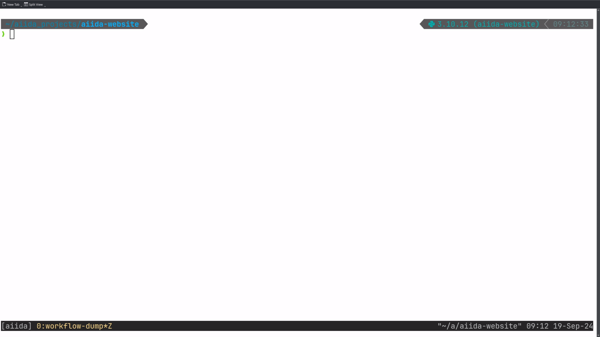

# Improvements in the ways to get your data out of AiiDA

Dear users, as the saying goes "Data is the Gold of the 21st Century", in today's blog post, we would like to showcase
improvements in how you can get your data out of AiiDA's internal storage. We hope that these new features will enrich
not only you, but also the science you conduct.

## Dumping process data to disk

_From AiiDA's internal storage to classical file trees_

As you might be aware, AiiDA uses an SQL
[database](https://aiida.readthedocs.io/projects/aiida-core/en/v2.6.2/topics/storage.html), as well as an internal [file
repository](https://aiida.readthedocs.io/projects/aiida-core/en/stable/topics/repository.html#repository) [^1] to store
your data locally [^2]. Both are optimized towards high performance and therefore constructed to be machine-readable
rather than human-readable. Hence, the difference between AiiDA's internal data storage and the typical file-system
approach (that most of us are familiar with) could make it cumbersome to get your data out of AiiDA on your file system
into an easily understandable form.

Therefore, you, the user, are effectively forced to use the `verdi` CLI interface or AiiDA's Python API (e.g. the
`QueryBuilder` class) to access your data, making the transition towards AiiDA more challenging. To ease this
transition, we have added functionality to dump AiiDA `Process` data to disk in an intuitive directory structure via:

```shell
verdi process dump <pk>
```

The following video shows the result of running the command for a `PwCalculation` that was used to execute the `pw.x`
executable of Quantum ESPRESSO:


And for a more complex `PwBandsWorkChain` (which actually contains the previously shown `PwCalculation` as one of its steps):



As you can see, the command works both for individual calculations and for nested workflows, resulting in
the following output directories [^3]:

**`tree` on a dumped example `CalcJob`**

```shell
dump-PwCalculation-54
├── README.md
├── inputs
│  ├── _aiidasubmit.sh
│  └── aiida.in
├── outputs
│  ├── _scheduler-stderr.txt
│  ├── _scheduler-stdout.txt
│  ├── aiida.out
│  └── data-file-schema.xml
└── node_inputs
   └── pseudos
      └── Si
         └── Si.pbesol-n-rrkjus_psl.1.0.0.UPF
```

**`tree -d ` on a dumped example `WorkChain`**

```shell
dump-PwBandsWorkChain-70
├── 01-relax-PwRelaxWorkChain
│  ├── 01-iteration_01-PwBaseWorkChain
│  │  ├── 01-create_kpoints_from_distance
│  │  │  └── inputs
│  │  └── 02-iteration_01-PwCalculation
│  │     ├── inputs
│  │     ├── node_inputs
│  │     │  └── pseudos
│  │     │     └── Si
│  │     └── outputs
│  └── 02-iteration_02-PwBaseWorkChain
│     ├── 01-create_kpoints_from_distance
│     │  └── inputs
│     └── 02-iteration_01-PwCalculation
│        ├── inputs
│        ├── node_inputs
│        │  └── pseudos
│        │     └── Si
│        └── outputs
├── 02-seekpath-seekpath_structure_analysis
│  └── inputs
├── 03-scf-PwBaseWorkChain
│  ├── ...
...
```

Therefore, after running the command once, you'll have all data involved in the execution of your workflow directly
accessible as a standard folder [^4]. This allows you to explore it with your favorite file explorer or command-line
tool.

So happy grepping!

## New QueryBuilder Syntax

_SQL queries, but intuitive!_

In addition to accessing raw files as outlined above, AiiDA's powerful SQL database allows querying for stored nodes,
which can be achieved with the `QueryBuilder` class (as documented
[here](https://aiida.readthedocs.io/projects/aiida-core/en/v2.6.2/howto/query.html)). While using the `QueryBuilder` is
(at least for most of us) easier than writing raw SQL queries, its syntax typically requires some familiarization [^5].

Recent improvements have therefore enabled an alternative, more intuitive way to construct queries. Let us explain with
the following example: Assume you wanted to obtain all integers with values in a range between 1 and 10 (both excluded)
from a `Group` called "integers". You'd have to construct the following, rather convoluted query:

```python
from aiida import orm

qb = orm.QueryBuilder()
qb.append(
    orm.Group,
    filters={
        "label": "integers",
    },
    project=["label"],
    tag="group",
)
qb.append(
    orm.Int,
    with_group="group",
    filters={
        "and": [
            {"attributes.value": {">": 1}},
            {"attributes.value": {"<": 10}},
        ]
    }
    project=["pk", "attributes.value"],
)
```

In the code snippet above, we first import AiiDA's [object-relational
mapping](https://en.wikipedia.org/wiki/Object%E2%80%93relational_mapping) (`orm`), and then instantiate the
`QueryBuilder` class. The query is then gradually built up by adding the desired specifications using the `append`
method. Here, we first apply filtering for groups that are labelled "integers" and tag this filter as "group" so that we
can link it with the second `append`. In this second call of the method, we only filter for integers of AiiDA's integer
data type (`orm.Int`) that are part of our previously defined group via `with_group="group"`. We then apply the filter
that the values of the integers should be in our desired range between 1 and 10, and, lastly, using
`project=["pk", "attributes.value"]`, we only return the primary keys and actual values of the AiiDA `orm.Int` nodes we
obtain from our query (rather than, say, the entire AiiDA `Node` instance).

Instead, the new QueryBuilder syntax allows one to access attributes of AiiDA nodes directly via the `.fields` specifier,
with which the filtering logic can be applied to them directly:

```python
from aiida import orm

qb = orm.QueryBuilder()
qb.append(
    orm.Group,
    filters=orm.Group.fields.label == "integers",
    project=[orm.Group.fields.label],
    tag="group",
)
qb.append(
    orm.Int,
    with_group="group",
    filters=(orm.Int.fields.value > 1) & (orm.Int.fields.value < 10),
    project=[orm.Int.fields.pk, orm.Int.fields.value],
)
```

Hence, for example the filter on the values of the integer nodes reduces from:

```python
filters={
    "and": [
        {"attributes.value": {">": 1}},
        {"attributes.value": {"<": 10}},
    ]
}
```

to the more concise:

```python
filters=(orm.Int.fields.value > 1) & (orm.Int.fields.value < 10),
```

in which the `"and"` condition can be expressed via the ampersand (`&`) and directly be applied on the relevant
entities. Furthermore, accessing through the `.fields` attribute, e.g. in the updated `project` specifier:

```python
project=[orm.Int.fields.pk, orm.Int.fields.value]
```

albeit being slightly more verbose, is less prone to errors than access via string identifiers in the previous version:

```python
project=["pk", "attributes.value"]
```

as it allows for autocompletion.

Any feedback on the new QueryBuilder syntax is welcome!

***

## Relevant PRs

For the more tech-savvy among us, here are the relevant PRs of the changes outlined in this blog post:

- [[#6276]](https://github.com/aiidateam/aiida-core/pull/6276) Add CLI command to dump inputs/outputs of `CalcJob`/`WorkChain`
- [[#6245]](https://github.com/aiidateam/aiida-core/pull/6245) ✨ NEW: Add `orm.Entity.fields` interface for `QueryBuilder`
  (cont.) [and linked PRs]

## Footnotes

[^1]:
    The file repository is based on the [`disk-objectstore`](https://github.com/aiidateam/disk-objectstore)
    implementation. If you ever wondered what the `_dos` appendix of the `core.psql_dos` and `core.sqlite_dos` storage
    backends means, now you know! 😉

[^2]:
    The discussion in the main text refers to the files and data stored by AiiDA on the local computer where AiiDA is
    installed, and which are preserved long-term in its internal file repository. These files are obtained, e.g. by
    retrieval from the _remote computer_ once a calculation finishes, or could be parsed data or inputs provided by the
    user. Instead, during the execution of your calculations _on a remote computer_, files are located in a subfolder of
    the `work_directory` of the used `Computer` (typically in the `scratch`), where the subfolder name is generated from
    the UUID of the AiiDA `CalculationNode`. This directory has a three-level depth, obtained by "sharding" the UUID
    based on the first characters. For istance, if the UUID is `6861d8fb-4694-46be-b0e6-7282989f069d`, the calculation
    will run in a subfolder named `68/61/d8fb-4694-46be-b0e6-7282989f069d`.

[^3]:
    The workflow is recursively traversed, and files are written to disk for each calculation (remember, it's the
    `Calculation` that actually creates the data, while the `Workflow` can only return it, as [outlined
    here](https://aiida.readthedocs.io/projects/aiida-core/en/v2.6.2/topics/processes/concepts.html#process-types)). In
    the `verdi process dump` feature, the subdirectory naming is automatically determined based on the iteration
    counter, the link label, and the class name, leading to a directory structure that mirrors the execution logic of
    the workflow.

[^4]:
    The `verdi process dump` feature is currently still actively developed to enable obtaining remote and stashed data
    entities, e.g., intermediate files of the workflow that weren't originally retrieved from the remote
    (high-performance) computer or data that was moved to tape. In addition, we are working on allowing to `dump` larger
    collections of data, such as groups, or even all data contained in an AiiDA profile, again, in an easily
    understandable folder structure. So stay tuned!

[^5]:
    Modern LLMs like ChatGPT and Claude can actually generate (somewhat correct) AiiDA `QueryBuilder` queries (at least
    with the syntax until their training data cutoff date), so they can serve as a good starting point.
