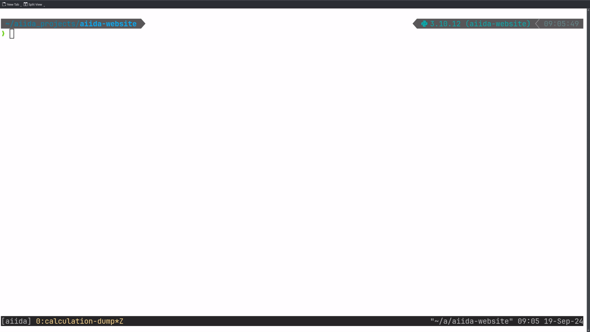

# Improvements in the ways to get your data out of AiiDA

Dear users, as the saying goes "Data is the Gold of the 21st Century", in today's blog post, we would like to showcase
improvements in how you can get your data out of AiiDA. We hope that these new features will enrich not only you, but
also the science you conduct.

## Dumping process data to disk

_From AiiDA's internal storage to classical file trees_

As you might be aware, AiiDA uses an SQL
[database](https://aiida.readthedocs.io/projects/aiida-core/en/v2.6.2/topics/storage.html), as well as an internal [file
repository](https://aiida.readthedocs.io/projects/aiida-core/en/stable/topics/repository.html#repository) [^1] to store
your data locally [^2].
Both are optimized towards high performance and the difference between the typical file-system approach most of us are
familiar with, and AiiDA's machine-readable internal data storage can make it difficult to get your data out of it in an
easily accessible way.

Therefore, you, the user, is effectively forced to use the `verdi` CLI interface or AiiDA's Python API (e.g. the `QueryBuilder`) to access your data, making
the transition towards AiiDA more challenging. Thus, to ease this transition, we have added functionality to dump AiiDA
`Process`es to disk in an intuitive directory structure via:

```shell
verdi process dump <pk>
```

The following video shows the result of running the command for a `PwCalculation` that was used to execute the `pw.x`
executable of Quantum ESPRESSO:



And for a more complex `PwBandsWorkChain` [^3]:


As you can see, the command works for both, individual calculations, as well as nested workflows [^4], resulting in
the following output directories:

**`tree` on a dumped example `CalcJob`**

```shell
dump-PwCalculation-54
├── README.md
├── inputs
│  ├── _aiidasubmit.sh
│  └── aiida.in
├── outputs
│  ├── _scheduler-stderr.txt
│  ├── _scheduler-stdout.txt
│  ├── aiida.out
│  └── data-file-schema.xml
└── node_inputs
   └── pseudos
      └── Si
         └── Si.pbesol-n-rrkjus_psl.1.0.0.UPF
```

**`tree -d ` on a dumped example `WorkChain`**

```shell
dump-PwBandsWorkChain-70
├── 01-relax-PwRelaxWorkChain
│  ├── 01-iteration_01-PwBaseWorkChain
│  │  ├── 01-create_kpoints_from_distance
│  │  │  └── inputs
│  │  └── 02-iteration_01-PwCalculation
│  │     ├── inputs
│  │     ├── node_inputs
│  │     │  └── pseudos
│  │     │     └── Si
│  │     └── outputs
│  └── 02-iteration_02-PwBaseWorkChain
│     ├── 01-create_kpoints_from_distance
│     │  └── inputs
│     └── 02-iteration_01-PwCalculation
│        ├── inputs
│        ├── node_inputs
│        │  └── pseudos
│        │     └── Si
│        └── outputs
├── 02-seekpath-seekpath_structure_analysis
│  └── inputs
├── 03-scf-PwBaseWorkChain
│  ├── ...
...
```

Therefore, after running the command once, you'll have all data involved in the execution of your workflow directly
accessible, and can explore it with the Unix command line utilities we all know and love [^5].

So happy grepping!

## New QueryBuilder Syntax

_SQL queries, but intuitive!_

In addition to accessing raw files as outlined above, AiiDA's powerful SQL database allows querying for stored
`Node`s, which can be achieved with the `QueryBuilder` (as documented
[here](https://aiida.readthedocs.io/projects/aiida-core/en/v2.6.2/howto/query.html)). While using the `QueryBuilder` is
(at least for most of us) easier than writing raw SQL queries, its syntax usually requires some familiarization [^6].

Recent improvements have therefore enabled an alternative, more intuitive way to construct queries. Let us explain with
the following example: Assume you wanted to obtain all integers with `pk`s in a range between 1 and 10 (both excluded)
from a `Group` called "integers". You'd have to construct the following, rather convoluted query:

```python
from aiida import orm

qb = orm.QueryBuilder()
qb.append(
    orm.Group,
    filters={
        "label": "integers",
    },
    project=["label"],
    tag="group",
)
qb.append(
    orm.Int,
    with_incoming="group",
    filters={"and": [{"pk": {">": 1}}, {"pk": {"<": 10}}]},
    project=["pk", "attributes.value"],
)
```

With the new syntax, `Node` `attribute`s are directly accessible via the `.fields` specifier and, as such, the logic can be applied to them directly:

```python
from aiida import orm

qb = orm.QueryBuilder()
qb.append(
    orm.Group,
    filters=orm.Group.fields.label == "integers",
    project=[orm.Group.fields.label],
    tag="group",
)
qb.append(
    orm.Int,
    with_incoming="group",
    filters=(orm.Int.fields.pk > 1) & (orm.Int.fields.pk < 10),
    project=[orm.Int.fields.pk, orm.Int.fields.value],
)
```

Through this, for example the filter on the values of the `pk`s reduces from:

```python
filters={
    "and": [
        {"pk": {">": 1}},
        {"pk": {"<": 10}},
    ]
}
```

to the more concise:

```python
filters=(orm.Int.fields.pk > 1) & (orm.Int.fields.pk < 10),
```

in which the `"and"` condition can be expressed via `&` and applied on the relevant entities. Furthermore,
accessing through the `.fields` attribute, e.g. in the updated `project`ion:

```python
project=[orm.Int.fields.pk, orm.Int.fields.value]
```

albeit being more verbose, is less error-prone than the access via string identifiers in the previous version:

```python
project=["pk", "attributes.value"]
```

as it allows for autocompletion.

Any feedback on the new QB syntax welcome!

***

## Relevant PRs

For the more tech-savvy among us, here are the relevant PRs of the changes outlined in this blog post:

- [[#6276]](https://github.com/aiidateam/aiida-core/pull/6276) Add CLI command to dump inputs/outputs of `CalcJob`/`WorkChain`
- [[#6245]](https://github.com/aiidateam/aiida-core/pull/6245) ✨ NEW: Add `orm.Entity.fields` interface for `QueryBuilder`
  (cont.) [and linked PRs]

## Footnotes

[^1]:
    The file repository is based on the [`disk-objectstore`](https://github.com/aiidateam/disk-objectstore)
    implementation. If you ever wondered what the `_dos` appendix of the `core.psql_dos` and `core.sqlite_dos` storage
    backends means, now you know! 😉

[^2]:
    While your workflows are being executed on the remote computer, files are located in a three level hierarchical
    directory structure under the `work_directory` of the given `Computer` (typically in the `scratch`), with folder names
    based on the universally unique identifiers (UUIDs) of the corresponding AiiDA `CalculationNode`s. For instance, if
    the UUID of your `CalculationNode` is `6861d8fb-4694-46be-b0e6-7282989f069d`, your files will be in
    `68/61/d8fb-4694-46be-b0e6-7282989f069d`. Tip: The `verdi calcjob gotocomputer <pk>` command provides a simple way to enter a
    shell session in the remote working directory of your calculation.

[^3]:
    Which actually contains the previous `PwCalculation` as one of its steps.

[^4]:
    The workflow is recursively traversed, and files are written to disk for each calculation. The subdirectory naming is
    automatically determined and based on the iteration counter, the link label, and the class name.

[^5]:
    The `dump`ing feature is currently still actively developed to enable obtaining remote and stashed data entities (e.g., intermediate files of the workflow that weren't originally retrieved from the HPC), as well as allowing for
    `dump`ing of larger collections of data, such as groups, or even all data contained in an AiiDA profile, in an
    understandable structure. So stay tuned!

[^6]:
    Modern LLMs like ChatGPT and Claude can actually generate (somewhat correct) AiiDA `QueryBuilder` queries (at least
    with the syntax until their training data cutoff date), so they can serve as a good starting point.
