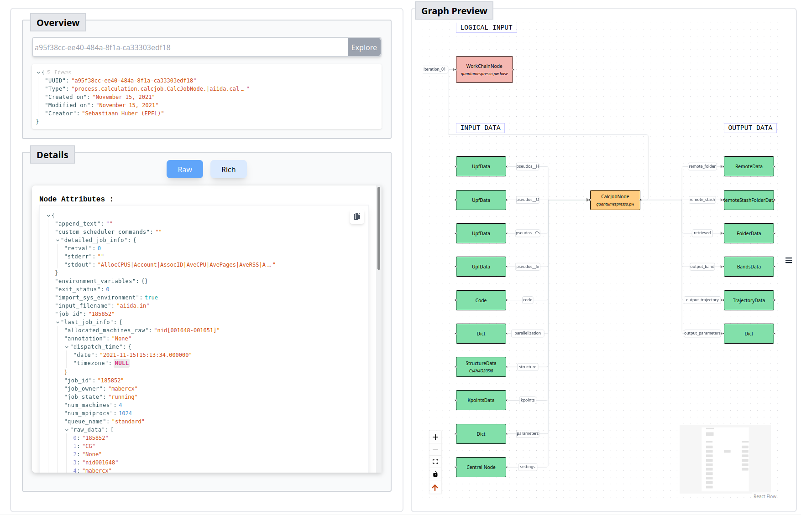

# AiiDA at Google Summer of Code 2024

We are proud to announce that AiiDA has successfully participated (under the [NumFOCUS](https://numfocus.org/) organization umbrella).
Our summer student [Sharan Poojari](https://github.com/SharanRP) built a prototype for a [next-generation web-based AiiDA provenance explorer](https://github.com/aiidateam/aiida-explorer).

Thank you, Sharan!

For more details of the outcome, see the [project report](https://github.com/aiidateam/aiida-explorer/blob/gsoc/gsoc/README.md).

