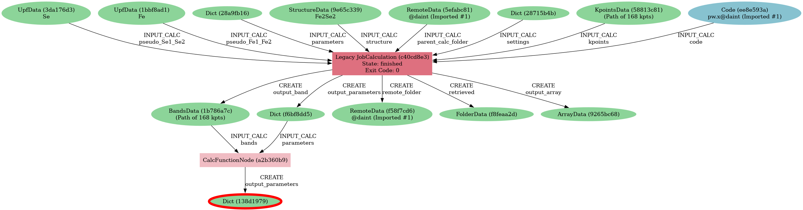

# Exploring an AiiDA Database You Didn't Create

New AiiDA users may find themselves excited to explore scientific data generated through AiiDA (in the form of an exported AiiDA database — an AiiDA archive), but might not know how to. Therefore, in this blog post, we illustrate how data can be explored systematically for an AiiDA database published on the [Materials Cloud Archive](https://archive.materialscloud.org), titled ["Two-dimensional materials from high-throughput computational exfoliation of experimentally known compounds"](https://archive.materialscloud.org/record/2024.157).
This database contains a collection of two-dimensional materials, and, for a select subset, it includes calculated values of various properties, such as electronic band structures and their associated band gaps.

To demonstrate how to start from an unfamiliar database, understand its layout, and query for a particular property, we set a goal for this blog post to filter the materials contained in the AiiDA database based on their band gaps and create a corresponding table.
We hope this will give you guidance on how to apply and extend queries for your own needs.

Note that while this is a curated database, meaning that it has supplementary metadata provided to help understand it, most of this blog post also applies to uncurated AiiDA archives.

## Setup

This analysis can be run with AiiDA v2+. One possibility to quickly get started is to use the [Quantum Mobile](https://quantum-mobile.readthedocs.io/) virtual machine. Currently the latest version is 24.04.0, which has `aiida-core` v2.4.3 available. Alternatively, you can install AiiDA on your local machine by simply running:

```bash
pip install aiida-core
verdi presto
```

and you're good to go (check also [our recent blog post](https://aiida.net/news/posts/2024-09-20-simpler-installation.html) on the different routes to install AiiDA locally).

In addition, you will also need to download the AiiDA archive `two_dimensional_database.aiida` from [the corresponding Materials Cloud Archive entry](https://archive.materialscloud.org/record/2024.157), which can also be done via wget:

```bash
$ wget 'https://archive.materialscloud.org/record/file?record_id=2396&filename=two_dimensional_database.aiida' -O two_dimensional_database.aiida
```

Next, we need to make the archive data available for the AiiDA environment, and there are two possibilities for this. The first and traditional way is to [set up an AiiDA profile](https://aiida.readthedocs.io/projects/aiida-core/en/v2.6.2/installation/guide_quick.html#quick-installation-guide) and import the archive data with

```bash
$ verdi archive import two_dimensional_database.aiida
```

However, we can also set up a read-only profile directly from an archive file. As we just want to investigate and analyze the contents without modifying or extending the data, this is more suitable for our current use case.

```bash
$ verdi profile setup core.sqlite_zip --filepath two_dimensional_database.aiida
```

It's also important to note that this profile is running on the `core.sqlite_zip` storage backend, that can have [some limitations for some queries](https://aiida.readthedocs.io/projects/aiida-core/en/stable/topics/storage.html), but these don't affect the analysis of this blog post.


## Finding band gap nodes

As our goal is to filter materials based on their band gaps, the first step is to find at least one AiiDA node (i.e. its universally unique identifier (UUID)) that contains the band gap value. Based on this we can later see how the data is organized relative to the structure node, which will help us write the AiiDA query to collect and filter based on all band gap values for all materials. Let's first have a look in a non-programmatic way.

### Using supplementary metadata

When AiiDA databases are published, it is recommended that authors provide a supplementary metadata file to help users understand how data is internally linked together. For this current dataset, this is the case, as the authors have provided `structures.json` (inside the tar `2D_materials.tar.gz` from the [published entry](https://archive.materialscloud.org/record/2024.157)), which contains a list of all the computationally investigated structures, together with AiiDA UUID values for corresponding calculated properties. Here's an excerpt from that file:

```json
[
    {
        // ...
        "relaxed_2D_structure_uuid": "ba8bbdd9-defc-4292-af7d-ed3eb73f778e",
        "formula_reduced": "AgBr",
        "band_gap": 1.3,
        "bands_uuid": "7fbb633d-a224-46b7-84b1-74a3ceca81e0",
        // ...
    },
    // ...
]
```
where we can see for the silver bromide (AgBr) the AiiDA UUIDs for the relaxed structure itself and the bands property that we want to analyse (the band gap node is a close descendent of this node). This information is enough to continue to the next section, but let's also explore alternative ways to obtain it.

### Direct investigation of the AiiDA archive

If there is no supplementary metadata file available, one can also directly investigate the data and its layout.

First, we can check the AiiDA groups:

```bash
$ verdi group list --all-users
  PK  Label                                   Type string    User
----  --------------------------------------  -------------  -----------------------
  11  two_dimensional_database_2D_bandgaps    core           aiida@theossrv5.epfl.ch
  10  two_dimensional_database_2D_bands       core           aiida@theossrv5.epfl.ch
   6  two_dimensional_database_2D_phonons     core           aiida@theossrv5.epfl.ch
...
```

We see we have a group containing the band gap nodes. How convenient! To obtain more information, we can use the interactive AiiDA shell as a quick helper:

```bash
$ verdi shell
```

and then retrieve the UUID of the first band gap node from the group via:

```python
In [1]: g = load_group("two_dimensional_database_2D_bandgaps")
In [2]: list(g.nodes)[0]
Out[2]: <Dict: uuid: 138d1979-4aca-4a23-af18-38c707707585 (pk: 273)>
```

Finally, if the original AiiDA database author has not even provided groups, one could still write various custom [AiiDA queries](https://aiida.readthedocs.io/projects/aiida-core/en/v2.6.2/howto/query.html) that would allow one to find the band gap node (e.g. one could query for a specific type of Quantum Espresso calculation), but this is out of the scope of this blog post.


## Manually browsing the database

Now that we have identified a band gap (or a band structure) node, let's see the various ways to explore the AiiDA provenance graph around it.

Let's open the AiiDA interactive shell:

```bash
$ verdi shell
```

We start by performing some browsing using the AiiDA API to explore the properties and connections of the selected node.

1. Load the node by using its UUID (note that the integer identifiers, called "primary keys" (PKs), will most probably be different in your DB, but the UUIDs will always be the same):

    ```python
    In [1]: bandgap_node = load_node('138d1979-4aca-4a23-af18-38c707707585')
    In [2]: bandgap_node
    Out[2]: <Dict: uuid: 138d1979-4aca-4a23-af18-38c707707585 (pk: 692)>
    ```

2. One can check the attributes and discover that the band gap is in eV and is stored in the attribute named `band_gap` (knowing that the parser always returns eV, we are not going to use the units in the following, but one could generalise the query later if necessary). Note that the current node corresponds to a metal and we also see how this is represented.

    ```python
    In [3]: bandgap_node.attributes
    Out[3]: {'is_insulator': False, 'band_gap': None, 'band_gap_units': 'eV'}
    ```

3. We start inspecting the provenance using the `.creator` method to get the calculation that generated the `Dict` data node:

    ```python
    In [4]: calculation_node = bandgap_node.creator
    In [5]: calculation_node
    Out[5]: <CalcFunctionNode: uuid: a2b360b9-4151-4917-b20d-6cde95ae5548 (pk: 45604)>
    ```


4. Then we can use `.inputs.LABEL_NAME` to access any of the inputs of this calculation. In our case, we will be interested in the one labeled `bands` (note that you can use tab completion to discover all input link labels: after `.inputs.` press the TAB key twice to see all available labels):

    ```python
    In [6]: bands_node = calculation_node.inputs.bands
    In [7]: bands_node
    Out[7]: <BandsData: uuid: 1b786a7c-639d-4fe4-a6e1-d0ac5b71bd39 (pk: 2829)>
    ```

5. In the same way we did before, we can now check the calculation that created this `BandsData` node (i.e., the band structure), to discover that it was a Quantum ESPRESSO run:

    ```python
    In [8]: qecalc_node = bands_node.creator
    In [9]: qecalc_node
    Out[9]: <CalcJobNode: uuid: c40cd8e3-638b-404e-b902-4377af810276 (pk: 18737) (aiida.calculations:quantumespresso.pw)>
    ```

6. Finally, we can check another input one level up to find the original crystal structure:

    ```python
    In [10]: qecalc_node.inputs.structure
    Out[10]: <StructureData: uuid: 9e65c339-2428-4fb1-8d75-a54da9f87879 (pk: 43956)>
    ```

    Note that we don't really need all of the intermediate node variables.
    We did it mostly for demonstration, but all of these steps can just be concatenated in a single long chain, as follows:

    ```python
    In [11]: bandgap_node.creator.inputs.bands.creator.inputs.structure
    Out[11]: <StructureData: uuid: 9e65c339-2428-4fb1-8d75-a54da9f87879 (pk: 43956)>
    ```

    The advantage of the long string above is that after every dot you can use tab completion. Therefore, it can become very quick to browse advanced provenance graphs in the verdi shell and find the data you seek.

    One more thing one might want to do is to check if there is a better way to distinguish the `CalcFunctionNode` obtained at `Out[5]` above (stored in `calculation_node = bandgap_node.creator`).
    Let us check its attributes:

    ```python
    In [12]: bandgap_node.creator.attributes.keys()
    Out[12]: dict_keys(['first_line_source_code', 'source_code', 'source_file', 'function_name', 'sealed'])
    In [13]: bandgap_node.creator.attributes['function_name']
    Out[13]: 'get_bandgap_inline'
    ```

    This information will be useful in the following section, and will basically allow us to perform a query by filtering by the original function name.

Now, after these steps, we have a better understanding of the the structure of the data.
Another useful tool to get a good idea of the connectivity is the graph generator.
One can use `verdi node graph generate` to visualize the provenance surrounding a node.
Limiting it to four levels up (ancestors) will be enough for this case; we will also avoid showing any descendants, since we are not interested here in calculations that used the data node as an input.
Note that this command is a normal terminal command, so it has to be executed outside of the verdi shell.

```bash
$ verdi node graph generate --process-in --process-out --ancestor-depth=4 --descendant-depth=0 138d1979-4aca-4a23-af18-38c707707585
```

The result should look something like this:



## Systematic querying of the database

Now that we have understood broadly the data layout (provenance links between nodes, their types, and some of the relevant attributes keys and values), let's now construct a query using the QueryBuilder in order to get the band structures of a set of 2D materials.
Create a new text file and copy the content below (these are essentially python scripts, so you can use the `.py` extension).
There are some comments which explain the purpose of each line of code, please read them carefully to understand how the query is constructed.
If you are not familiar with the `QueryBuilder`, we refer to the [official AiiDA documentation for more details](https://aiida.readthedocs.io/projects/aiida-core/en/v2.6.2/howto/query.html).

```python
from aiida.orm import QueryBuilder, Dict, CalculationNode, BandsData, StructureData

# Create a new query builder object
qb = QueryBuilder()

# I want, in the end, the 'band_gap' property returned ("projected")
# This is in the attributes of the Dict node
# As an additional challenge, I also want to filter them and get only those where the band gap (in eV) is < 0.5
qb.append(
    Dict,
    project=['attributes.band_gap'],
    filters={'attributes.band_gap': {'<': 0.5}},
    tag='bandgap_node'
)

# This node must have been generated by a CalcFunctionNode (so, with outgoing link the node of the previously
# part, that we tagged as `bandgap_node`, and I only want those where the
# function name stored in the attributes is 'get_bandgap_inline'
qb.append(
    CalcFunctionNode,
    filters={'attributes.function_name': 'get_bandgap_inline'},
    with_outgoing='bandgap_node',
    tag='bandgap_calc'
)

# One of the inputs should be a BandsData (band structure node in AiiDA)
qb.append(BandsData, with_outgoing='bandgap_calc', tag='band_structure')

# This should have been computed by a calculation (we know it's always Quantum ESPRESSO
# in this specific DB, so I don't add more specific filters, but I could if I wanted to)
qb.append(CalculationNode, with_outgoing='band_structure', tag='qe')

# I want to get back the input crystal structure, and I want to get back
# the whole AiiDA node (indicated with '*') rather than just some attributes
qb.append(StructureData, with_outgoing='qe', project='*')

# So, now, summarizing, I have decided to project on two things: the band_gap and the structure node.
# I iterate on the query results, and I will get the two values for each matching result.
for band_gap, structure in qb.all():
    print("Band gap for {}: {:.3f} eV".format(structure.get_formula(), band_gap))
```

With essentially just 8 lines of Python code (apart from the imports), one is able to perform a query that will return all the structures (and band gaps) that are below a 0.5 eV threshold, but still with a finite gap (remeber, for metals, the current database sets `'band_gap': None`, as we saw above).
You can now execute the script by running

```bash
$ verdi run <script_name>
```

Here is the output you should obtain if you only have the 2D materials database in your profile.

```bash
Band gap for I4Zr2: 0.416 eV
Band gap for Br2Nd2O2: 0.308 eV
Band gap for Br2Cr2O2: 0.448 eV
Band gap for Br4O2V2: 0.108 eV
Band gap for Cl2La2: 0.003 eV
Band gap for Cl2Co: 0.029 eV
Band gap for CdClO: 0.217 eV
Band gap for Cl2Er2S2: 0.252 eV
Band gap for Cl4O2V2: 0.010 eV
Band gap for CdClO: 0.251 eV
Band gap for GeI2La2: 0.369 eV
Band gap for Se2Zr: 0.497 eV
Band gap for Cu4Te2: 0.207 eV
Band gap for Br2Cr2S2: 0.441 eV
Band gap for Co2H4O4: 0.014 eV
Band gap for Cl2Er2S2: 0.252 eV
Band gap for Br2Co: 0.039 eV
Band gap for I2Ni: 0.295 eV
Band gap for I2N2Ti2: 0.020 eV
Band gap for Cl2Cu: 0.112 eV
Band gap for Cl2O2Yb2: 0.006 eV
Band gap for Cl2O2Yb2: 0.006 eV
Band gap for Br2Co: 0.196 eV
Band gap for C2: 0.000 eV
Band gap for Cl2La2: 0.008 eV
Band gap for Br2Nd2O2: 0.002 eV
Band gap for I2O2Pr2: 0.030 eV
Band gap for Cl2Co: 0.171 eV
Band gap for Cl2Cu: 0.158 eV
Band gap for Cl2Er2S2: 0.203 eV
Band gap for Br2Cr2S2: 0.427 eV
Band gap for S2Ti: 0.059 eV
Band gap for Br2Cr2O2: 0.486 eV
Band gap for I2Ni: 0.319 eV
```

Now that you have learnt how to create such a query, we invite you to have more fun, adding additional statements before the final call to `qb.all()`.
Here a couple of examples:

- You can check that the input code of the `qe` calculation was indeed a using the Quantum ESPRESSO plugin (`quantumespresso.pw`):

    ```python
    qb.append(Code, with_outgoing='qe', filters={'attributes.input_plugin': 'quantumespresso.pw'})
    ```

- You can project back also the total running time (wall time) of the Quantum ESPRESSO calculation (it is in an output node with link label `output_parameters`).
  For this you need to add a third element to the tuple when looping over `.all()`:

    ```python
    qb.append(Dict, with_incoming='qe', edge_filters={'label':'output_parameters'}, project=['attributes.wall_time_seconds'])

    (...)

    for band_gap, structure, walltime in qb.all():
        print("Band gap for {}: {:.3f} eV (walltime = {}s)".format(structure.get_formula(), band_gap, walltime))
    ```


## Behind the scenes

As an extra comment, we strongly suggest using the QueryBuilder rather than going directly into the SQL database, even if you know SQL.
We have spent significant efforts in making the QueryBuilder interface as easy to use as possible, and taken care ourselves of converting this into the corresponding SQL.
Just for reference, if you do `print(qb.as_sql())` you get the corresponding SQL statement for the query above, that should translate to the following not-so-short string:

```sql
SELECT db_dbnode_1.attributes #> '{band_gap}' AS anon_1, db_dbnode_2.uuid, db_dbnode_2.attributes, db_dbnode_2.id, db_dbnode_2.extras, db_dbnode_2.label, db_dbnode_2.mtime, db_dbnode_2.ctime, db_dbnode_2.node_type, db_dbnode_2.process_type, db_dbnode_2.description, db_dbnode_2.user_id, db_dbnode_2.dbcomputer_id
FROM db_dbnode AS db_dbnode_1 JOIN db_dblink AS db_dblink_1 ON db_dblink_1.output_id = db_dbnode_1.id JOIN db_dbnode AS db_dbnode_3 ON db_dblink_1.input_id = db_dbnode_3.id JOIN db_dblink AS db_dblink_2 ON db_dblink_2.output_id = db_dbnode_3.id JOIN db_dbnode AS db_dbnode_4 ON db_dblink_2.input_id = db_dbnode_4.id JOIN db_dblink AS db_dblink_3 ON db_dblink_3.output_id = db_dbnode_4.id JOIN db_dbnode AS db_dbnode_5 ON db_dblink_3.input_id = db_dbnode_5.id JOIN db_dblink AS db_dblink_4 ON db_dblink_4.output_id = db_dbnode_5.id JOIN db_dbnode AS db_dbnode_2 ON db_dblink_4.input_id = db_dbnode_2.id
WHERE CAST(db_dbnode_5.node_type AS VARCHAR) LIKE 'process.calculation.%%' AND CAST(db_dbnode_4.node_type AS VARCHAR) LIKE 'data.array.bands.%%' AND CAST(db_dbnode_2.node_type AS VARCHAR) LIKE 'data.structure.%%' AND CAST(db_dbnode_1.node_type AS VARCHAR) LIKE 'data.dict.%%' AND CASE WHEN (jsonb_typeof(db_dbnode_1.attributes #> %(attributes_1)s) = 'number') THEN CAST((db_dbnode_1.attributes #>> '{band_gap}') AS FLOAT) < 0.5 ELSE false END AND CAST(db_dbnode_3.node_type AS VARCHAR) LIKE 'process.calculation.%%' AND CASE WHEN (jsonb_typeof(db_dbnode_3.attributes #> %(attributes_2)s) = 'string') THEN (db_dbnode_3.attributes #>> '{function_name}') = 'get_bandgap_inline' ELSE false END
```

So unless you feel ready to tackle this, we suggest that you stick with the simpler QueryBuilder interface!


## Materials Cloud discover section

We mentioned at the start of the post that this is a curated AiiDA database and discussed how it has an author-provided metadata file in JSON format available. However, that is not the only supplementary metadata for this AiiDA database. For a selection of AiiDA studies, the [Materials Cloud](https://www.materialscloud.org/) hosts Discover sections - curated web interfaces to browse the AiiDA data in an accessible manner. This current AiiDA database that this blog explores, contributes to the [Materials Cloud 2D crystals Discover section](https://www.materialscloud.org/discover/mc2d/).
In this web interface, one can find materials, get access to their available calculated properties, as well  as to information on the provenance of such properties. Note, however, that the Discover section also contains data from other AiiDA databases, so for exploring this specific AiiDA database, one would need to find a material that originates from it.

As the last step on this journey, to illustrate on how to find the band gap UUID of silver bromide (AgBr) that we were looking for earlier as well, let's access the details page of AgBr in the main interface. You can then use the Explore button (the little AiiDA icon) next to the text `Band gap [eV]: 1.3` to go to the corresponding [actual AiiDA node](https://www.materialscloud.org/explore/mc2d/details/89315c33-2f9b-41ab-b7d4-22aff0ae75f4) in the web AiiDA provenance explorer.
This will also provide you with the same UUID as we obtained above (`89315c33-2f9b-41ab-b7d4-22aff0ae75f4`).
Similarly, you can click on the Explore button next to the band structure plot to inspect the `BandsData` node, and so on.
We invite you to browse the Discover and Explore sections for this database on you own, to get an idea of the features offered by the Materials Cloud interface.

Thank you for reading this blog post and have fun exploring AiiDA!
