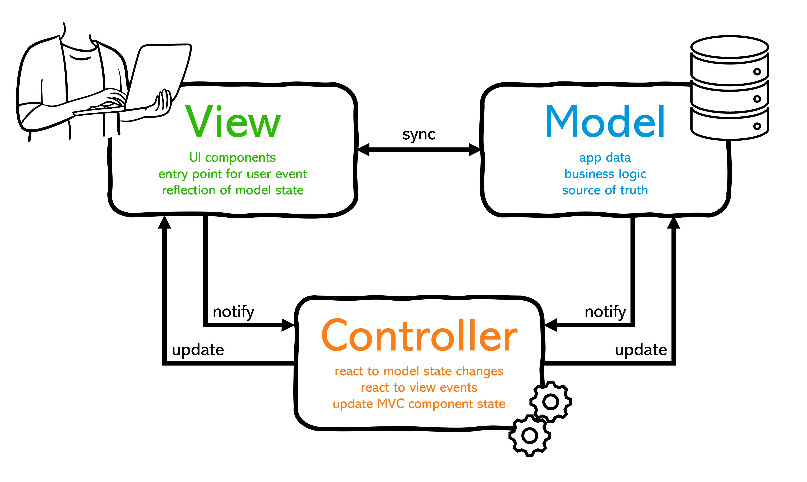
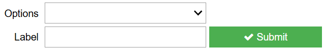
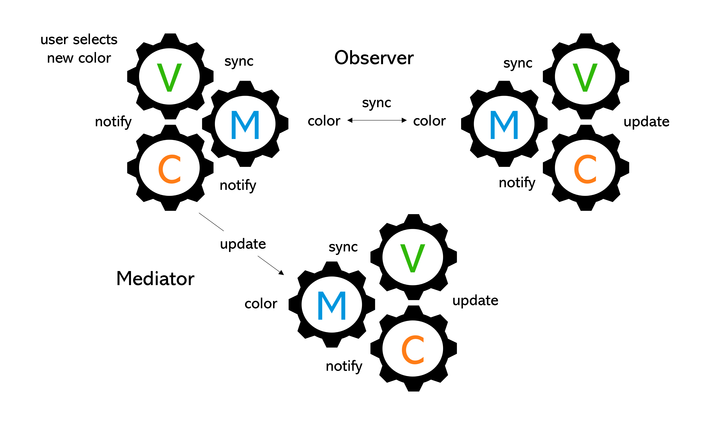

# Design principles for AiiDAlab apps

For computational scientists, AiiDA can provide such benefits as workflow automation, HPC integration, and full provenance tracking. However, performing materials simulations may not be immediately accessible to experimentalists with little to no knowledge of the underlying theories.

To remove this barrier, we've developed [AiiDAlab](https://www.aiidalab.net/), a Jupyter Notebook environment with out-of-the-box AiiDA support on which dedicated user interfaces (UIs) can be developed to abstract the complexities and facilitate the use of materials discovery through computation.


For example, a growing feature set from [Quantum ESPRESSO](https://www.quantum-espresso.org/), a popular open-source package for performing materials simulations, has been made accessible through the [Quantum ESPRESSO AiiDAlab app](https://aiidalab-qe.readthedocs.io/) developed hand-in-hand with input and feedback from experimentalists. Similar apps developed along side experimentalists can be found at the [AiiDAlab application registry](https://aiidalab.github.io/aiidalab-registry/).

Guides for the installation, setup, and usage of AiiDAlab can be found on the [official site](https://www.aiidalab.net/), which also includes basic guidelines for [developing AiiDAlab apps](https://aiidalab.readthedocs.io/en/latest/app_development/index.html). This blog, however, is more focused on providing tips and guidelines for designing a flexible, scalable, and extensible AiiDAlab app.

## Separation of concerns/responsibilities - MVC design

A good approach to designing any graphical user interface is to set aside the UI and first focus on the so-called **business logic** of the app. What should the app do? How should data flow across the app? The logic to achieve the goals of the app should in principle be independent from any UI components. Effectively, if you can script it and test it, you have a working app and you're ready to _connect_ it to a UI.

One approach to handle the separation of responsibility and concern is to divide the app into a network of **Model-View-Controller** (MVC) components, with interconnected models managing the business logic.



### The `Model`

Consider the following `Model` class:

```python

class Model:
    attr1 = ...
    attr2 = ...
    attr3 = ...

    def update(self): ...
    def reset(self): ...
```

It encapsulates the data (attributes) and logic (methods) to operate on the data. This represents the app's **source of truth**. The full operation of the app **should**, in principle, be achievable by leveraging the model network, feeding data from one model to the next.

#### Observables

In the MVC design pattern, the `Model` is observed by the `View` and updated by the `Controller` based on changes in the **state** of the app. To enable event-driven logic in AiiDAlab apps, we presently leverage the [traitlets](https://traitlets.readthedocs.io/en/stable/#) Python package to "upgrade" `Model` attributes to observable **traits**.

```python

import traitlets as tl

class Model(tl.HasTraits):
    attr1 = tl.Unicode(...)
    attr2 = tl.Float(...)
    attr3 = tl.Bool(...)

    def update(self): ...
    def reset(self): ...
```

Trait (state) changes can be observed and acted upon by the `Controller`, updating the `MVC` component (and network) according to the defined logic. The specific use (the API) of traits in the `View` and `Controller` classes will be discussed in their respective sections.

### The `View`

Once the logic of the app is established and tested by leveraging the model network, its time to connect it to a `View` to enable user interactions. In AiiDAlab, views are _mostly_ constructred from UI components provided by the [ipywidgets](https://ipywidgets.readthedocs.io/en/stable/) Python UI library. The library also provides means to construct [custom widgets](https://ipywidgets.readthedocs.io/en/stable/examples/Widget%20Custom.html). Alternatively, one could explore the [anywidget](https://anywidget.dev/) API for developing custom UI components.

A typical view may look like the following:

```python

import ipywidgets as ipw

class View(ipw.VBox):

    def __init__(self, **kwargs):
        self.dropdown = ipw.Dropdown(description="Options")
        self.textbox = ipw.Text(description="Label")
        self.button = ipw.Button(
            description="Submit",
            button_style="success",
            icon="check",
        )
        super().__init__(
            children=[
                self.dropdown,
                ipw.HBox(
                    children=[
                        self.textbox,
                        self.button,
                    ],
                ),
            ],
        )
```



The class represents a UI for the user to interact with the app. It typically provides an interface for the user to select and provide input for the underlying simulation software.

**Tip 💡** consider arranging UI components in a pattern closely representative of the flow of app operations. This is often best determined hand-in-hand with the intended user base.

#### `View`-`Model` synchronization

The observable state variables defined in the `Model` can be leveraged to synchronize the `View` with the current state of the app. This can be done via the `traitlets` linking mechanism. This can be set up in the `Controller` class.

### The `Controller`

The purpose of the `Controller` class, the final component of the MVC design pattern, is to handle events and control the flow of information across the app. This means reacting to changes in models and/or user-driven view events, updating either according to the defined app logic. To do so, a `Controller` is typically instantiated with instances of both the `View` and the `Model`, as follows:

```python

import traitlets as tl

class Controller:
    def __init__(self, model, view):
        self._model = model
        self._view = view

        self._set_up_observations()

    def _set_up_observations(self):
        self._model.observe(
            self._on_some_change,
            "something",
        )
        tl.dlink(
            (self._model, "options"),
            (self._view.dropdown, "options")
        )
        tl.link(
            (self._model, "selected"),
            (self._view.dropdown, "value")
        )
        tl.link(
            (self._model, "label"),
            (self._view.textbox, "value")
        )
        self._view.button.on_click(self._on_button_click)

    def _on_some_change(self, change):
        self._do_something(change["new"])

    def _on_button_click(self, _): ...

    def _do_something(self, parameter): ...
```

The above `Controller` class handles observations in three ways:

1. Observing `Model` changes through the model's `observe` method provided by the `HasTraits` base class
2. Linking the UI components of the `View` with the data of the `Model` using `traitlets`:
   1. `dlink` for one-way directional links to receive data from the `Model`, and
   2. `link` for two-way linking, synchronizing the `View` and `Model`
3. Observing button clicks using `ipywidgets` `on_click` API for button widgets

For 1 and 3, dedicated `_on_event` methods are a good practice for readability, each encapsulating one or more operations (methods) to perform on either the `View` or the `Model`.

## The `Model` network

The models of the various MVC components form the backbone of the app. To connect the models, you can choose one or both of the following patterns:

1. The **Observer** pattern
2. The **Mediator** pattern

### The Observer pattern

In the observer pattern, traits of one MVC `Model` are linked to a copy in another. When the source trait changes, the other is synchronized. The `Controller` of the latter `Model` observes the change and update its local MVC component, thus facilitating the flow of data in the app.

### The Mediator pattern

On can also choose to opt for more granular control. In the Mediator pattern, traits of one `MVC` pattern are observed locally by its `Controller`, with the `Controller` subsequently taking action on another `Model`. In such cases, the latter `Model` is often of a dependent MVC component, of which the `Controller` is aware.



---

**Tip 💡** typically, it is not a matter of choosing one or the other, but instead balancing the two patterns to best fit the logic of the app.

## Services and backends

As apps grow, providing additional features may come with changes in core mechanics. In anticipation of such changes, it is often best to isolate the core mechanics of an app in one or more dedicated services, to be injected into models on demend.

```python

class AiiDAService:
    def get_process_uuid(self):
        return "..."
```

```python

import traitlets as tl

class Model(tl.HasTraits):
    process_uuid = tl.Unicode(...)

    def __init__(self, aiida_service):
        self._aiida = aiida_service

    def update(self): ...

    def reset(self):
        self.process_uuid = self._aiida.get_process_uuid()
```

The above demonstarates how common functionality such as AiiDA interactions could be encapsulated in an `AiiDAService`. When AiiDA core mechanics change, **app maintenance is reduced** to modifications of the service. Common uses of services include database and/or network interactions, logging, utilities, and more.

### Exchangable backends

To further isolate common functionality, a `Service` could leverage dedicated `Backend` classes that provide tailored functionality through an abstraction layer. For example, using AiiDA, one may want to interact with the local AiiDA database instance via a `DbBackend`, or via AiiDA's (or another) REST API using a `RestBackend` instance. Each can isolate the specific implementation and inject into the app's services for different applications as needed.

```python

import abc

class Backend(abc.ABC):

    @abc.abstractmethod
    def fetch_process_uuid(self): ...

class DbBackend(Backend):
    def fetch_process_uuid(self):
        from aiida import orm

        return (
            orm.QueryBuilder()
            .append(
                orm.ProcessNode,
                filters=...,
                project="uuid"
            )
            .first()
         ) or ""

class RestBackend(Backend):
    API = "https://..."

    def fetch_process_uuid(self):
        import requests

        response = requests.get(f"{API}/.../uuid")
        return response.json().get("uuid", "")
```

```python

from app.backends import Backend

class AiiDAService:
    def __init__(self, backend: Backend):
        self._backend = backend

    def get_process_uuid(self):
        return self._backend.fetch_process_uuid()
```

In the above example, the `AiiDAService` is injected with a concrete backend depending on the needs of the app. For example, one could design an app that is seeded with (or auto-detects) information regarding the local environment. If the app is deployed on the same server as AiiDA, it could communicate with AiiDA directly by leveraging a `DbBackend`. If it is instead deployed on a server separated from the AiiDA instance, it could leverage a `RestBackend` to communicate with AiiDA over HTTP. Note that in any case, the API of the `AiiDAService` is agnostic to the concrete `Backend` instance - the service simply makes a call to `fetch_process_uuid`, which is a required method of _any_ `Backend`. Thus, maintenance of the `Service` class is reduced through logic encapsulation in the backend classes.

**Tip 💡** for those interested, we encourage further reading on the above principles to better understand the pros and cons of the suggested patterns.

## Optimization

Lastly, it is often the case that some operations in a given AiiDAlab app may take longer than others. To ensure a smooth user experience (UX), it is crucial to take the following into consideration.

### Lazy loading

The entirety of the app is not required at any given moment. Consider implementing lazy loading techniques to limit the impact of rendering on the user. For example, a lazy-loaded view could be designed as follows:

```python

class View(ipw.VBox):

    def __init__(self, **kwargs):
        super().__init__(
            children=[
                LoadingWidget("Loading the view"),  # or any custom spinner widget
                **kwargs,
            ]
        )

        self.rendered = False

    def render(self):
        if self.rendered:
            return

        self.dropdown = ipw.Dropdown(description="Options")
        self.textbox = ipw.Text(description="Label")
        self.button = ipw.Button(
            description="Submit",
            button_style="success",
            icon="check",
        )
        children=[
            self.dropdown,
            ipw.HBox(
                children=[
                    self.textbox,
                    self.button,
                ],
            ),
        ]

        self.rendered = True
```

An associated `Controller` can handle the rendering of the `View` (calling `render()`) at the precise moment it is visited by the user, thus deferring the loading impact to a later stage of the app. To see this pattern in practice, you can check out [this PR](https://github.com/aiidalab/aiidalab-qe/pull/802) implementing lazy loading in the Quantum ESPRESSO app.

### Concurrency and parallelization

It will often be the case that some operations of your app will take longer than others. To reduce the impact on the experience of the user, one should consider asynchronous operations (concurrency) and/or threading and other parallelization techniques. Here we reference you to a great article about [burgers](https://tiangolo.medium.com/concurrent-burgers-understand-async-await-eeec05ae7cfe).

**Warning** ⚠️ if you do choose to leverage threading, try to avoid sharing AiiDA node instances between threads. In other words, one thread should avoid making use of a node from another thread. Often, this will lead to DB session conflicts. You can read more about it [here](https://aiida.discourse.group/t/using-thread-to-watch-workchains-status-in-aiidalab/135).

## Final thoughts

Plan your design! The impact early design choices will have on your app down the road are hard to measure in advance. But a solid design plan rooted in standard patterns can at least provide some assurance that future changes will require minimal (isolated) maintenance. We encourage you to read more about design patterns in general. A great resource is [Refactoring.Guru](https://refactoring.guru/design-patterns), where you can find examples in many programming languages.

Also, be sure to visit the [AiiDA plugin registry](https://aiidateam.github.io/aiida-registry/) to check out the available plugins you could build apps for today! And of course, you can build your own AiiDA plugin and companion app for use in your lab and/or research. We hope you find our tools useful 🙂 And please feel free to reach out to us anytime on [Discourse](https://aiida.discourse.group/) if you have any questions.

---

As always, happy computing 🎉
