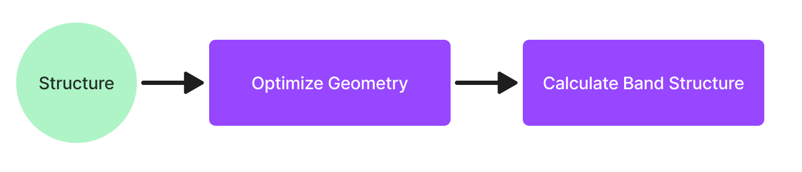

# Setting up a high-throughput infrastructure with AiiDA

One of the main use cases of AiiDA is to set up powerful infrastructures for running calculations in high-throughput on e.g. a set of structures.
A straightforward example from the condensed matter community here would be to calculate the band structure of said structures in two steps:

1. Optimize the geometry of the input structure.
2. Calculate the band structure of the optimized geometry.



There are many ways to use AiiDA to solve this problem!
In this blog post, we will use a collection of submission controllers to set up a command line interface for automatically calculating the band structure for all the structures in an AiiDA group using the `aiida-quantumespresso` plugin.
All the code examples are gathered in a single repository:

[https://github.com/mbercx/high-throughput-blog](https://github.com/mbercx/high-throughput-blog)

Feel free to clone the repository and try to execute the controllers with your local setup.

:::{warning}
This tutorial is aimed at more advanced users!
While reading it can still be instructive for beginners, not that more basic concepts such as work chains, groups etc will not be explained.
:::

## `aiida-submission-controller`

As discussed in our [previous blogpost](post-aiida-core-plugins), the submission controller is a tool for:

1. Taking care of keeping a certain number of workflows active at any time, without needing to monitor the runs.
2. Making sure you don't run the same structure twice.

Unfortunately, the tool is currently largely undocumented, and users can only rely on two examples to help them understand how to use it.
Here, we'll show how to set up two submission controllers for optimizing the geometry and calculating the band structure, respectively.
Let's start by having a look at a submission controller for running the `PwRelaxWorkChain`:

```python
class PwRelaxSubmissionController(FromGroupSubmissionController):
    """SubmissionController to run PwRelaxWorkChains from a group of `StructureData` nodes."""

    pw_code: str
    """The label of the `Code` to use for the `PwRelaxWorkChain`."""
    overrides: dict = {}
    """A dictionary of overrides to pass to `PwRelaxWorkChain.get_builder_from_protocol()`."""

    def get_inputs_and_processclass_from_extras(self, extras_values):
        parent_node = self.get_parent_node_from_extras(extras_values)

        builder = PwRelaxWorkChain.get_builder_from_protocol(
            code=orm.load_code(self.pw_code),
            structure=parent_node,
            overrides=self.overrides,
            protocol='fast'
        )
        return builder
```

In order to write the submission controller, you have to do three things:

1. Inherit from the `FromGroupSubmissionController`.
   This means the submission controller will define a "parent" group whose nodes it will use to submit work chains.
   The `FromGroupSubmissionController` also already defines some basic inputs, which we'll get to later.
2. Define additional inputs, in this case the `pw.x` code from Quantum ESPRESSO (`pw_code`) and the `overrides` dictionary, which will allow us to set different settings than the protocol defaults.
3. Tell the submission controller how to construct the builder based on the extras in the `get_inputs_and_processclass_from_extras` method.
   In this case, we simply extract the `parent_node` based on the extras and use the `get_builder_from_protocol` method of the `PwRelaxWorkChain` to get a fully populated builder.

## Running the controller

Now that we have defined the controller class, let's use it to submit our first batch of work chains.
If you're running the `high-throughput-blog` example, you can use `./cli.py init` to set up the basic groups:

1. `structures`, which is automatically populated with some basic `StructureData` nodes for us to run.
2. the work chain groups, `workchain/relax` and `workchain/bands`, in which we'll be storing the work chain nodes.

First we initialise the `PwRelaxSubmissionController`:

```python
relax_controller = PwRelaxSubmissionController(
    group_label='workchain/relax',
    parent_group_label='structures',
    pw_code='pw@localhost',
    max_concurrent=2,
)
```

Let's go over the various inputs:

* `group_label` defines the group in which the work chains will be stored.
* `parent_group_label` is the label of the parent group, from which `StructureData` nodes will be taken to run the `PwRelaxWorkChain` for.
* `pw_code` is the label of the installed `pw.x` code of Quantum ESPRESSO.
* `max_concurrent` is the maximum number of work chains that will run at any time.

In order to submit the work chains and store them in the `workchain/relax` group, we can use the `submit_new_batch` command:

```
relax_controller.submit_new_batch(verbose=True)
```

By using the `verbose=True` setting, the submission controller will print the current status of the submissions:

```
                               Status
┏━━━━━━━┳━━━━━━━━━━━┳━━━━━━━━━━━━━┳━━━━━━━━━━━━┳━━━━━━━━┳━━━━━━━━━━━┓
┃ Total ┃ Submitted ┃ Left to run ┃ Max active ┃ Active ┃ Available ┃
┡━━━━━━━╇━━━━━━━━━━━╇━━━━━━━━━━━━━╇━━━━━━━━━━━━╇━━━━━━━━╇━━━━━━━━━━━┩
│ 5     │ 0         │ 5           │ 2          │ 0      │ 2         │
└───────┴───────────┴─────────────┴────────────┴────────┴───────────┘
```

We can see that there are 5 structures in total to be run, and none have been submitted.
Since the `max_concurrent` setting is set to none, but no work chains are currently active, the submission controller will proceed with submitting two work chains:

```
Info: 🚀 Submitting 2 new workchains!
Report: Submitted work chain <uuid: 9e461a90-2f38-4a6b-b44a-8a1447d9908a (pk: 73007) (aiida.workflows:quantumespresso.pw.relax)> for extras <('519d8e113651f745c6906a11e749f3e32fbcca820f47faca6f455dc815d0dc14',)>.
Report: Submitted work chain <uuid: 395849ff-8522-46d5-b265-a6566d95d197 (pk: 73023) (aiida.workflows:quantumespresso.pw.relax)> for extras <('c9f1c1ea824b2be42ad61ce4d6505b9b2bd03b77c4f863c0c9d54fe29260b318',)>.
```

Great, our first `PwRelaxChain`s are in progress!
Since now two work chains are already running, rerunning the command should lead to no new submissions:

```
                               Status
┏━━━━━━━┳━━━━━━━━━━━┳━━━━━━━━━━━━━┳━━━━━━━━━━━━┳━━━━━━━━┳━━━━━━━━━━━┓
┃ Total ┃ Submitted ┃ Left to run ┃ Max active ┃ Active ┃ Available ┃
┡━━━━━━━╇━━━━━━━━━━━╇━━━━━━━━━━━━━╇━━━━━━━━━━━━╇━━━━━━━━╇━━━━━━━━━━━┩
│ 5     │ 2         │ 3           │ 2          │ 2      │ 0         │
└───────┴───────────┴─────────────┴────────────┴────────┴───────────┘
Info: 😴 Nothing to submit.
```

If we wait a while, some of the work chains running will finish.
At this point, executing the `submit_new_batch` method will submit more `PwRelaxChain` work chains, but it will skip structures that have already been run.

:::{note}
Looking at the report on the submissions above, we can see that the extras used by the submission controller are rather bulky (e.g. `519d8e113651f745c6906a11e749f3e32fbcca820f47faca6f455dc815d0dc14`).
This is because by default, the `FromGroupSubmissionController` will use the AiiDA hash of the parent node to keep track of which work chains have already been run.
Using a more descriptive hash, like a unique identifier from a source database, can be quite useful when you are managing large project and want to quickly find the work chain corresponding to a certain structure.
:::

## Combining submission controllers into a "pipeline"

Now that we understand how to run a single submission controller, let's also set one up for the `PwBandsWorkChain` and combine them into a single "pipeline".
The `PwBandsSubmissionController` is very similar to the one for the geometry optimizations, we simply add the following line in the `get_inputs_and_processclass_from_extras` method:

```
structure = parent_node.outputs.output_structure
```

To extract the output structure of the `PwRelaxWorkChain`, which is then passed to the `get_builder_from_protocol` method of the `PwBandsWorkChain`.

Combining the two submission controllers is pretty straightforward: simply initialise one after the other and submit a new batch of work chains for each.
The `cli.py` file in the `high-throughput-blog` example defines the following `run` command:

```python
def run():

    while True:

        relax_controller = PwRelaxSubmissionController(
            group_label='workchain/relax',
            parent_group_label='structures',
            pw_code='pw@localhost',
            max_concurrent=2,
        )

        relax_controller.submit_new_batch(verbose=True)

        bands_controller = PwBandsSubmissionController(
            group_label='workchain/bands',
            parent_group_label='workchain/relax',
            pw_code='pw@localhost',
            max_concurrent=1,
            filters={"attributes.exit_status": 0},
        )

        bands_controller.submit_new_batch(verbose=True)

        time.sleep(30)
```

In order to keep the submissions running in the background, the submission code is simply wrapped in a `while` loop with a `sleep` at the end.
One more thing to note here is the following line in the initialisation of the `PwBandsSubmissionController`:

```python
filters={"attributes.exit_status": 0}
```

By default, the submission controller will try to submit the work chain for _all_ the nodes in the parent group that haven't been run yet.
However, in case the parent node is a work chain that is still running, it won't have the necessary `output_structure` to submit the band structure work chain with.
Hence, the submission will fail in that case.
In the end the submission controller will just skip that one and keep submitting, but it's cleaner to immediately filter for parent work chains that have completed successfully.

## Final notes

Hopefully you now understand a bit better how submission controllers work, and how you can combine them to set up a pipeline for your high-throughput research project.
Note that the `aiida-submission-controller` package is currently still heavily under development, and there might still be breaking changes in the (near) future!
The documentation is also still severely lacking, which this blog post tries to alleviate to some extent.
Hopefully we'll soon have more time to polish the package, I'll make sure to keep this blog post updated in case we do!
