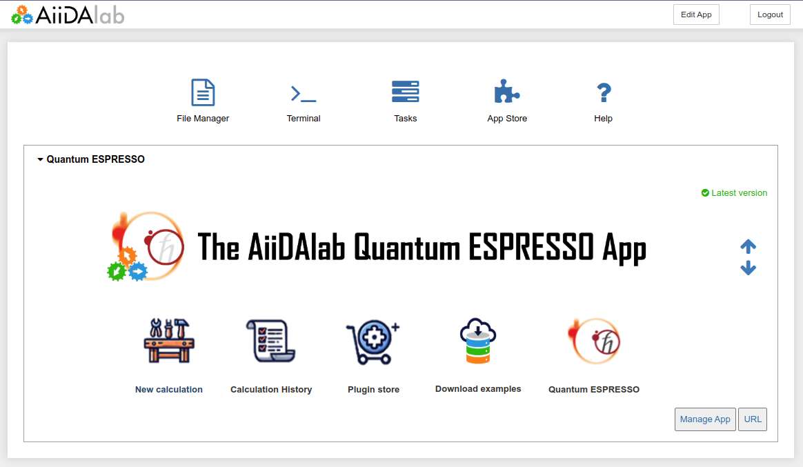
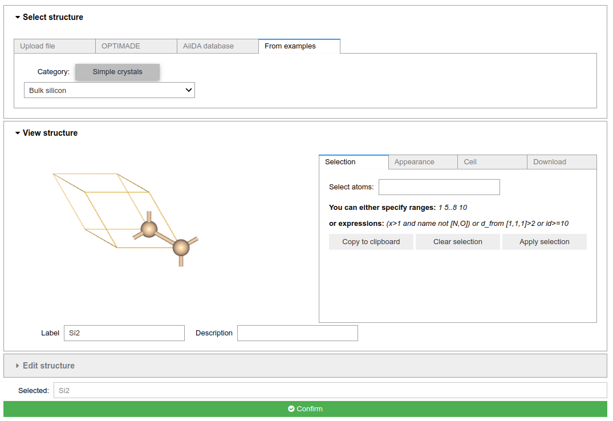
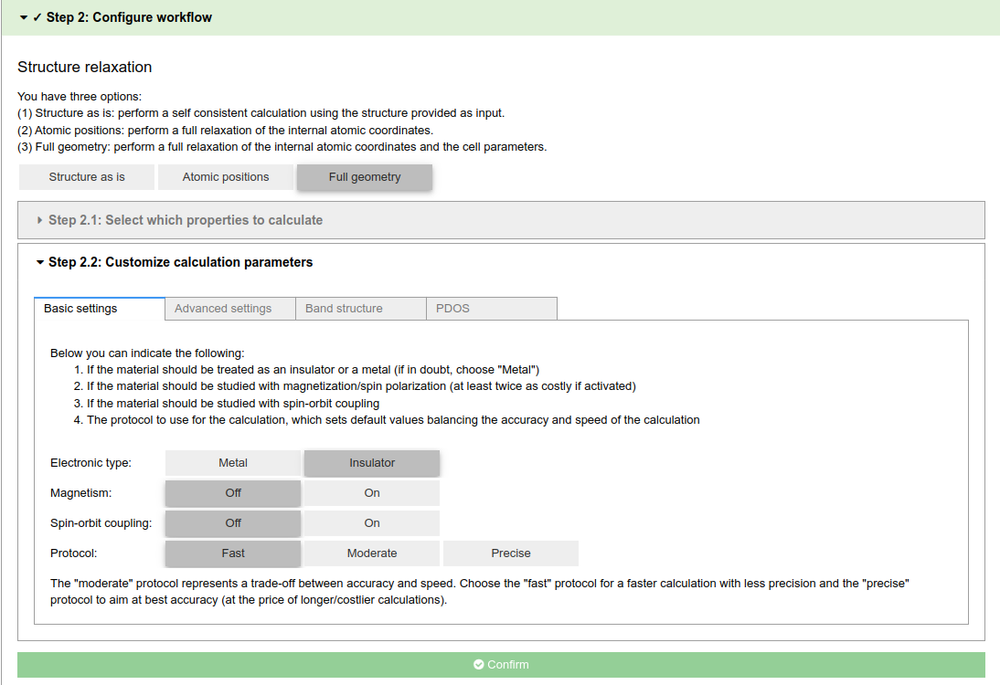
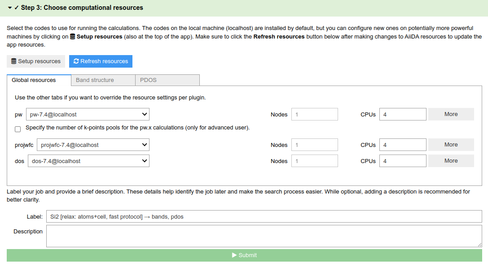
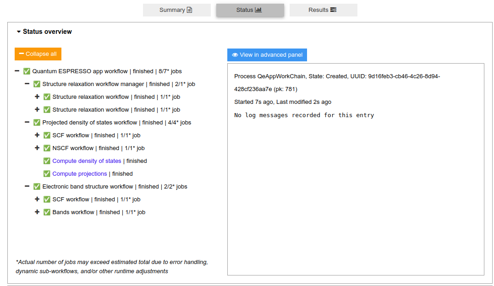
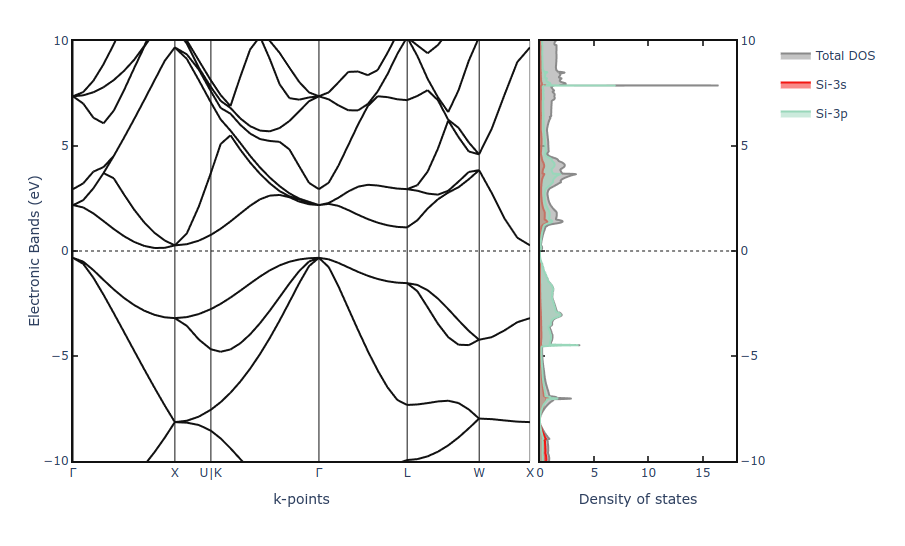
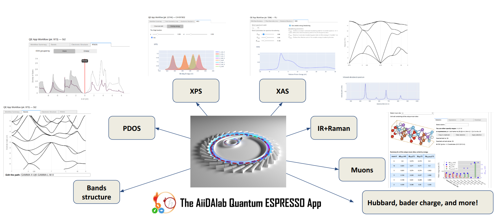

# Exploring the AiiDAlab-QE App for Materials Simulations

*A streamlined approach to running advanced materials simulations on the AiiDAlab platform*

## Introduction

The [AiiDAlab-QE app](https://aiidalab-qe.readthedocs.io/) is a web-based application that leverages the power of the [AiiDA](https://aiida.net/) workflow engine, making computational materials science more accessible through intuitive graphical interfaces. It provides a convenient way to set up, launch, and manage Quantum ESPRESSO calculations directly in your web browser. This post highlights the app’s key features, walks you through a typical calculation setup, and showcases some of the available plugins.

## Why AiiDAlab-QE?

1. **User-friendly interface** – A straightforward GUI eliminates the need to manually write input files.  
2. **Powered by AiiDA** – All calculations are managed by AiiDA, ensuring reproducibility by tracking workflows, inputs, and outputs.  
3. **Broad functionality** – Supports basic geometry optimizations, band structure calculations, and more advanced materials property calculations.  
4. **Modular and pluggable** – Developers can integrate extra functionalities (e.g., post-processing or advanced workflows) without changing interfaces.  
5. **Easy access** – Compatible with local and cloud-based installations, accommodating diverse user needs.

## Getting Started

### Step 1: Access the App

In this post, we focus on a local installation using the `aiidalab-launch` tool. A convenient Docker image containing the app, a pre-configured AiiDA environment, QE executables, and commonly used pseudopotentials is also available.

#### 1. Install AiiDAlab Launch

Use [`pipx`](https://pypa.github.io/pipx/installation/) (recommended):

```sh
pipx install aiidalab-launch
```

Or install directly with `pip`:

```sh
pip install aiidalab-launch
```

#### 2. Add a `QE` Profile

Run the following command to add a new `QE` profile:

```sh
aiidalab-launch profile add --image ghcr.io/aiidalab/qe:v25.03.0 QE
```

When prompted, enter `n` to skip editing the profile settings.

#### 3. Start AiiDAlab

Use the newly added `QE` profile:

```sh
aiidalab-launch start -p QE
```

#### 4. Open AiiDAlab in Your Browser

Follow the URL that appears on your screen to open AiiDAlab in your browser. You will see a start page similar to this:



### Step 2: Setting Up a Calculation

Once inside the AiiDAlab-QE app, you will be guided through four main steps in a wizard-style interface:

- 🔍 Step 1: Select the structure you want to run.
- ⚙️ Step 2: Select the properties you are interested in.
- 💻 Step 3: Choose the computational resources you want to run on and submit your workflow.
- 🚀 Step 4: Monitor and view your workflow results.

Below is a detailed walkthrough of each step.

---

## Step 1: Select a Structure

In the first step, choose a structure from one of several sources:

- **Upload file** – Upload a structure file from your computer.  
- **OPTIMADE** – Search for structures in the OPTIMADE database.  
- **AiiDA database** – Search for structures in your local AiiDA database.  
- **From Examples** – Pick from a curated list of example structures.

For this tutorial, select **From Examples** and then choose **Bulk silicon** from the dropdown menu:



Click **Confirm** to finalize your selection.

> **Tip:**  
> The app supports a variety of sources for importing structures. For more details, see the [How-To guide](https://aiidalab-qe.readthedocs.io/howto/import_structure.html).

---

## Step 2: Configure the Workflow

Next, define the tasks for the workflow (e.g., geometry optimization or property calculations) and select calculation parameters. For this tutorial, choose **Full geometry** optimization. Then select which properties to compute:

- **Band structure**  
- **Projected density of states (PDOS)**  

(We’ll select both here.)

> **Tip:**  
> Additional property calculations are available through plugins. If the required plugin is not installed, install it from the Plugin store to enable that functionality.

### Customize Calculation Parameters
You can refine multiple settings:

- **Basic settings** – top-level calculation settings
- **Advanced settings** – fine-tune the calculations
- **Plugin settings** – Specific options for plugin-based calculations like band structure or PDOS.

A convenient way to set most parameters at once is to select a **protocol** (e.g., “fast,” “moderate,” or “precise”). For a quick run, choose **fast** and set the **Electronic type** to `Insulator`.

When ready, click **Confirm**.



---

## Step 3: Choose Computational Resources

In this step, define the computational resources for the calculations. By default, a local machine (`localhost`) is configured alongside the following Quantum ESPRESSO codes:

- `pw-7.0@localhost`  
- `dos-7.0@localhost`  
- `projwfc-7.0@localhost`  

For our example, we’ll stick with these defaults, using four CPUs. Click **Submit** to launch the calculation.



> **Note:**  
> For more substantial calculations, you can set up a remote computer (cluster, HPC, etc.), see the [How-To guide](https://aiidalab-qe.readthedocs.io/howto/setup_computer_code.html) for instructions on configuring remote machines.

---

## Step 4: Monitor the Calculation and View Results

Finally, track the calculation in real time and check the results when it finishes. A summary of calculation parameters is also shown. You can download the raw input and output files upon completion, as well as an AiiDA archive containing full provenance data.

This example calculation take around **3 minutes** to complete.



When the calculation completes, switch to the **Results** panel for a summary of the run, along with interactive visualizations of the band structure and PDOS:



---

## Available Plugins

One of the key strengths of the AiiDAlab-QE app is its modularity and extensibility. Developers and researchers can enhance functionality by integrating plugins, enabling advanced workflows tailored to specific computational tasks. Below are some of the available plugins:

- **Phonons and IR/Raman**
- **Muon Spectroscopy**
- **Core-Level Spectroscopy (XAS/XPS)**
- **Bader Charge Analysis**
- **Wannier Functions**
- **Hubbard Parameters**

These plugins significantly extend the capabilities of the app, allowing users to perform more specialized calculations while maintaining the ease of use of the AiiDAlab interface.



---

## Conclusion

The AiiDAlab-QE app simplifies the setup and execution of Quantum ESPRESSO calculations by combining AiiDA’s powerful provenance tracking with an intuitive user interface. Whether you’re a domain scientist or an expert in computational materials, AiiDAlab-QE helps streamline your workflows, saving time and reducing errors often associated with manual setup.

For more information, visit the [AiiDAlab-QE Documentation](https://aiidalab-qe.readthedocs.io/) and the [GitHub repository](https://github.com/aiidalab/aiidalab-qe).