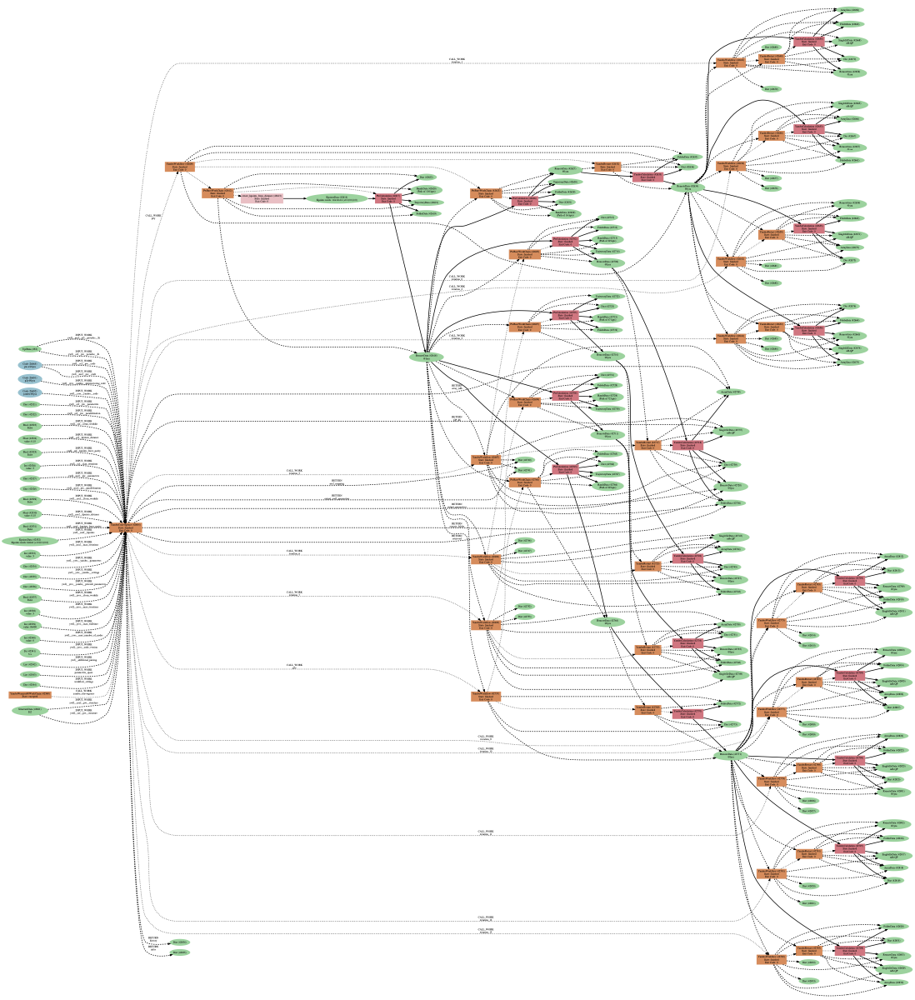

# AiiDA success stories: band structures and excitons with aiida-yambo

*An example on how AiiDA is used to advance science.*

## Introduction

Ab initio many-body perturbation theory (MBPT), including methods like GW and BSE, is the state-of-the-art approach for accurate predictions of band structures and excitonic properties. 
However, MBPT is significantly more challenging than standard density functional theory (DFT): it requires convergence tests over a space of interdependent parameters, calculations are computationally much more demanding than DFT, and several chained calculations need to be performed in order to obtain the final result. 
Running reliable MBPT calculations in an automated fashion represents a technically demanding task that has traditionally been accessible only to expert users.  
The integration of the [Yambo code](https://iopscience.iop.org/article/10.1088/1361-648X/ab15d0/meta) with AiiDA through the `aiida-yambo` plugin addresses these challenges by automating MBPT workflows, ensuring data provenance, and paving the way for high-throughput GW and BSE computations.

> **Note:** For a detailed explanation of the plugin's design, implementation, and use cases, please refer to the dedicated publication associated with this plugin: [Bonacci et. al, npj Computational Materials, 9, 74, 2023](https://www.nature.com/articles/s41524-023-01027-2). 
A [set of tutorials](https://aiida-yambo.readthedocs.io/en/documentation/user_guide/index.html) is also provided in the documentation of the plugin.

## Why Combine AiiDA and Yambo?

Yambo is among the most used codes for performing MBPT calculations, including GW and BSE. 
AiiDA, on the other hand, provides a robust infrastructure for managing complex computational workflows with full data provenance. 
By combining these tools, researchers can:

- Automate the setup, error handling and execution of MBPT calculations/workflows
- Track the complete provenance of data and workflows
- Easily reproduce and share computational results
- Scale simulations to high-throughput studies

> **Note:** For more details on the Yambo code features and usage, please consult the [official website](https://www.yambo-code.eu/) and the corresponding [Yambo wiki page](https://wiki.yambo-code.eu/wiki/index.php?title=Main_Page).

To give you an idea of the complexity of typical MBPT simulations, in Figure 1 we show an AiiDA provenance graph for the G0W0 quasiparticle convergences workflow of a single material.



*Figure 1: Provenance graph of a G0W0 quasiparticle convergence workflow for a single material, generated using the `aiida-yambo` plugin. This graph highlights the complexity and interdependence of the calculations involved in MBPT simulations.*

Starting from the input set (on the left of the figure), we perform several interconnected calculations (DFT+GW) which are then used to estimate the convergence set of parameters which allows us to obtain accurate quasiparticle corrections (i.e. band structure)

## Case studies

Before showing the plugin and a taste of its usage, we start with some of the applications that were made possible thanks to the `aiida-yambo` plugin.  

One of the first studies performed with the plugin was the calculation of excitonic effects in the 2D C3N (2D polyaniline), a material particularly promising for optoelectronic application ([Bonacci et al., Phys. Rev. Materials, 6:034009, 2022](https://journals.aps.org/prmaterials/abstract/10.1103/PhysRevMaterials.6.034009)).  
The authors used the plugin to perfom complex GW calculations (particularly tricky for 2D materials, as explained [here](https://wiki.yambo-code.eu/wiki/index.php?title=How_to_treat_low_dimensional_systems)). 
Thanks to AiiDA, it was possible to perform very accurate BSE characterization of the lowest energy excitons in C3N, shown in Figure 2.

```{image} ../pics/c3n.png
:alt: fishy
:class: bg-primary
:width: 400px
:align: center
```

*Figure 2: Visualization in both real and reciprocal space of the lowest energy excitons in 2D C3N, obtained using the `aiida-yambo` plugin. The accurate GW and BSE calculations enabled by the plugin provided detailed insights into excitonic effects in this material.*  

The `aiida-yambo` plugin has been instrumental in several other studies:

- [Marrazzo et al., "Relative Abundance of Z2 Topological Order in Exfoliable Two-Dimensional Insulators", Nano Letters, 19:8431-8440 (2019)](https://pubs.acs.org/doi/abs/10.1021/acs.nanolett.9b02689);
- [Atambo et al., "Electronic and optical properties of doped TiO2 by many-body perturbation theory", Phys. Rev. Materials 3, 045401 (2019)](https://doi.org/10.1103/PhysRevMaterials.3.045401);  
- [Betti et al., “Gap opening in double-sided highly hydrogenated free-standing graphene", Nano Letters, 22(7):2971–2977 (2022)](https://pubs.acs.org/doi/full/10.1021/acs.nanolett.2c00162);
- [Betti et al., “Dielectric response and excitations of free-standing graphane”, Carbon Trends 12, 100274 (2023)](https://doi.org/10.1016/j.cartre.2023.100274);
- [Bonacci et al., "Benchmarking the GW100 dataset with the Yambo code by means of G0W0 approximation, Materials Cloud Archive 2023.54 (2023)"](https://doi.org/10.24435/materialscloud:ce-82).

## How to Run a simple GW Calculation with `aiida-yambo`

The `YamboWorkflow` is the core workchain of the `aiida-yambo` plugin. Below, we consider the case of a single GW calculation.  

> **Note:** Running automated BSE@GW and several other types of simulations, e.g. convergence studies, are also supported and are covered in the dedicated [set of tutorials](https://aiida-yambo.readthedocs.io/en/documentation/user_guide/index.html).  

The workflow orchestrates all steps involved in a typical GW calculation: from initial DFT preprocessing to the final GW calculation, ensuring smooth integration between the **Quantum ESPRESSO** and **Yambo** codes.  

Depending on the input provided, the workflow will:

- Launch SCF and NSCF DFT calculations using the `PwBaseWorkChain` (from the `aiida-quantumespresso` plugin)
- Run the GW step using the `YamboRestart` workchain (providing automatic error handling)
- Skip already computed steps if valid parent input is provided, leveraging data provenance 

The execution is dynamic: users don’t need to explicitly define each intermediate step unless they want to. 
If any underlying process fails (e.g., due to memory errors) and cannot be restarted successfully, the workflow exits cleanly and transparently thanks to the robust restart mechanisms inherited from `BaseRestartWorkChain`.

The only required inputs are: 

- the codes we are going to use during the simulation: pw.x, p2y and yambo (as AiiDA `Code` nodes)
- the input structure (as AiiDA `StructureData` node).

This snippet of code is what you need to perform a basic GW calculation within the plugin:

```python
from aiida import orm, load_profile
load_profile()

from aiida.plugins import WorkflowFactory
from aiida.engine import submit

YamboWorkflow = WorkflowFactory('yambo.yambo.yambowf')

# ...
# Loading the codes and the structure here
# ...

builder = YamboWorkflow.get_builder_from_protocol(
    protocol="fast",
    pw_code=pw_code,
    preprocessing_code=p2y_code,
    code=yambo_code,
    structure=structuredata_node,
)

run = submit(builder)
```

it is possible to ask the workflow to parse specific quantities, like gaps or single quasiparticle levels. 
To do that, we can provide an additional input to our builder. For example, to ask for the minimum gap, that is, the direct gap at Gamma and the HOMO and LUMO:  

```python
builder.additional_parsing = orm.List(list=['gap_','gap_GG','homo','lumo'])
```

At the end of the calculation we obtain an output node, called `output_ywfl_parameters`, containing the information we asked the workflow to compute (as well as their DFT counterpart):

```python
{
    'gap_': 1.0573099312007,
    'homo': -0.30465849325061,
    'lumo': 0.75265143795013,
    'gap_GG': 3.0613290492713,
    'homo_G': -0.30465849325061,
    'lumo_G': 2.7566705560207,
    'gap_dft': 0.66473089347482,
    'homo_dft': 0.0,
    'lumo_dft': 0.66473089347482,
    'gap_GG_dft': 2.5552411541998,
    'homo_G_dft': 0.0,
    'lumo_G_dft': 2.5552411541998
}
```

## Conclusions

The integration of Yambo with AiiDA through the aiida-yambo plugin provides highly streamlined MBPT simulations, making them more accessible and reproducible.  
As computational materials science continues to evolve, tools like these will be essential in driving forward research and discovery.