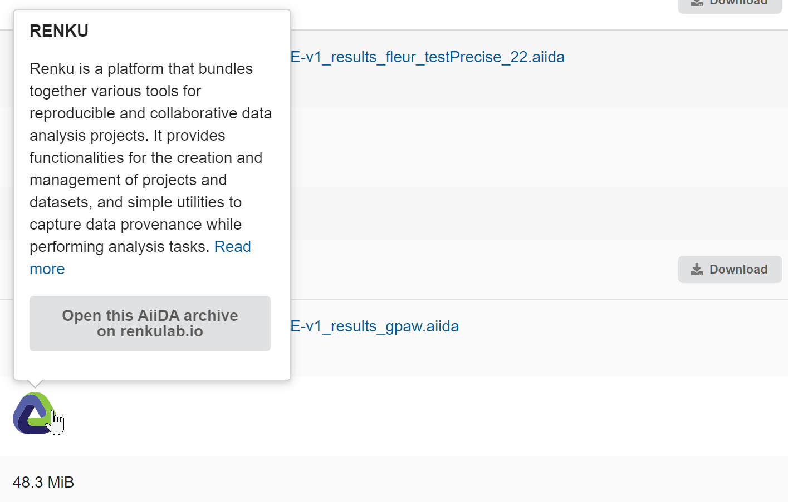
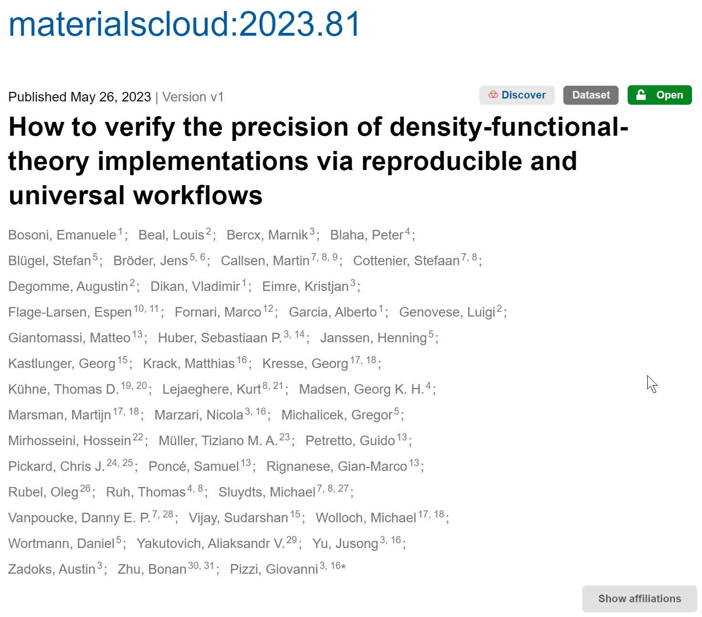
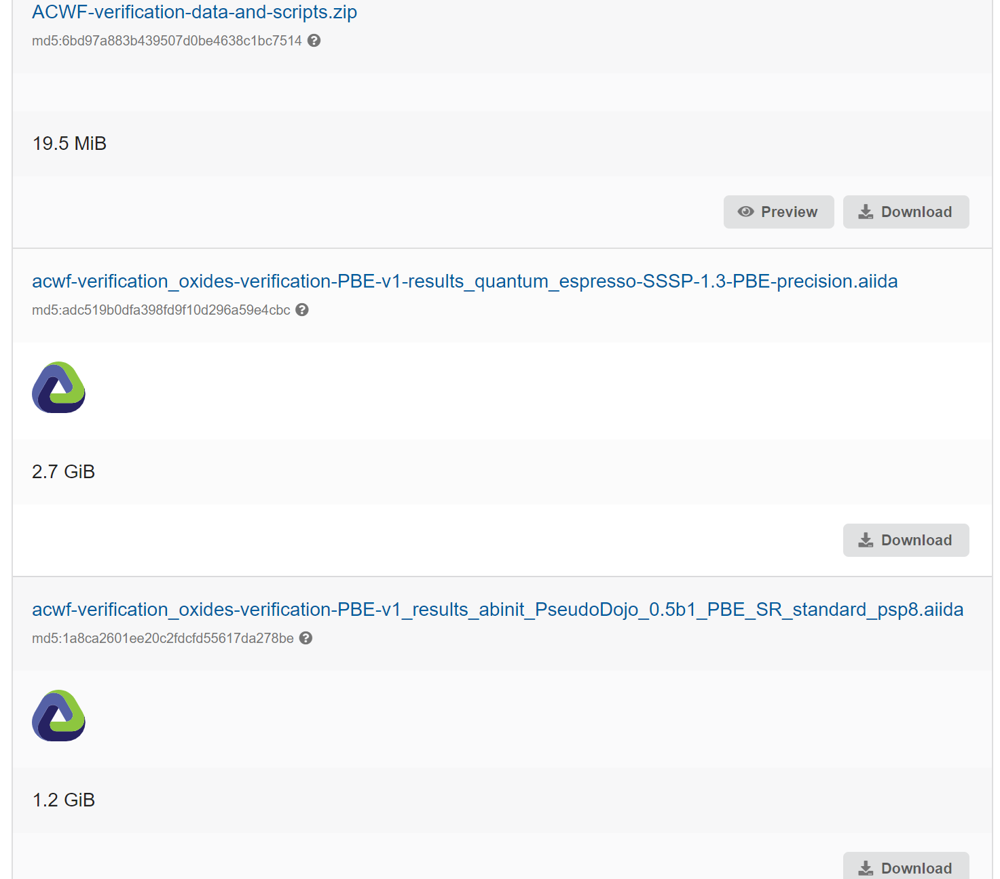
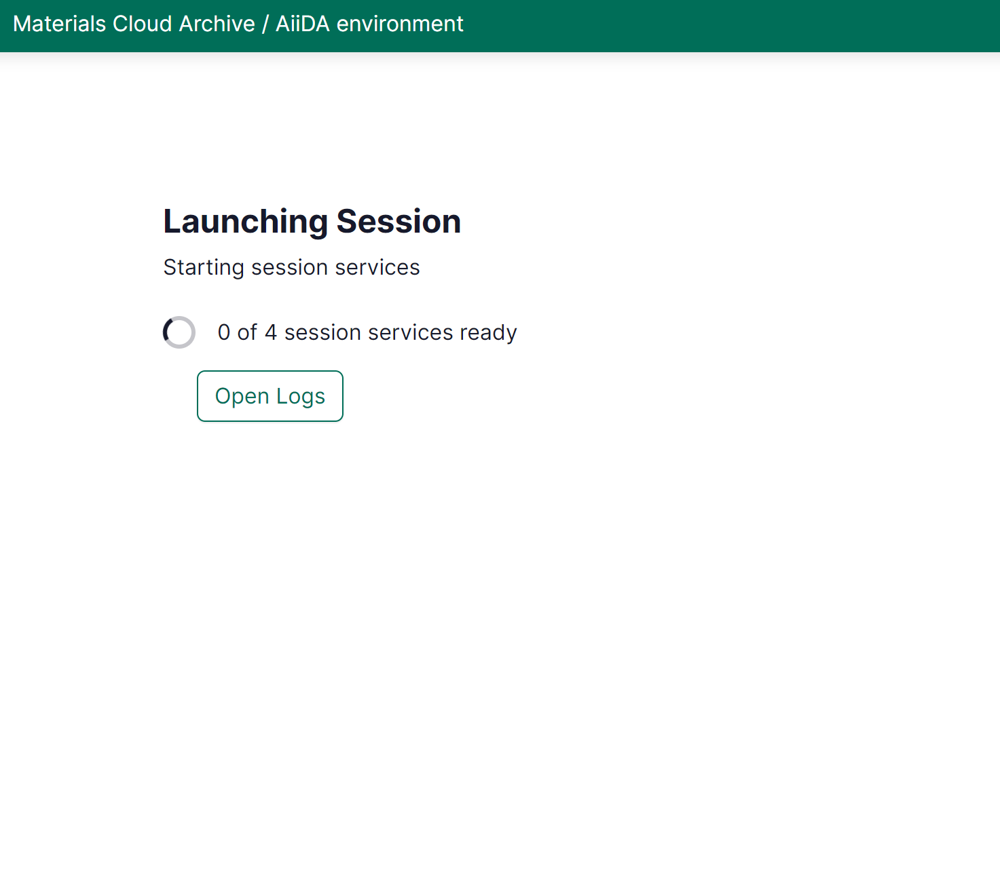
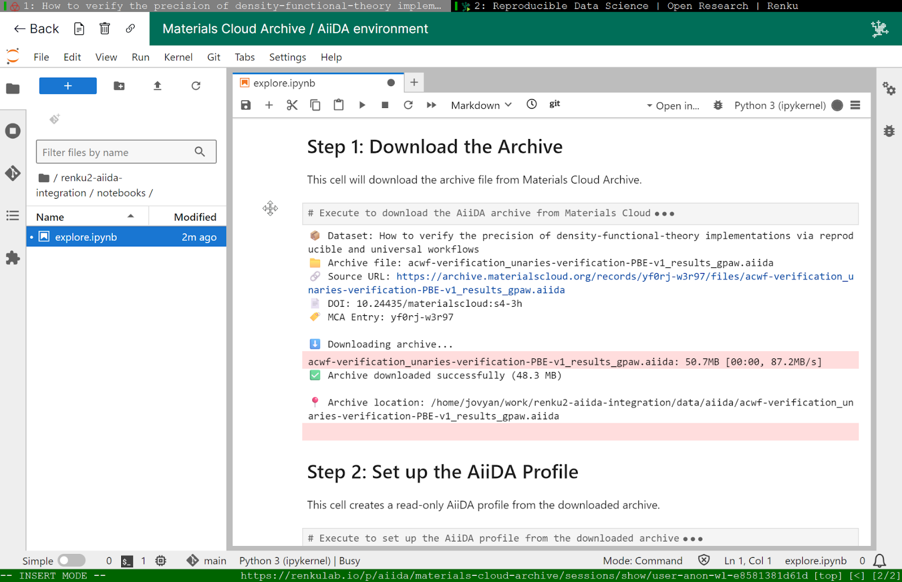
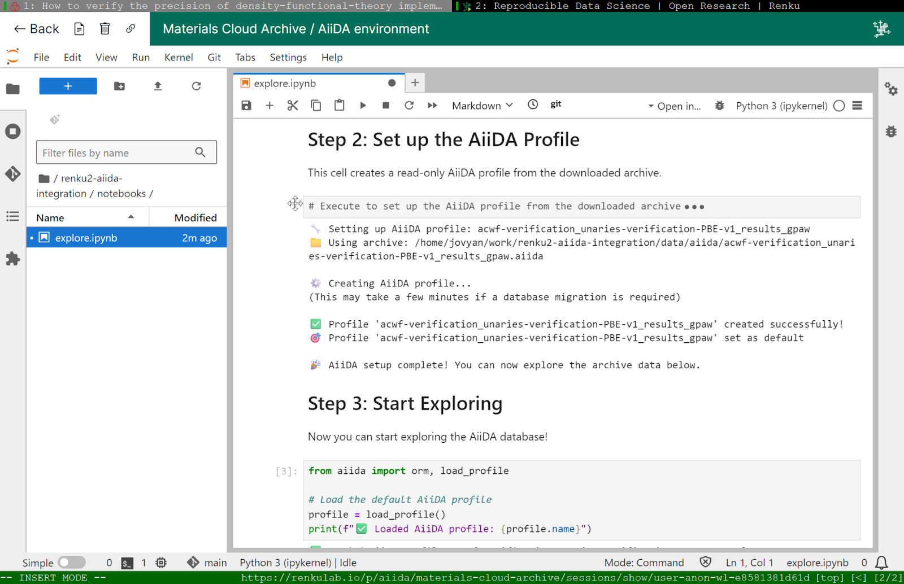
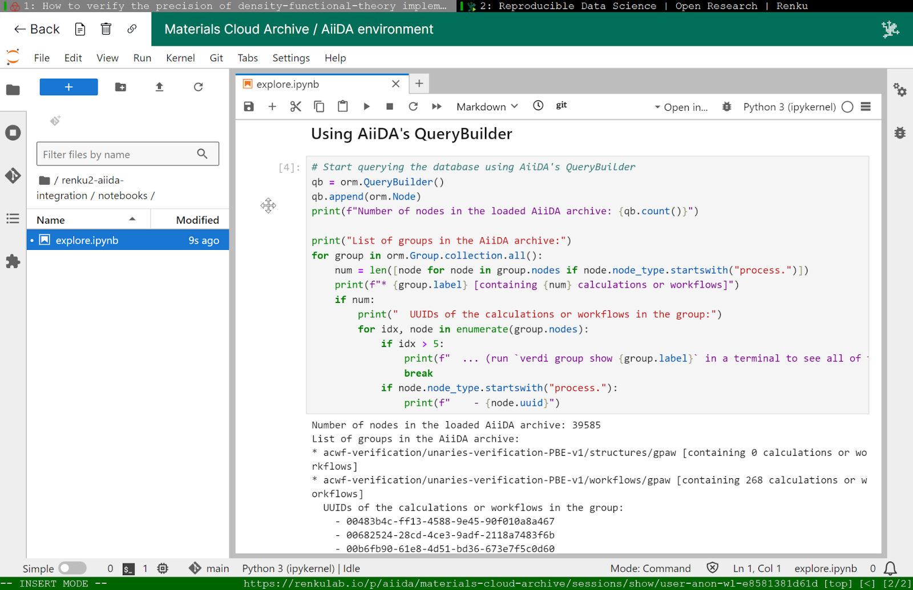
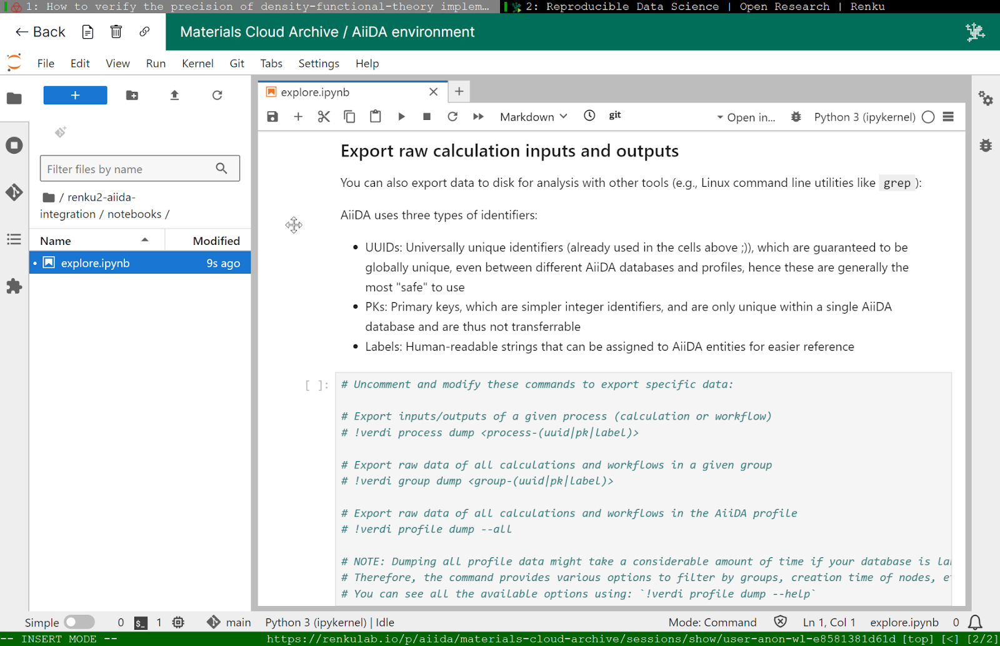
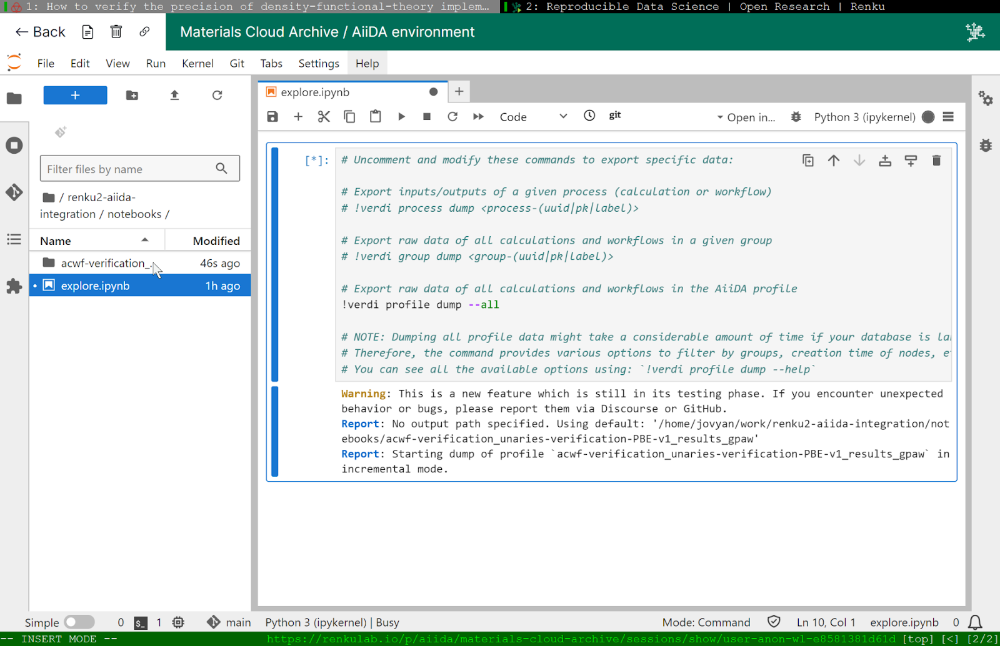

# One-click exploration of AiiDA archives via RenkuLab

Did you know that when you conduct research using AiiDA, you can host the generated data for free on the [Materials Cloud Archive (MCA)](https://archive.materialscloud.org/)?
By doing so, you make your data available to the research community at large, offload the responsibility of long-term data storage, and allow users to explore it with MCA's built-in provenance explorer.

## The Problem: No data access without local setup

Sounds great, now, where's the catch?
While uploading the data to MCA makes it, in principle, available to the world,  exported AiiDA archives are not directly human-readable.
This is because they are _not_ just a classical directory (and file) trees, but a compressed file with a specific format that was designed for performance[^1].
Therefore, exploring the data is not straightforward, and typically required users to install AiiDA locally, including complex system dependencies like PostgreSQL and RabbitMQ[^2], download the archive, and use AiiDA's API and CLI to explore the computational data.

This barrier meant that the data hosted on MCA was effectively locked in to users already familiar with AiiDA or willing to invest the necessary time to learn it.
And, still, even experienced users had to manually download archives and configure their local environments before exploring the data---time that could have been spent on research instead.

## The Solution: Integration with RenkuLab

Hence, in 2019, the AiiDA development team decided to partner with [RenkuLab](https://renkulab.io/), a platform developed at the Swiss Data Science Center (SDSC) for reproducible and collaborative data science, to address these challenges.
Both platforms share a Swiss origin and a strong commitment to provenance tracking, making them natural partners.
While AiiDA tracks computational workflow provenance through directed acyclic graphs (DAGs), RenkuLab captures provenance and lineage of research objects in a knowledge graph, recording connections between data, code, and results.

The integration allows researchers to click the Renku logo next to any AiiDA archive on MCA and be automatically launched into a fully configured environment with AiiDA installed and their selected data ready for exploration, eliminating the need for local installation and configuration:

(corresponding MCA record [here](https://archive.materialscloud.org/record/2023.81))

The first version of the integration with RenkuLab was established six years ago and has been operational ever since.
While we recently also launched the [AiiDAlab demo server](https://demo.aiidalab.io/) geared towards the AiiDAlab graphical user interface, this development is very recent and still being actively adapted.

<!-- read here -->
## Initial Implementation (Renku v1)

The first implementation was built as a [contributed Renku template](https://github.com/SwissDataScienceCenter/contributed-project-templates/tree/main/aiida) ([PR](https://github.com/SwissDataScienceCenter/contributed-project-templates/pull/1) opened in 2019) and was based the Renku Docker image, with the AiiDA installation baked into the image creation process.
Jinja2 placeholders were used to conditionally populate metadata in a startup Jupyter notebook, and other configuration files, based on the URL of the MCA record from which the Renku project was launched.
A `post-init.sh` script, for example, set up the AiiDA profile using the appropriate storage backend (`sqlite_zip`) to directly mount the provided archive in read-only mode[^3].

On the MCA side, the integration was achieved by building a Renku project launch link with all the necessary parameters to automatically configure the template based on selected archive.
This link is accessible via the Renku logo displayed next to each AiiDA archive on MCA record pages (see image above).
The initial implementation still required user interaction with Renku's GUI during the project creation process, though all data was prefilled based on the data contained in the URL.

## Current Implementation (Renku v2)

With the upgrade to Renku v2, the [current implementation](https://github.com/aiidateam/renku2-aiida-integration) retained its core technical foundations, but introduces several key improvements:
For one, the GUI-based project creation step required in Renku v1 is bypassed through the use of a [pre-created project](https://renkulab.io/p/aiida/materials-cloud-archive), enabling genuine one-click AiiDA archive access from MCA.
In addition, the archive download (and AiiDA profile creation) has been deferred to manual execution of notebook cells by the user, rather than being done at session startup.
This drastically reduces startup time, as downloads of multi-gb archives could previously take minutes during session startup.
Further, in Renku v2, the archive URL that points to the MCA record from which the session was launched is available as an environment variable and is used to fetch relevant metadata via the InvenioRDM API[^4].
This allowed for a more customized startup notebook with the set of displayed cells adapted based on the MCA entry.
The startup notebook now also contains additional code snippets showcasing AiiDA's API for archive exploration, while internal backend code (e.g., archive download and AiiDA profile setup) is hidden in auto-folded cells.
Finally, the Docker image now includes the latest released aiida-core version, 2.7.1, with all its recent improvements.
Here, one notable feature is the capability to _dump_ all relevant data of an AiiDA process, group, or profile to disk in a human-readable directory and file tree.
This data can then be explored via the Jupyter file browser, command line utilities, or downloaded to the local machine.
Instructions on how to use this feature that simplifies data access also for non-AiiDA users, is contained in the startup notebook, as well.

Below the text, we provide you with screenshots of the full journey from an MCA archive to a RenkuLab project, the startup notebook, and exporting the AiiDA data to a directory tree for easy exploration.

<!-- 

 -->

## Future Directions

In the development team, we are already exploring several enhancements using Renku v2's new capabilities:

### Data Connectors

Renku v2 provides "data connectors" that can mount data from supported providers directly in a project's filesystem.
Since MCA uses the InvenioRDM platform, which Renku v2 supports, creating an MCA data connector could allow mounting AiiDA archives directly without having to download them at all.
This would further reduce the startup time and it would also circumvent storage limitations typically applied by Renku (every project comes, by default, with 10GB of disk space).

One technical challenge currently still prevents the use of data connectors:
many MCA archives were created with older AiiDA versions and require data migration to work with current versions of AiiDA.
Since mounted filesystems via data connectors are read-only, AiiDA's current approach of in-place migration doesn't work.
<!-- [^5] TODO: mention PRs that were motivated by this -->
Potential solutions include periodic, automatic migrations of MCA-hosted archives to the latest version of AiiDA, or creation of the migrated file on the Renku project's actual filesystem (though this sacrifices one of the main advantages of data connectors, instant access without the need for downloading the whole file).

### Expanding the AiiDAlab App Ecosystem

Renku v2's support for arbitrary Docker images opens possibilities for integrating other AiiDA applications.
Work has already been carried out to make the [AiiDAlab Quantum ESPRESSO (aiidalab-qe) app compatible with Renku](https://github.com/aiidalab/aiidalab-qe/pull/1105), potentially providing the same GUI and user experience as the standalone app.
Other candidates include the [`aiida-archive-inspect` app](https://github.com/superstar54/aiida-archive-inspect), which could display information about all available AiiDA archives for an MCA page and enable interactive selection.

## Conclusion

The integration between AiiDA and Renku demonstrates how research infrastructure can evolve from serving primarily expert users to welcoming the broader scientific community.
By removing barriers between data discovery and analysis, the integration enables more researchers to engage with computational datasets, ultimately accelerating scientific discovery in materials science and beyond.

RenkuLab has been very stable throughout the various integration stages, and the Renku team has consistently been responsive and helpful with technical concerns.
While the AiiDA-RenkuLab integration uses only part of Renku's technical infrastructure, the platform's ability to connect external tools and data sources with ready-to-use computational environments makes it
<!-- enables researchers to connect their entire workflow in one place without technical barriers. -->
<!-- an ideal foundation for eliminating setup barriers and enabling instant access to complex research workflows. -->

For researchers interested in exploring AiiDA archives on the Materials Cloud Archive, simply look for the Renku logo next to any archive and click to begin your exploration.

## A visual journey

Below, we show the full journey from an MCA archive to the working Renku project, going through the startup notebook, and finally exporting the AiiDA data to a directory tree.
Please note that some parts of the original recording were cut out to shorten the video (e.g., session startup on Renku typically took approx. 1 minute):

[^1]:
    For the full specification of AiiDA's export format, the reader is referred to the corresponding [AEP](https://aiida-aep.readthedocs.io/en/latest/005_exportformat/readme.html).

[^2]:
    Before they were made optional, and before the `verdi presto` endpoint was implemented

[^3]:
    In addition, it was ensured that the template could be used both when launched from MCA and when accessed directly from the Renku website.
    In the latter case, no URL was available, and a generic AiiDA profile with an `sqlite_dos` backend, into which an archive can be loaded in the future, was created.

[^4]:
    Materials Cloud Archive recently converted their storage backend to InvenioRDM.
