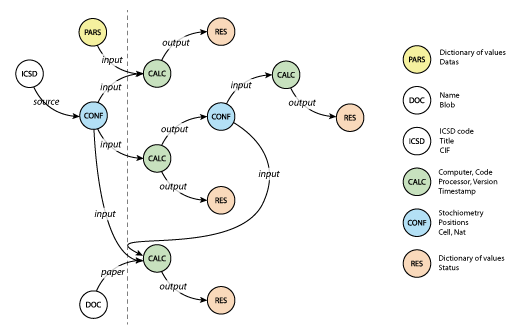

# About

## What is AiiDA?

```{highlights}
AiiDA is an open-source Python infrastructure to help researchers with automating, managing, persisting, sharing and reproducing the complex workflows associated with modern computational science and all associated data.
```

AiiDA is built to support and streamline the four core pillars of the [ADES model](https://arxiv.org/abs/1504.01163): Automation, Data, Environment, and Sharing. Key features include:

- **Workflows**: AiiDA allows to build and execute complex, auto-documenting workflows linked to multiple codes on local and remote computers.
- **High-throughput**: AiiDA’s event-based workflow engine supports tens of thousands of processes per hour with full check-pointing.
- **Data provenance**: AiiDA automatically tracks and records inputs, outputs and metadata of all calculations and workflows in extensive provenance graphs that preserve the full lineage of all data.
- **Advanced queries**: AiiDA’s query language enables fast graph queries on millions of nodes.
- **Plugin interface**: AiiDA can support via plugins any computational code and data analytics tool, data type, scheduler, connection mode, etc. (see [public plugin repository](https://aiidateam.github.io/aiida-registry/))
- **HPC interface**: AiiDA can seamlessly deal with heterogeneous and remote computing resources; it works with many schedulers out of the box (SLURM, PBS Pro, torque, SGE or LSF).
- **Open science**: AiiDA allows to export both full databases and selected subsets, to be shared with collaborators or made available and browsable online on the [Archive](https://archive.materialscloud.org/) and [Explore](https://www.materialscloud.org/explore) sections of [Materials Cloud](https://www.materialscloud.org/).
- **Open source**: AiiDA is released under the MIT open-source license.

## Features

(feat-workflows)=

### Workflows

One of the fundamental tasks in modern computational materials science is to** automate complex numerical procedures**, involving multi-step procedures and integrating different simulation softwares.

In AiiDA, workflow authors have the full power of the python programming language at their fingertips, from running simple python functions on the local computer to launching arbitrary executables on remote compute resources. Once a workflow is submitted, the event-based AiiDA daemon handles its execution, waiting for jobs to finish before launching subsequent steps.

AiiDA workflows can be chained, enabling users to encode their workflow logic in functional building blocks and combined them in sophisticated simulations. These building blocks become part of a workflow library that users can share and expand with their collaborators, thus building a common ground for modern material simulations.

(feat-data-provenance)=

### Data Provenance

Keeping track of data provenance means being able to **reconstruct the complete history of each calculation** or scientific result, including all steps that lead up to it and all parameters used in intermediate calculations.

In AiiDA, **data provenance is tracked automatically** and stored in the form of a **directed acyclic graph**. For example, each calculation is represented by a node, that is linked to its input and output data nodes. The provenance graph is stored in a local database that can be queried using a high-level python interface that allows for performant queries on millions of nodes.



(feat-plugin-framework)=

### Plugin Framework

**Flexibility** is a key requirement in order to match the diversity of scientific challenges in the computational physics, chemistry and material science communities. For this reason, AiiDA was designed with a powerful plugin interface based on [python entry points](https://packaging.python.org/specifications/entry-points/).

AiiDA plugins will typically take care of preparing input files for a simulation code and parsing its output files into the AiiDA data types. Plugins can, however, extend AiiDA in numerous other ways as well, such as by adding new data types, adding support for new [job schedulers](feat-hpc-interface), adding new transport types or extending the AiiDA command line interface. Importantly, AiiDA plugins can provide self-documenting [workflows](feat-workflows).

The public [AiiDA registry](https://aiidateam.github.io/aiida-registry/) is the central place to find AiiDA plugins, listing not only plugin names, authors and installation instructions but also what extensions they provide.

(feat-hpc-interface)=

### HPC Interface

Abstracting the interaction with remote compute resources is key for reducing the time spent on fixing typos and studying the documentation of your job scheduler and increasing time doing productive calculations. AiiDA knows how to speak to job schedulers such as slurm, torque, PBSpro, SGE, LSF, and translates your resource requirements to their language. This lets you move your calculations to a different computer by changing one line of code.

Once a calculation of workflow is submitted, all you need to do is wait: the AiiDA daemon prepares the necessary input files, sends them to the cluster and submits a new job to the scheduler. It continues monitoring the status of calculations and will retrieve and parse the relevant files as soon as the job finishes.

If your cluster is “different”, don’t worry: thanks to AiiDA’s flexible plugin architecture, you can write your own scheduler plugin. Simply start by copying the plugin for the closest one.

(feat-open-science)=

### Open Science

While AiiDA does not enforce publication of any resources, **AiiDA aims to make Open Science easy** and provides numerous ways of sharing data, knowledge and capabilities:

AiiDA users can export their provenance graph and share it with others. When uploaded to [Materials Cloud](https://materialscloud.org/), peers can browse the graph interactively, download individual files or the whole database, and start their research right from where the original author left off.

On the [AiiDA registry](https://aiidateam.github.io/aiida-registry/), users can share self-documenting AiiDA workflows, along with plugins for new simulation codes, data types, schedulers and more.

The [AiiDA lab](https://aiidalab.materialscloud.org/) allows users to wrap AiiDA workflows in interactive web applications. Using jupyter notebooks, computational researchers can share intuitive turn-key solutions with their experimental peers, researchers from companies and the scientific community at large.

(feat-open-source)=

### Open Source

The AiiDA framework is released under the permissive [MIT open-source license](https://opensource.org/licenses/MIT), making it suitable for use in both in academic and commercial settings.

AiiDA is developed publicly on the [aiida-core GitHub repository](https://github.com/aiidateam/aiida_core), and has benefited enormously from contributions by an active developer community. All contributions are welcome, ranging from prioritization of new features, issue reports to pull requests.

While the AiiDA team are proponents of open source software, AiiDA plugins can connect to both open source and commercial codes, and plugin developers can choose to develop their plugin privately or under different licenses.

<iframe loading="lazy" src="https://www.youtube.com/embed/56DpmUawOz4" allow="accelerometer; autoplay; encrypted-media; gyroscope; picture-in-picture" allowfullscreen="" width="560" height="315" frameborder="0"></iframe>

## Further resources

- **Users:** See the [documentation](http://aiida-core.readthedocs.io/) for how to download & install AiiDA
- **Developers:** [clone it from github](https://github.com/aiidateam/aiida-core/tree/master) or [download a source release](https://github.com/aiidateam/aiida-core/releases).
- [AiiDA plugin registry](https://aiidateam.github.io/aiida-registry/): AiiDA plugins provide interfaces with external codes as well as new features.
- [AiiDA tutorials](https://aiida-tutorials.readthedocs.io): Tutorials with downloadable materials and virtual environments
- [Quantum Mobile](https://materialscloud.org/work/quantum-mobile): A virtual machine based on Ubuntu Linux that comes pre-installed with AiiDA and a number of simulation codes.

## License note

The core of the AiiDA engine (“aiida-core”) is released under the **[MIT License](https://opensource.org/licenses/MIT)**.
The MIT License (also called Expat) is an open source license that essentially grants you the right of dealing in the software without restrictions, as long as the original copyright notice and the name of the copyright holder is included in derivatives of the software. It is very similar to the [BSD Licenses](http://en.wikipedia.org/wiki/BSD_licenses#4-clause_license_.28original_.22BSD_License.22.29), the main differences being that the MIT License explicitly describes the usage permissions and does not limit the use of the copyright holder name.
