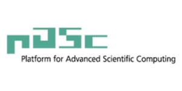
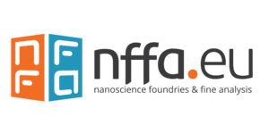
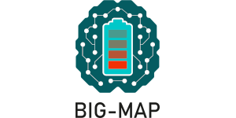
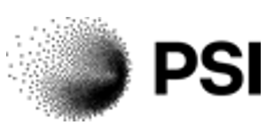
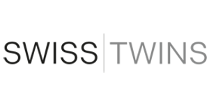

# Acknowledgements

AiiDA development is supported or has been supported by:

:::{list-table}

* - 
  - [NCCR MARVEL](https://nccr-marvel.ch/)\
    *MARVEL National Centre for Competence in Research*\
    *funded by [SNSF](https://www.snf.ch/)*

* - 
  - [MaX CoE](http://www.max-centre.eu/)\
    *MaX European Centre of Excellence for materials design at the exascale*

* - 
  - [MarketPlace](https://www.the-marketplace-project.eu/)\
    *European H2020 MarketPlace project*

* - 
  - [INTERSECT](https://intersect-project.eu/)\
    *European H2020 INTERSECT project*

* - 
  - [PASC](https://www.pasc-ch.org/)\
    *Swiss Platform for Advanced Scientific Computing*

* - 
  - [swissuniversities](https://www.materialscloud.org/swissuniversities)\
    *swissuniversities P-5 project “Materials Cloud”*

* - 
  - [NFFA](https://www.nffa.eu/)\
    *European H2020 NFFA project*

* - 
  - [BIG-MAP](https://www.big-map.eu/)\
    *BIG-MAP Battery 2030+ initiative*

* - 
  - [PSI](https://www.psi.ch/en/)\
    *Paul Scherrer Institute (Switzerland)*

* - 
  - [EPFL](https://www.epfl.ch/en/)\
    *École Polytechnique Fédérale de Lausanne*

* - 
  - [Harvard University](https://www.harvard.edu/)\
    *Harvard University (USA)*

* - 
  - [Bosch](https://www.bosch.com/research/)\
    *Bosch Research and Technology Center (USA)*

* - 
  - [ORD-PREMISE](https://www.ord-premise.org/)\
    *Open and Reproducible Materials Science Research*\
    *funded by the [ETH Board](https://ethrat.ch/en/)*

* - 
  - [SwissTwins](https://www.cscs.ch/about/collaborations/swisstwins)\
    *funded by the Swiss State Secretariat for Education, Research and Innovation (SERI)*

:::
