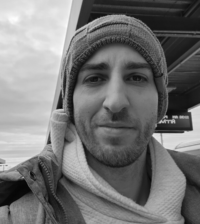
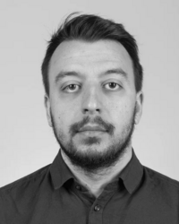
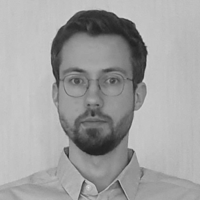
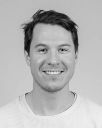
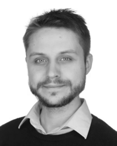
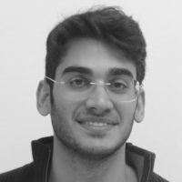
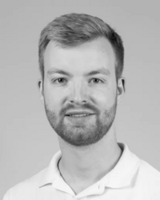
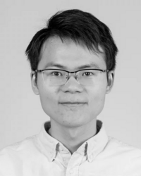
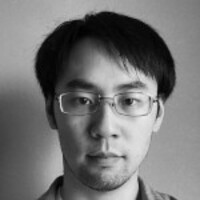

# Team

## Credits

AiiDA is a joint effort of the [Materials Software and Data group](https://www.psi.ch/en/lms/msd-group) (part of the [LMS](https://www.psi.ch/en/lms) laboratory at [PSI](https://www.psi.ch/), Switzerland), [THEOS](http://theossrv1.epfl.ch/) laboratory at EPFL (Switzerland), and [Bosch RTC](https://www.bosch.us/) in Cambridge MA (USA). Its development is supported by [NCCR MARVEL](https://nccr-marvel.ch/) and [a number of additional supporting partners and institutions](acknowledgements.md).
Data generated with AiiDA are disseminated through [materialscloud.org](http://materialscloud.org/).

## External contributors

Besides the AiiDA development team listed below, we thank our [numerous external code contributors](https://raw.githubusercontent.com/aiidateam/aiida_core/develop/AUTHORS.txt) as well as [all plugin developers](https://aiidateam.github.io/aiida-registry/) for making the AiiDA ecosystem what it is today.

## The AiiDA Development team (alphabetical order)

:::{list-table}

* - 
  - **Edan Bainglass**\
    *PostDoc Research Scientist, Materials Software and Data Group, PSI*

* - 
  - **Marnik Bercx**\
    *PostDoc Research Scientist, Materials Software and Data Group, PSI*\

* - 
  - **Miki Bonacci**\
    *PostDoc Research Scientist, Materials Software and Data Group, PSI*

* - 
  - **Kristjan Eimre**\
    *PostDoc Research Scientist, Materials Software and Data Group, PSI*

* - 
  - **Julian Geiger**\
    *PostDoc Research Scientist, Materials Software and Data Group, PSI*

* - 
  - **Alexander Goscinski**\
    *PostDoc Research Scientist, Materials Software and Data Group, PSI*

* - 
  - **Sebastiaan P. Huber**\
    *Former PostDoc Research Scientist, Theory and Simulation of Materials, EPFL*

* - 
  - **Ali Khosravi**\
    *PostDoc Research Scientist, Materials Software and Data Group, PSI*

* - 
  - **Nicola Marzari**\
    *Chair, Theory and Simulation of Materials, EPFL*\
    *Director, National Centre for Competence in Research NCCR MARVEL, EPFL*\
    *Head of Laboratory for Materials Simulations, PSI*

* - 
  - **Timo Reents**\
    *PhD student, Materials Software and Data Group, PSI*

* - 
  - **Giovanni Pizzi**\
    *Group Leader, Materials Software and Data Group, PSI*

* - 
  - **Xing Wang**\
    *PostDoc Research Scientist, Materials Software and Data Group, PSI*

* - 
  - **Aliaksandr Yakutovich**\
    *Research Software engineer, Empa*

* - 
  - **Jusong Yu**\
    *PostDoc Research Scientist, Materials Software and Data Group, PSI*

:::

### Former members (alphabetical order)

- Simon Adorf (EPFL, 2019-2022)
- Casper W. Andersen (EPFL, 2018-2021)
- Andrea Cepellotti (EPFL, 2011-2016)
- Flaviano Dos Santos (EPFL, 2020-2022)
- Fernando Gargiulo (EPFL, 2015-2017)
- Rico Häuselmann (EPFL, 2016-2018)
- Conrad Johnston (EPFL, 2018-2019)
- Leonid Kahle (EPFL, 2015-2020)
- Boris Kozinsky (Bosch, first pre-AiiDA prototypes before 2012, and 2012-2018)
- Snehal Kumbhar (EPFL, 2015-2020)
- Andrius Merkys (EPFL, 2014-2015)
- Nicolas Mounet (EPFL, 2015-2018)
- Elsa Passaro (EPFL, 2017-2021)
- Francisco F. Ramirez (EPFL, 2019-2023)
- Riccardo Sabatini (EPFL, 2013-2015)
- Christopher Sewell (EPFL, 2020-2023)
- Leopold Talirz (EPFL, 2017-2024)
- Martin Uhrin (EPFL, 2015-2019)
- Spyros Zoupanos (EPFL, 2015-2019)

## Contact us

### General questions about AiiDA

Please ask on [discourse](https://aiida.discourse.group/).

### Bug reports

Please check our [GitHub issue tracker](https://github.com/aiidateam/aiida_core/issues) whether the bug is already known. If not, please open a new issue.

### Feedback on AiiDA

The AiiDA core developers greatly appreciate [feedback on the AiiDA user experience](https://aiida.discourse.group/).
Your comments and suggestions influence where we focus our development efforts.

[Let us know!](https://aiida.discourse.group/)

## Join us

Are you interested in the intersection of software and computational science?

You love coding and building the tools for the computational science of tomorrow?

Then you might be a candidate for the AiiDA team!

We advertise openings for positions on [discourse](https://aiida.discourse.group/c/announcements/) and the [news section](https://aiida.net/news/index/tag/positions.html), when they become available. But excellent candidates are encouraged to apply throughout the year (you can get contact via our emails).
(you can also check open positions on [PSI website](https://www.psi.ch/en/hr/job-opportunities), [THEOS](https://theos-wiki.epfl.ch/) and [psi-k mailing list](https://psi-k.net/list/)).

**Use a 1-page cover letter to explain what motivates you and why you would fit into the team** – please note that we don’t consider blanket applications.
