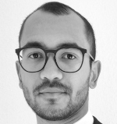
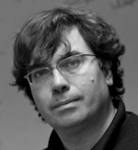
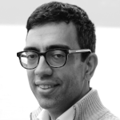
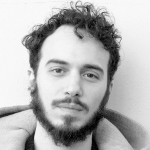
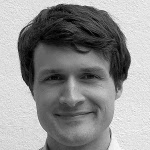

# Team

## Credits

AiiDA is a joint effort of [THEOS](http://theossrv1.epfl.ch/)/[MARVEL](http://nccr-marvel.ch/) at EPFL (Switzerland) and of [Bosch RTC](http://www.bosch.us/) in Cambridge MA (USA). Its development is supported by [a number of supporting partners and institutions](more/acknowledgements.md).
Data generated with AiiDA are disseminated through [materialscloud.org](http://materialscloud.org/).

## External contributors

Besides the AiiDA team at EPFL listed below, we thank our [numerous external code contributors](https://raw.githubusercontent.com/aiidateam/aiida_core/develop/AUTHORS.txt) as well as [all plugin developers](https://aiidateam.github.io/aiida-registry/) for making the AiiDA ecosystem what it is today.

## The AiiDA team at EPFL

:::{list-table}

* - 
  - **Simon Adorf**\
    *PostDoc Research Scientist, Theory and Simulation of Materials, EPFL*\
    [epfl.ch](http://people.epfl.ch/simon.adorf)

* - 
  - **Marnik Bercx**\
    *PostDoc Research Scientist, Theory and Simulation of Materials, EPFL*\
    [epfl.ch](http://people.epfl.ch/marnik.bercx)

* - 
  - **Flaviano Dos Santos**\
    *PostDoc Research Scientist, Theory and Simulation of Materials, EPFL*\
    [epfl.ch](https://people.epfl.ch/flaviano.dossantos)

* - 
  - **Sebastiaan P. Huber**\
    *PostDoc Research Scientist, Theory and Simulation of Materials, EPFL*\
    [epfl.ch](http://people.epfl.ch/sebastiaan.huber)

* - 
  - **Boris Kozinsky**\
    *Professor, Materials Intelligence Research, Harvard University (USA)*\
    [havard.edu](https://bkoz.seas.harvard.edu/people/boris-kozinsky)

* - 
  - **Nicola Marzari**\
    *Chair, Theory and Simulation of Materials, EPFL
Director, National Centre for Competence in Research NCCR MARVEL, EPFL*\
    [epfl.ch](http://people.epfl.ch/nicola.marzari)

* - 
  - **Giovanni Pizzi**\
    *Staff Scientist, Theory and Simulation of Materials, EPFL*

* - 
  - **Francisco F. Ramirez**\
    *PostDoc Research Scientist, Theory and Simulation of Materials, EPFL*\
    [epfl.ch](http://people.epfl.ch/francisco.ramirez)

* - 
  - **Leopold Talirz**\
    *PostDoc Research Scientist, Theory and Simulation of Materials, EPFL*\
    [epfl.ch](http://people.epfl.ch/leopold.talirz)

* - 
  - **Aliaksandr Yakutovich**\
    *PostDoc Research Scientist, Theory and Simulation of Materials, EPFL*\
    [epfl.ch](http://people.epfl.ch/aliaksandr.yakutovich)

* - 
  - **Jusong Yu**\
    *PostDoc Research Scientist, Theory and Simulation of Materials, EPFL*\
    [epfl.ch](http://people.epfl.ch/jusong.yu)

:::

### Former members

- Riccardo Sabatini (EPFL, 2013-2015)
- Andrea Cepellotti (EPFL, 2011-2016)
- Andrius Merkys (EPFL, 2014-2015)
- Nicolas Mounet (EPFL, 2015-2018)
- Rico Häuselmann (EPFL, 2016-2018)
- Fernando Gargiulo (EPFL, 2015-2017)
- Martin Uhrin (EPFL, 2015-2019)
- Spyros Zoupanos (EPFL, 2015-2019)
- Conrad Johnston (EPFL, 2018-2019)
- Leonid Kahle (EPFL, 2015-2020)
- Snehal Kumbhar (EPFL, 2015-2020)
- Casper W. Andersen (EPFL, 2018-2021)
- Elsa Passaro (EPFL, 2017-2021)

## Contact us

### General questions about AiiDA

Please ask on the [AiiDA mailing list](http://www.aiida.net/mailing-list/).

### Bug reports

Please check our [GitHub issue tracker](https://github.com/aiidateam/aiida_core/issues) whether the bug is already known. If not, please open a new issue.

### Feedback on AiiDA

The AiiDA core developers greatly appreciate [feedback on the AiiDA user experience](https://goo.gl/forms/u0yhDQ39IoRQeFg42).
Your comments and suggestions influence where we focus our development efforts.

[Let us know!](https://goo.gl/forms/u0yhDQ39IoRQeFg42)

## Join us

Are you interested in the intersection of software and computational science?

You love coding and building the tools for the computational science of tomorrow?

Then you might be a candidate for the AiiDA team!

We advertise [openings for positions](http://theossrv1.epfl.ch/Main/Openings) when they become available, but excellent candidates are encouraged to apply throughout the year.

**Use a 1-page cover letter to explain what motivates you and why you would fit into the team** – please note that we don’t consider blanket applications.
